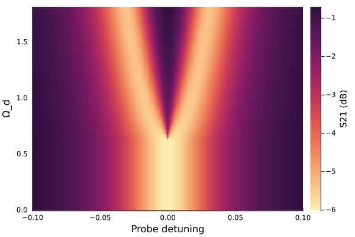

# Linear response and transmission/reflection coeffictients for magnon three-wave mixing {#Linear-response-and-transmission/reflection-coeffictients-for-magnon-three-wave-mixing}

```julia
using HarmonicSteadyState, QuantumCumulants, Plots
```


Consider a model of nonlinear magnon-magnon coupling, as described in [this](https://arxiv.org/abs/2506.11527) paper. The model describes  a three-wave mixing interaction between a strongly driven $k=0$ FMR mode and two parametricallly excited propagating modes with opposite momentum $\pm k$ and at half frequency. In this notebook, we will show how the mean-field approximation can be used to calculate steady states, and to calculate the $S_{21}$ transmission coefficient.

```julia
hm = FockSpace(:magnon)
hc = FockSpace(:polariton)
h = hm ⊗ hc  # Hilbertspace

@qnumbers m::Destroy(h, 1) c::Destroy(h, 2) # Operators

@rnumbers Δ Vk Ωd γm γk # Parameters
param = [Δ, Vk, Ωd, γm, γk]

H_RWA_sym = (
    Δ * m' * m + Δ / 2 * c' * c + Vk * m * c' * c' + Vk * m' * c * c + (Ωd * m + Ωd * m')
)
ops = [m, m', c, c'] # Operators for meanfield evolution

eqs_RWA = meanfield(ops, H_RWA_sym, [m, c]; rates=[γm, γk], order=1)
eqs_completed_RWA = complete(eqs_RWA) # Meanfield equations using QuantumCumulants.jl
```

\begin{align}
\frac{d}{dt} \langle m\rangle  &= -1 i Vk \langle c\rangle ^{2} -1 i {\Omega}d -1 i \Delta \langle m\rangle  -0.5 {\gamma}m \langle m\rangle  \\
\frac{d}{dt} \langle m^\dagger\rangle  &= 1 i {\Omega}d + 1 i \langle m^\dagger\rangle  \Delta + 1 i Vk \langle c^\dagger\rangle ^{2} -0.5 {\gamma}m \langle m^\dagger\rangle  \\
\frac{d}{dt} \langle c\rangle  &= -0.5 {\gamma}k \langle c\rangle  -2 i Vk \langle c^\dagger\rangle  \langle m\rangle  + \frac{-1}{2} i \Delta \langle c\rangle  \\
\frac{d}{dt} \langle c^\dagger\rangle  &= -0.5 {\gamma}k \langle c^\dagger\rangle  + 2 i \langle m^\dagger\rangle  Vk \langle c\rangle  + \frac{1}{2} i \Delta \langle c^\dagger\rangle 
\end{align}


We can use this meanfield equations to construct a `HarmonicEquation` object in HarmonicSteadyState.jl. In the construction, additional information is computed, such as the Jacobian of the equations, which is used to determine the stability if the the steady states.

```julia
harmonic_eq = HarmonicEquation(eqs_completed_RWA, param)
```


```ansi
A set of 4 harmonic equations
Variables: mᵣ(t), mᵢ(t), cᵣ(t), cᵢ(t)
Parameters: Δ, Vk, Ωd, γm, γk

Harmonic ansatz: 
0 = mᵣ(t) + mᵢ(t) + cᵣ(t) + cᵢ(t)

Harmonic equations:

-0.5mᵣ(t)*γm - mᵢ(t)*Δ - 2.0Vk*cᵣ(t)*cᵢ(t) ~ Differential(t)(mᵣ(t))

Ωd + mᵣ(t)*Δ - 0.5mᵢ(t)*γm + Vk*(cᵣ(t)^2) - Vk*(cᵢ(t)^2) ~ Differential(t)(mᵢ(t))

-0.5cᵣ(t)*γk - 0.5cᵢ(t)*Δ - 2.0Vk*cᵣ(t)*mᵢ(t) + 2.0Vk*mᵣ(t)*cᵢ(t) ~ Differential(t)(cᵣ(t))

0.5cᵣ(t)*Δ - 0.5cᵢ(t)*γk + 2.0Vk*cᵣ(t)*mᵣ(t) + 2.0Vk*cᵢ(t)*mᵢ(t) ~ Differential(t)(cᵢ(t))

```


Let&#39;s sweep the power of the drive $\Omega_d$, with $\Delta=0$, and solve for the steady state. The steady-state solutions show that the FMR mode saturates after a threshold power, followed by the coherent excitation of the parametrically induced counter-propagating modes.

```julia
drive_range = range(0, 1.8, 100)
fixed = (Δ => 0, Vk => 0.0002, γm => 0.1, γk => 0.01)
varied = (Ωd => drive_range)
result = get_steady_states(harmonic_eq, TotalDegree(), varied, fixed)

plot(plot(result; y="1/sqrt(2)*(mᵣ+ mᵢ)"), plot(result; y="1/sqrt(2)*(cᵣ + cᵢ)"))

# Linear response and S21
```

{width=600px height=400px}

To find the response of the driven system to a second, weak probe, we use the method described [here](https://quantumengineeredsystems.github.io/HarmonicBalance.jl/stable/background/stability_response#linresp_background). Here, we calculate the response in the same rotating frame as the Hamiltonian. The linear response is related to the scattering parameter $S_{21}$ by $S_{21}(\omega)=1-\sqrt{\kappa_{ext}} \chi(\omega),$ where $\kappa_{ext}$ is the coupling of the system to the measurement apparatus.

The result below shows the characteristic splitting of the magnon resonance above the power threshold, which matches the experiment.

```julia
Ω_range = range(-0.1, 0.1, 500)
χ3 = get_susceptibility(result, 1, Ω_range, 3);
χ1 = get_susceptibility(result, 1, Ω_range, 1);
κ_ext = 0.05
S21_3 = 1 .- χ3 * κ_ext / 2
S21_log_3 = 20 .* log10.(abs.(S21_3)) # expressed in dB
S21_1 = 1 .- χ1 * κ_ext / 2
S21_log_1 = 20 .* log10.(abs.(S21_1)) # expressed in dB
```


```ansi
500×35 Matrix{Float64}:
 -0.705811  -0.705811  -0.705811  …  -0.705811  -0.705811  -0.705811
 -0.71075   -0.71075   -0.71075      -0.71075   -0.71075   -0.71075
 -0.715739  -0.715739  -0.715739     -0.715739  -0.715739  -0.715739
 -0.720778  -0.720778  -0.720778     -0.720778  -0.720778  -0.720778
 -0.725868  -0.725868  -0.725868     -0.725868  -0.725868  -0.725868
 -0.731009  -0.731009  -0.731009  …  -0.731009  -0.731009  -0.731009
 -0.736202  -0.736202  -0.736202     -0.736202  -0.736202  -0.736202
 -0.741448  -0.741448  -0.741448     -0.741448  -0.741448  -0.741448
 -0.746748  -0.746748  -0.746748     -0.746748  -0.746748  -0.746748
 -0.752102  -0.752102  -0.752102     -0.752102  -0.752102  -0.752102
  ⋮                               ⋱                        
 -0.746748  -0.746748  -0.746748     -0.746748  -0.746748  -0.746748
 -0.741448  -0.741448  -0.741448     -0.741448  -0.741448  -0.741448
 -0.736202  -0.736202  -0.736202     -0.736202  -0.736202  -0.736202
 -0.731009  -0.731009  -0.731009     -0.731009  -0.731009  -0.731009
 -0.725868  -0.725868  -0.725868  …  -0.725868  -0.725868  -0.725868
 -0.720778  -0.720778  -0.720778     -0.720778  -0.720778  -0.720778
 -0.715739  -0.715739  -0.715739     -0.715739  -0.715739  -0.715739
 -0.71075   -0.71075   -0.71075      -0.71075   -0.71075   -0.71075
 -0.705811  -0.705811  -0.705811     -0.705811  -0.705811  -0.705811
```


Compare the two branches

```julia
stable = get_class(result, 3, "physical")
heatmap(
    Ω_range, drive_range, vcat(S21_log_1', S21_log_3'); c=:matter, cbar_title="S21 (dB)"
)
ylabel!("Ω_d")
xlabel!("Probe detuning")
```

{width=600px height=400px}


---


_This page was generated using [Literate.jl](https://github.com/fredrikekre/Literate.jl)._
