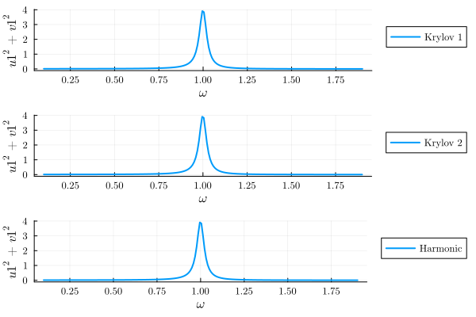
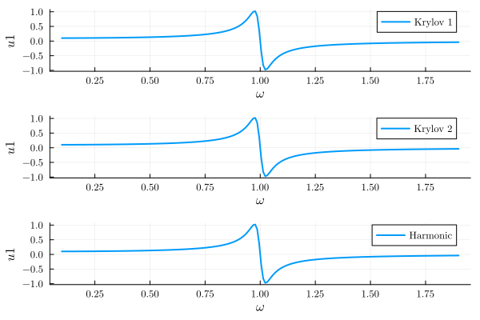
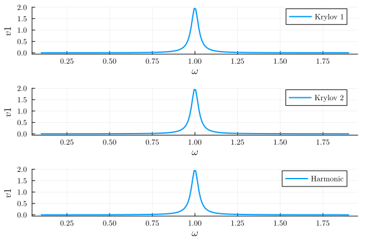
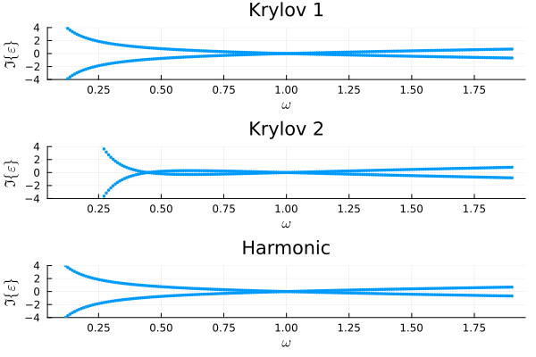
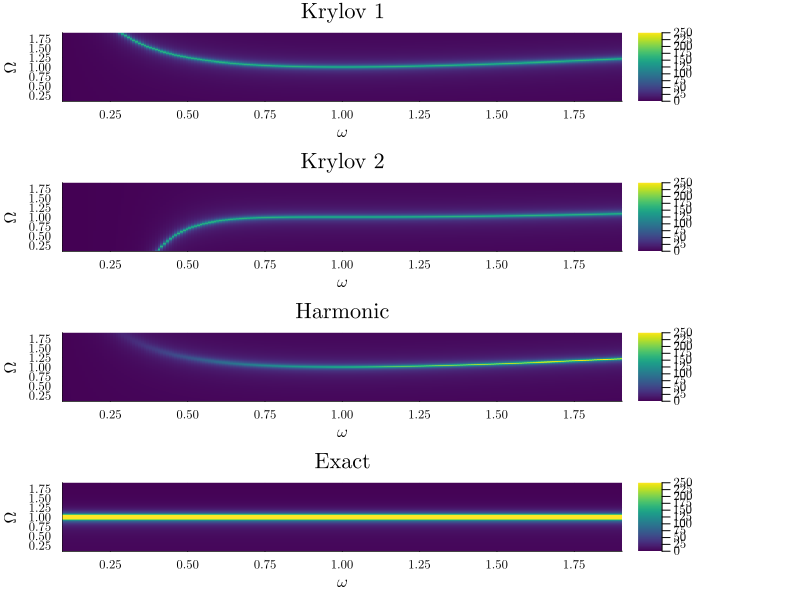

Harmonic oscillator: comparison of KB and HB methods

```julia
using HarmonicBalance, Plots

@variables ω ω0 F γ t x(t)
diff_eq = DifferentialEquation(d(x, t, 2) + ω0^2 * x + γ * d(x, t) ~ F * cos(ω * t), x)
add_harmonic!(diff_eq, x, ω)
```


```julia
krylov_eq1 = get_krylov_equations(diff_eq; order=1)
```


```ansi
A set of 2 harmonic equations
Variables: u1(T), v1(T)
Parameters: ω, ω0, F, γ

Harmonic ansatz: 
x(t) = u1(T)*cos(ωt) + v1(T)*sin(ωt)

Harmonic equations:

-(((1//2)*u1(T)*γ*ω + (1//2)*v1(T)*(ω^2) - (1//2)*v1(T)*(ω0^2)) / ω) ~ Differential(T)(u1(T))

((1//2)*F + (1//2)*u1(T)*(ω^2) - (1//2)*u1(T)*(ω0^2) - (1//2)*v1(T)*γ*ω) / ω ~ Differential(T)(v1(T))

```


```julia
krylov_eq2 = get_krylov_equations(diff_eq; order=2)
```


```ansi
A set of 2 harmonic equations
Variables: u1(T), v1(T)
Parameters: ω, ω0, F, γ

Harmonic ansatz: 
x(t) = u1(T)*cos(ωt) + v1(T)*sin(ωt)

Harmonic equations:

((1//8)*F*γ*(ω^6) - (1//8)*v1(T)*(γ^2)*(ω^7) - (1//8)*v1(T)*(ω^9) + (1//4)*v1(T)*(ω^7)*(ω0^2) - (1//8)*v1(T)*(ω^5)*(ω0^4)) / (ω^8) + (-(1//2)*u1(T)*γ*ω - (1//2)*v1(T)*(ω^2) + (1//2)*v1(T)*(ω0^2)) / ω ~ Differential(T)(u1(T))

((1//8)*F*(ω^7) - (1//8)*F*(ω^5)*(ω0^2) + (1//8)*u1(T)*(γ^2)*(ω^7) + (1//8)*u1(T)*(ω^9) - (1//4)*u1(T)*(ω^7)*(ω0^2) + (1//8)*u1(T)*(ω^5)*(ω0^4)) / (ω^8) + ((1//2)*F + (1//2)*u1(T)*(ω^2) - (1//2)*u1(T)*(ω0^2) - (1//2)*v1(T)*γ*ω) / ω ~ Differential(T)(v1(T))

```


```julia
harmonic_eq = get_harmonic_equations(diff_eq)
harmonic_eq = rearrange_standard(harmonic_eq)
```


```ansi
A set of 2 harmonic equations
Variables: u1(T), v1(T)
Parameters: γ, ω, ω0, F

Harmonic ansatz: 
x(t) = u1(T)*cos(ωt) + v1(T)*sin(ωt)

Harmonic equations:

(-F + ((2//1)*((2(-F - u1(T)*(ω^2) + u1(T)*(ω0^2) + v1(T)*γ*ω)*ω) / γ - u1(T)*γ*ω - v1(T)*(ω^2) + v1(T)*(ω0^2))*ω) / (((-4//1)*(ω^2)) / γ - γ) - u1(T)*(ω^2) + u1(T)*(ω0^2) + v1(T)*γ*ω) / (-γ) ~ Differential(T)(u1(T))

((2(-F - u1(T)*(ω^2) + u1(T)*(ω0^2) + v1(T)*γ*ω)*ω) / γ - u1(T)*γ*ω - v1(T)*(ω^2) + v1(T)*(ω0^2)) / (((-4//1)*(ω^2)) / γ - γ) ~ Differential(T)(v1(T))

```


```julia
varied = (ω => range(0.1, 1.9, 200)) # range of parameter values
fixed = (ω0 => 1.0, γ => 0.05, F => 0.1) # fixed parameters
show_progress = false # show progress bar
result_krylov1 = get_steady_states(krylov_eq1, varied, fixed; show_progress)
result_krylov2 = get_steady_states(krylov_eq2, varied, fixed; show_progress)
result_harmonic = get_steady_states(harmonic_eq, varied, fixed; show_progress);
```


```julia
plot(
    plot(result_krylov1; y="u1^2+v1^2", label="Krylov 1"),
    plot(result_krylov2; y="u1^2+v1^2", label="Krylov 2"),
    plot(result_harmonic; y="u1^2+v1^2", label="Harmonic");
    layout=(3, 1),
)
```

{width=600px height=400px}

```julia
plot(
    plot(result_krylov1; y="u1", label="Krylov 1", legend=:best),
    plot(result_krylov2; y="u1", label="Krylov 2", legend=:best),
    plot(result_harmonic; y="u1", label="Harmonic", legend=:best);
    layout=(3, 1),
)
```

{width=600px height=400px}

```julia
plot(
    plot(result_krylov1; y="v1", label="Krylov 1", legend=:best),
    plot(result_krylov2; y="v1", label="Krylov 2", legend=:best),
    plot(result_harmonic; y="v1", label="Harmonic", legend=:best);
    layout=(3, 1),
)
```

{width=600px height=400px}

```julia
plot(
    plot_eigenvalues(result_krylov1, 1; title="Krylov 1", ylims=(-4, 4)),
    plot_eigenvalues(result_krylov2, 1; title="Krylov 2", ylims=(-4, 4)),
    plot_eigenvalues(result_harmonic, 1; title="Harmonic", ylims=(-4, 4));
    layout=(3, 1),
)
```

{width=600px height=400px}

```julia
plot(
    plot_linear_response(
        result_krylov1, x, 1; Ω_range=range(0.1, 1.9, 200), title="Krylov 1"
    ),
    plot_linear_response(
        result_krylov2, x, 1; Ω_range=range(0.1, 1.9, 200), title="Krylov 2"
    ),
    plot_linear_response(
        result_harmonic, x, 1; Ω_range=range(0.1, 1.9, 200), title="Harmonic"
    ),
    plot_linear_response(
        result_harmonic, x, 1; Ω_range=range(0.1, 1.9, 200), title="Exact", order=2
    );
    layout=(4, 1),
    clims=(0, 250),
    size=(800, 600),
)
```

{width=800px height=600px}


---


_This page was generated using [Literate.jl](https://github.com/fredrikekre/Literate.jl)._
