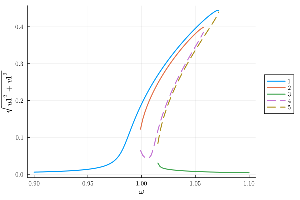
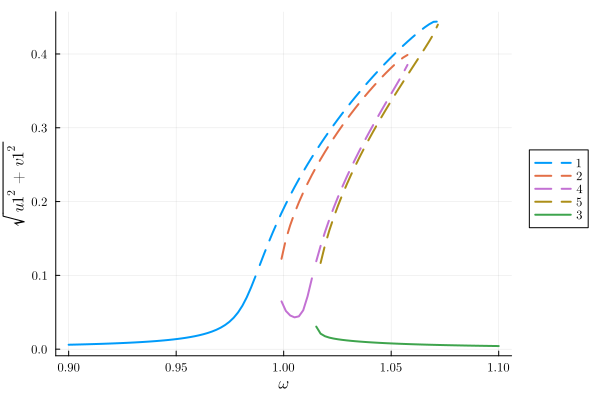
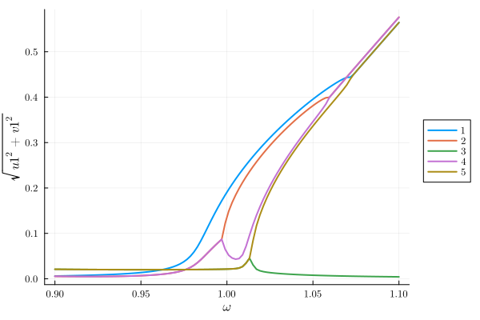
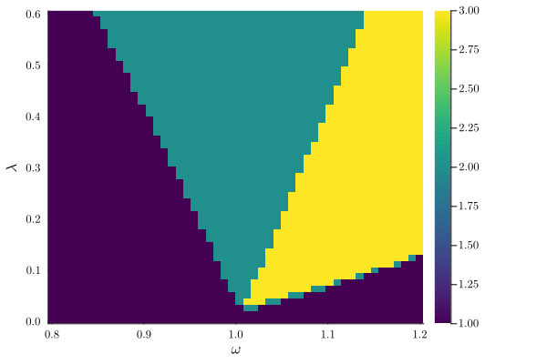
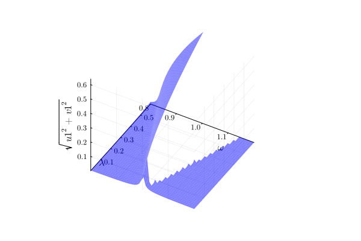

# Parametrically driven resonator {#parametron}

One of the most famous effects displaced by nonlinear oscillators is parametric resonance, where the frequency of the linear resonator is modulated in time [Phys. Rev. E 94, 022201 (2016)](https://doi.org/10.1103/PhysRevE.94.022201). In the following we analyse this system, governed by the equations

$$\ddot{x}(t)+\gamma\dot{x}(t)+\Omega^2(1-\lambda\cos(2\omega t + \psi))x + \alpha x^3 +\eta x^2 \dot{x}+F_\text{d}(t)=0$$

where for completeness we also considered an external drive term $F_\text{d}(t)=F\cos(\omega t + \theta)$ and a nonlinear damping term $\eta x^2 \dot{x}$

To implement this system in Harmonic Balance, we first import the library

```julia
using HarmonicBalance, Plots
```


Subsequently, we type define parameters in the problem and the oscillating amplitude function $x(t)$ using the `variables` macro from `Symbolics.jl`

```julia
@variables ω₀ γ λ F η α ω t x(t)

natural_equation =
    d(d(x, t), t) +
    γ * d(x, t) +
    (ω₀^2 - λ * cos(2 * ω * t)) * x +
    α * x^3 +
    η * d(x, t) * x^2
forces = F * cos(ω * t)
diff_eq = DifferentialEquation(natural_equation + forces, x)
```


```ansi
System of 1 differential equations
Variables:       x(t)
Harmonic ansatz: x(t) => ;   

Differential(t)(Differential(t)(x(t))) + F*cos(t*ω) + Differential(t)(x(t))*γ + x(t)*(-cos(2t*ω)*λ + ω₀^2) + (x(t)^3)*α + (x(t)^2)*Differential(t)(x(t))*η ~ 0

```


Note that an equation of the form

$$m \ddot{x}+m \omega_{0}^{2}\left(1-\lambda \cos (2\omega t+\psi)\right) x+\gamma \dot{x}+\alpha x^{3}+\eta x^{2} \dot{x}=F \cos \omega t$$

can be brought to dimensionless form by rescaling the units as described in [Phys. Rev. E 94, 022201 (2016)](https://doi.org/10.1103/PhysRevE.94.022201).

We are interested in studying the response of the oscillator to parametric driving and forcing. In particular, we focus on the first parametric resonance of the system, i.e. operating around twice the bare frequency of the undriven oscillator $\omega$ while the frequency of the external drive is also $\omega$. For this purpose, we consider a harmonic ansatz which contains a single frequency: $x(t)\approx u\cos(\omega t)+v\sin(\omega t)$. In HarmonicBalance, we can do this via `add_harmonic` command:

```julia
add_harmonic!(diff_eq, x, ω);
```


and replacing this by the time independent (averaged) equations of motion. This can be simply done by writing

```julia
harmonic_eq = get_harmonic_equations(diff_eq)
```


```ansi
A set of 2 harmonic equations
Variables: u1(T), v1(T)
Parameters: ω, α, γ, ω₀, λ, η, F

Harmonic ansatz: 
x(t) = u1(T)*cos(ωt) + v1(T)*sin(ωt)

Harmonic equations:

F - (1//2)*u1(T)*λ + (2//1)*Differential(T)(v1(T))*ω + Differential(T)(u1(T))*γ - u1(T)*(ω^2) + u1(T)*(ω₀^2) + v1(T)*γ*ω + (3//4)*(u1(T)^3)*α + (3//4)*(u1(T)^2)*Differential(T)(u1(T))*η + (1//2)*u1(T)*Differential(T)(v1(T))*v1(T)*η + (3//4)*u1(T)*(v1(T)^2)*α + (1//4)*(v1(T)^2)*Differential(T)(u1(T))*η + (1//4)*(u1(T)^2)*v1(T)*η*ω + (1//4)*(v1(T)^3)*η*ω ~ 0

Differential(T)(v1(T))*γ + (1//2)*v1(T)*λ - (2//1)*Differential(T)(u1(T))*ω - u1(T)*γ*ω - v1(T)*(ω^2) + v1(T)*(ω₀^2) + (1//4)*(u1(T)^2)*Differential(T)(v1(T))*η + (3//4)*(u1(T)^2)*v1(T)*α + (1//2)*u1(T)*v1(T)*Differential(T)(u1(T))*η + (3//4)*Differential(T)(v1(T))*(v1(T)^2)*η + (3//4)*(v1(T)^3)*α - (1//4)*(u1(T)^3)*η*ω - (1//4)*u1(T)*(v1(T)^2)*η*ω ~ 0

```


The output of these equations are consistent with the result found in the literature. Now we are interested in the linear response spectrum, which we can obtain from the solutions to the averaged equations (rotating frame) as a function of the external drive, after fixing all other parameters in the system. A call to `get_steady_states` then retrieves all steadystates found along the sweep employing the homotopy continuation method, which occurs in a complex space (see the nice [HomotopyContinuation.jl docs](https://www.juliahomotopycontinuation.org))

## 1D parameters {#1D-parameters}

We start with a `varied` set containing one parameter, $\omega$,

```julia
fixed = (ω₀ => 1.0, γ => 1e-2, λ => 5e-2, F => 1e-3, α => 1.0, η => 0.3)
varied = ω => range(0.9, 1.1, 100)

result = get_steady_states(harmonic_eq, varied, fixed)
```


```ansi
A steady state result for 100 parameter points

Solution branches:   5
   of which real:    5
   of which stable:  3

Classes: stable, physical, Hopf

```


In `get_steady_states`, the default method `WarmUp()` initiates the homotopy in a generalised version of the harmonic equations, where parameters become random complex numbers. A parameter homotopy then follows to each of the frequency values $\omega$ in sweep. This offers speed-up, but requires to be tested in each scenario against the method `TotalDegree`, which initializes the homotopy in a total degree system (maximum number of roots), but needs to track significantly more homotopy paths and there is slower.

After solving the system, we can save the full output of the simulation and the model (e.g. symbolic expressions for the harmonic equations) into a file

```julia
HarmonicBalance.save("parametron_result.jld2", result);
```


During the execution of `get_steady_states`, different solution branches are classified by their proximity in complex space, with subsequent filtering of real (physically acceptable solutions). In addition, the stability properties of each steady state is assessed from the eigenvalues of the Jacobian matrix. All this information can be succinctly represented in a 1D plot via

```julia
plot(result; x="ω", y="sqrt(u1^2 + v1^2)")
```

{width=600px height=400px}

The user can also introduce custom classes based on parameter conditions via `classify_solutions!`. Plots can be overlaid and use keywords from `Plots`,
MarkdownAST.LineBreak()


```julia
classify_solutions!(result, "sqrt(u1^2 + v1^2) > 0.1", "large")
plot(result, "sqrt(u1^2 + v1^2)"; class=["physical", "large"], style=:dash)
plot!(result, "sqrt(u1^2 + v1^2)"; not_class="large")
```

{width=600px height=400px}

Alternatively, we may visualise all underlying solutions, including complex ones,

```julia
plot(result, "sqrt(u1^2 + v1^2)"; class="all")
```

{width=600px height=400px}

## 2D parameters {#2D-parameters}

The parametrically driven oscillator boasts a stability diagram called &quot;Arnold&#39;s tongues&quot; delineating zones where the oscillator is stable from those where it is exponentially unstable (if the nonlinearity was absence).  We can retrieve this diagram by calculating the steady states as a function of external detuning $\delta=\omega_L-\omega_0$ and the parametric drive strength $\lambda$.

To perform a 2D sweep over driving frequency $\omega$ and parametric drive strength $\lambda$, we keep `fixed` from before but include 2 variables in `varied`

```julia
fixed = (ω₀ => 1.0, γ => 1e-2, F => 1e-3, α => 1.0, η => 0.3)
varied = (ω => range(0.8, 1.2, 50), λ => range(0.001, 0.6, 50))
result_2D = get_steady_states(harmonic_eq, varied, fixed);
```


```ansi

Solving for 2500 parameters...   2%|▍                   |  ETA: 0:00:34
   # parameters solved: 44
       # paths tracked: 220






Solving for 2500 parameters...   3%|▌                   |  ETA: 0:00:33
   # parameters solved: 68
       # paths tracked: 340






Solving for 2500 parameters...   4%|▊                   |  ETA: 0:00:32
   # parameters solved: 91
       # paths tracked: 455






Solving for 2500 parameters...   5%|▉                   |  ETA: 0:00:31
   # parameters solved: 116
       # paths tracked: 580






Solving for 2500 parameters...   5%|█▏                  |  ETA: 0:00:32
   # parameters solved: 136
       # paths tracked: 680






Solving for 2500 parameters...   6%|█▎                  |  ETA: 0:00:31
   # parameters solved: 160
       # paths tracked: 800






Solving for 2500 parameters...   7%|█▌                  |  ETA: 0:00:31
   # parameters solved: 185
       # paths tracked: 925






Solving for 2500 parameters...   8%|█▋                  |  ETA: 0:00:30
   # parameters solved: 209
       # paths tracked: 1045






Solving for 2500 parameters...   9%|█▊                  |  ETA: 0:00:31
   # parameters solved: 225
       # paths tracked: 1125






Solving for 2500 parameters...  10%|██                  |  ETA: 0:00:30
   # parameters solved: 251
       # paths tracked: 1255






Solving for 2500 parameters...  11%|██▎                 |  ETA: 0:00:30
   # parameters solved: 275
       # paths tracked: 1375






Solving for 2500 parameters...  12%|██▍                 |  ETA: 0:00:30
   # parameters solved: 294
       # paths tracked: 1470






Solving for 2500 parameters...  13%|██▋                 |  ETA: 0:00:29
   # parameters solved: 321
       # paths tracked: 1605






Solving for 2500 parameters...  14%|██▊                 |  ETA: 0:00:29
   # parameters solved: 342
       # paths tracked: 1710






Solving for 2500 parameters...  15%|██▉                 |  ETA: 0:00:28
   # parameters solved: 367
       # paths tracked: 1835






Solving for 2500 parameters...  16%|███▏                |  ETA: 0:00:28
   # parameters solved: 392
       # paths tracked: 1960






Solving for 2500 parameters...  17%|███▎                |  ETA: 0:00:28
   # parameters solved: 414
       # paths tracked: 2070






Solving for 2500 parameters...  17%|███▌                |  ETA: 0:00:28
   # parameters solved: 436
       # paths tracked: 2180






Solving for 2500 parameters...  19%|███▊                |  ETA: 0:00:27
   # parameters solved: 465
       # paths tracked: 2325






Solving for 2500 parameters...  20%|███▉                |  ETA: 0:00:27
   # parameters solved: 488
       # paths tracked: 2440






Solving for 2500 parameters...  20%|████▏               |  ETA: 0:00:26
   # parameters solved: 512
       # paths tracked: 2560






Solving for 2500 parameters...  21%|████▎               |  ETA: 0:00:26
   # parameters solved: 536
       # paths tracked: 2680






Solving for 2500 parameters...  22%|████▌               |  ETA: 0:00:26
   # parameters solved: 556
       # paths tracked: 2780






Solving for 2500 parameters...  23%|████▋               |  ETA: 0:00:25
   # parameters solved: 581
       # paths tracked: 2905






Solving for 2500 parameters...  24%|████▉               |  ETA: 0:00:25
   # parameters solved: 608
       # paths tracked: 3040






Solving for 2500 parameters...  25%|█████               |  ETA: 0:00:24
   # parameters solved: 632
       # paths tracked: 3160






Solving for 2500 parameters...  26%|█████▎              |  ETA: 0:00:24
   # parameters solved: 653
       # paths tracked: 3265






Solving for 2500 parameters...  27%|█████▍              |  ETA: 0:00:24
   # parameters solved: 677
       # paths tracked: 3385






Solving for 2500 parameters...  28%|█████▋              |  ETA: 0:00:24
   # parameters solved: 696
       # paths tracked: 3480






Solving for 2500 parameters...  29%|█████▊              |  ETA: 0:00:23
   # parameters solved: 720
       # paths tracked: 3600






Solving for 2500 parameters...  30%|█████▉              |  ETA: 0:00:23
   # parameters solved: 742
       # paths tracked: 3710






Solving for 2500 parameters...  31%|██████▏             |  ETA: 0:00:23
   # parameters solved: 765
       # paths tracked: 3825






Solving for 2500 parameters...  31%|██████▎             |  ETA: 0:00:23
   # parameters solved: 781
       # paths tracked: 3905






Solving for 2500 parameters...  32%|██████▌             |  ETA: 0:00:23
   # parameters solved: 805
       # paths tracked: 4025






Solving for 2500 parameters...  33%|██████▋             |  ETA: 0:00:22
   # parameters solved: 831
       # paths tracked: 4155






Solving for 2500 parameters...  34%|██████▉             |  ETA: 0:00:22
   # parameters solved: 858
       # paths tracked: 4290






Solving for 2500 parameters...  35%|███████             |  ETA: 0:00:22
   # parameters solved: 877
       # paths tracked: 4385






Solving for 2500 parameters...  36%|███████▎            |  ETA: 0:00:21
   # parameters solved: 901
       # paths tracked: 4505






Solving for 2500 parameters...  37%|███████▍            |  ETA: 0:00:21
   # parameters solved: 926
       # paths tracked: 4630






Solving for 2500 parameters...  38%|███████▋            |  ETA: 0:00:21
   # parameters solved: 948
       # paths tracked: 4740






Solving for 2500 parameters...  39%|███████▊            |  ETA: 0:00:20
   # parameters solved: 968
       # paths tracked: 4840






Solving for 2500 parameters...  40%|███████▉            |  ETA: 0:00:20
   # parameters solved: 988
       # paths tracked: 4940






Solving for 2500 parameters...  40%|████████▏           |  ETA: 0:00:20
   # parameters solved: 1012
       # paths tracked: 5060






Solving for 2500 parameters...  41%|████████▎           |  ETA: 0:00:20
   # parameters solved: 1036
       # paths tracked: 5180






Solving for 2500 parameters...  42%|████████▌           |  ETA: 0:00:19
   # parameters solved: 1057
       # paths tracked: 5285






Solving for 2500 parameters...  43%|████████▋           |  ETA: 0:00:19
   # parameters solved: 1081
       # paths tracked: 5405






Solving for 2500 parameters...  44%|████████▉           |  ETA: 0:00:18
   # parameters solved: 1111
       # paths tracked: 5555






Solving for 2500 parameters...  45%|█████████▏          |  ETA: 0:00:18
   # parameters solved: 1133
       # paths tracked: 5665






Solving for 2500 parameters...  46%|█████████▎          |  ETA: 0:00:18
   # parameters solved: 1156
       # paths tracked: 5780






Solving for 2500 parameters...  47%|█████████▌          |  ETA: 0:00:18
   # parameters solved: 1182
       # paths tracked: 5910






Solving for 2500 parameters...  48%|█████████▋          |  ETA: 0:00:17
   # parameters solved: 1207
       # paths tracked: 6035






Solving for 2500 parameters...  49%|█████████▉          |  ETA: 0:00:17
   # parameters solved: 1230
       # paths tracked: 6150






Solving for 2500 parameters...  50%|██████████          |  ETA: 0:00:17
   # parameters solved: 1255
       # paths tracked: 6275






Solving for 2500 parameters...  51%|██████████▎         |  ETA: 0:00:16
   # parameters solved: 1283
       # paths tracked: 6415






Solving for 2500 parameters...  52%|██████████▌         |  ETA: 0:00:16
   # parameters solved: 1306
       # paths tracked: 6530






Solving for 2500 parameters...  53%|██████████▋         |  ETA: 0:00:15
   # parameters solved: 1333
       # paths tracked: 6665






Solving for 2500 parameters...  54%|██████████▉         |  ETA: 0:00:15
   # parameters solved: 1357
       # paths tracked: 6785






Solving for 2500 parameters...  55%|███████████         |  ETA: 0:00:15
   # parameters solved: 1379
       # paths tracked: 6895






Solving for 2500 parameters...  56%|███████████▎        |  ETA: 0:00:15
   # parameters solved: 1400
       # paths tracked: 7000






Solving for 2500 parameters...  57%|███████████▍        |  ETA: 0:00:14
   # parameters solved: 1427
       # paths tracked: 7135






Solving for 2500 parameters...  58%|███████████▋        |  ETA: 0:00:14
   # parameters solved: 1452
       # paths tracked: 7260






Solving for 2500 parameters...  59%|███████████▊        |  ETA: 0:00:14
   # parameters solved: 1475
       # paths tracked: 7375






Solving for 2500 parameters...  60%|████████████        |  ETA: 0:00:13
   # parameters solved: 1496
       # paths tracked: 7480






Solving for 2500 parameters...  61%|████████████▏       |  ETA: 0:00:13
   # parameters solved: 1520
       # paths tracked: 7600






Solving for 2500 parameters...  62%|████████████▎       |  ETA: 0:00:13
   # parameters solved: 1539
       # paths tracked: 7695






Solving for 2500 parameters...  62%|████████████▌       |  ETA: 0:00:12
   # parameters solved: 1560
       # paths tracked: 7800






Solving for 2500 parameters...  63%|████████████▋       |  ETA: 0:00:12
   # parameters solved: 1582
       # paths tracked: 7910






Solving for 2500 parameters...  64%|████████████▉       |  ETA: 0:00:12
   # parameters solved: 1604
       # paths tracked: 8020






Solving for 2500 parameters...  65%|█████████████       |  ETA: 0:00:12
   # parameters solved: 1625
       # paths tracked: 8125






Solving for 2500 parameters...  66%|█████████████▏      |  ETA: 0:00:11
   # parameters solved: 1645
       # paths tracked: 8225






Solving for 2500 parameters...  67%|█████████████▍      |  ETA: 0:00:11
   # parameters solved: 1665
       # paths tracked: 8325






Solving for 2500 parameters...  68%|█████████████▌      |  ETA: 0:00:11
   # parameters solved: 1688
       # paths tracked: 8440






Solving for 2500 parameters...  68%|█████████████▋      |  ETA: 0:00:11
   # parameters solved: 1709
       # paths tracked: 8545






Solving for 2500 parameters...  69%|█████████████▉      |  ETA: 0:00:10
   # parameters solved: 1729
       # paths tracked: 8645






Solving for 2500 parameters...  70%|██████████████      |  ETA: 0:00:10
   # parameters solved: 1750
       # paths tracked: 8750






Solving for 2500 parameters...  71%|██████████████▏     |  ETA: 0:00:10
   # parameters solved: 1772
       # paths tracked: 8860






Solving for 2500 parameters...  72%|██████████████▍     |  ETA: 0:00:09
   # parameters solved: 1796
       # paths tracked: 8980






Solving for 2500 parameters...  73%|██████████████▋     |  ETA: 0:00:09
   # parameters solved: 1822
       # paths tracked: 9110






Solving for 2500 parameters...  74%|██████████████▊     |  ETA: 0:00:09
   # parameters solved: 1845
       # paths tracked: 9225






Solving for 2500 parameters...  75%|███████████████     |  ETA: 0:00:08
   # parameters solved: 1871
       # paths tracked: 9355






Solving for 2500 parameters...  76%|███████████████▏    |  ETA: 0:00:08
   # parameters solved: 1894
       # paths tracked: 9470






Solving for 2500 parameters...  77%|███████████████▍    |  ETA: 0:00:08
   # parameters solved: 1921
       # paths tracked: 9605






Solving for 2500 parameters...  78%|███████████████▌    |  ETA: 0:00:07
   # parameters solved: 1945
       # paths tracked: 9725






Solving for 2500 parameters...  79%|███████████████▊    |  ETA: 0:00:07
   # parameters solved: 1970
       # paths tracked: 9850






Solving for 2500 parameters...  80%|████████████████    |  ETA: 0:00:07
   # parameters solved: 1993
       # paths tracked: 9965






Solving for 2500 parameters...  81%|████████████████▏   |  ETA: 0:00:06
   # parameters solved: 2017
       # paths tracked: 10085






Solving for 2500 parameters...  82%|████████████████▍   |  ETA: 0:00:06
   # parameters solved: 2044
       # paths tracked: 10220






Solving for 2500 parameters...  83%|████████████████▌   |  ETA: 0:00:06
   # parameters solved: 2065
       # paths tracked: 10325






Solving for 2500 parameters...  83%|████████████████▊   |  ETA: 0:00:06
   # parameters solved: 2087
       # paths tracked: 10435






Solving for 2500 parameters...  85%|████████████████▉   |  ETA: 0:00:05
   # parameters solved: 2113
       # paths tracked: 10565






Solving for 2500 parameters...  86%|█████████████████▏  |  ETA: 0:00:05
   # parameters solved: 2138
       # paths tracked: 10690






Solving for 2500 parameters...  87%|█████████████████▎  |  ETA: 0:00:04
   # parameters solved: 2163
       # paths tracked: 10815






Solving for 2500 parameters...  88%|█████████████████▌  |  ETA: 0:00:04
   # parameters solved: 2188
       # paths tracked: 10940






Solving for 2500 parameters...  89%|█████████████████▊  |  ETA: 0:00:04
   # parameters solved: 2213
       # paths tracked: 11065






Solving for 2500 parameters...  89%|█████████████████▉  |  ETA: 0:00:04
   # parameters solved: 2234
       # paths tracked: 11170






Solving for 2500 parameters...  90%|██████████████████▏ |  ETA: 0:00:03
   # parameters solved: 2259
       # paths tracked: 11295






Solving for 2500 parameters...  92%|██████████████████▎ |  ETA: 0:00:03
   # parameters solved: 2289
       # paths tracked: 11445






Solving for 2500 parameters...  93%|██████████████████▌ |  ETA: 0:00:02
   # parameters solved: 2320
       # paths tracked: 11600






Solving for 2500 parameters...  94%|██████████████████▊ |  ETA: 0:00:02
   # parameters solved: 2339
       # paths tracked: 11695






Solving for 2500 parameters...  94%|██████████████████▉ |  ETA: 0:00:02
   # parameters solved: 2361
       # paths tracked: 11805






Solving for 2500 parameters...  95%|███████████████████▏|  ETA: 0:00:02
   # parameters solved: 2385
       # paths tracked: 11925






Solving for 2500 parameters...  96%|███████████████████▎|  ETA: 0:00:01
   # parameters solved: 2407
       # paths tracked: 12035






Solving for 2500 parameters...  97%|███████████████████▌|  ETA: 0:00:01
   # parameters solved: 2430
       # paths tracked: 12150






Solving for 2500 parameters...  98%|███████████████████▋|  ETA: 0:00:01
   # parameters solved: 2451
       # paths tracked: 12255






Solving for 2500 parameters...  99%|███████████████████▊|  ETA: 0:00:00
   # parameters solved: 2474
       # paths tracked: 12370






Solving for 2500 parameters...  99%|████████████████████|  ETA: 0:00:00
   # parameters solved: 2496
       # paths tracked: 12480






Solving for 2500 parameters... 100%|████████████████████| Time: 0:00:33
   # parameters solved: 2500
       # paths tracked: 12500
```


Now, we count the number of solutions for each point and represent the corresponding phase diagram in parameter space. This is done using `plot_phase_diagram`. Only counting stable solutions,

```julia
plot_phase_diagram(result_2D; class="stable")
```

{width=600px height=400px}

In addition to phase diagrams, we can plot functions of the solution. The syntax is identical to 1D plotting. Let us overlay 2 branches into a single plot,

```julia
# overlay branches with different colors
plot(result_2D, "sqrt(u1^2 + v1^2)"; branch=1, class="stable", camera=(60, -40))
plot!(result_2D, "sqrt(u1^2 + v1^2)"; branch=2, class="stable", color=:red)
```

{width=600px height=400px}

Note that solutions are ordered in parameter space according to their closest neighbors. Plots can again be limited to a given class (e.g stable solutions only) through the keyword argument `class`.


---


_This page was generated using [Literate.jl](https://github.com/fredrikekre/Literate.jl)._
