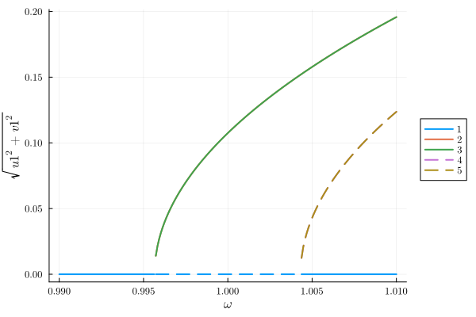
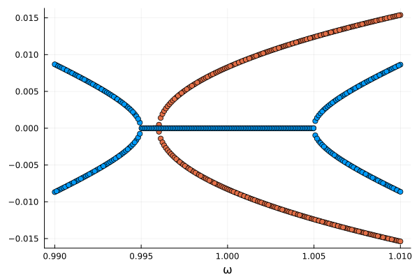
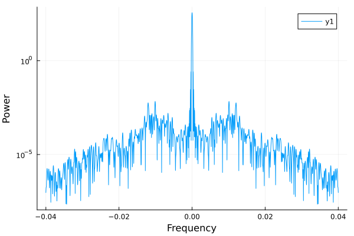
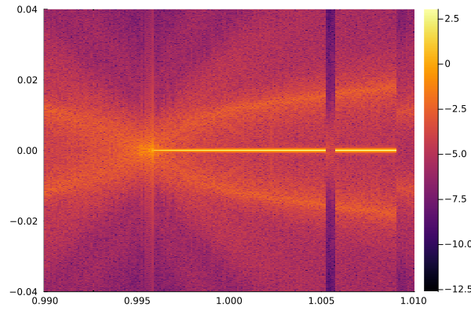
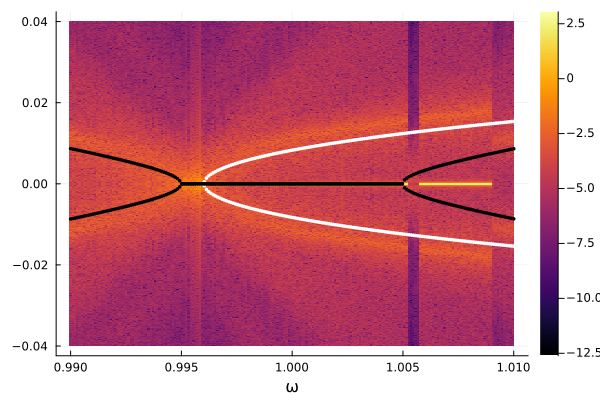

# Ab Initio Noise sidebands and spectra {#Ab-Initio-Noise-sidebands-and-spectra}

This example demonstrates how to compute the spectra obtained from probing the system with noisy probe.

```julia
using HarmonicBalance, Plots
using ModelingToolkit, StaticArrays, StochasticDiffEq, DSP
using ModelingToolkit: setp
```


We first define a  gelper function to compute power spectral density of the simulated response

```julia
function outputpsd(sol; fs=1.0)
    xt = getindex.(sol.u, 1)
    pxx = periodogram(
        xt; fs=fs, nfft=nextfastfft(10 * length(xt)), window=DSP.hanning, onesided=false
    )

    freqω = freq(pxx) * 2π
    perm = sortperm(freqω)
    freqlowidx = argmin(abs.(freqω[perm] .+ 0.04))
    freqhighidx = argmin(abs.(freqω[perm] .- 0.04))
    return freqω[perm][freqlowidx:freqhighidx], power(pxx)[perm][freqlowidx:freqhighidx]
end
```


```ansi
outputpsd (generic function with 1 method)
```


We define the parametric oscillator using the HarmonicBalance.jl package and compute effective equations of motion at the frequency $\omega$.

```julia
@variables ω₀ γ λ F α ω t x(t)
@variables T u1(T) v1(T)

natural_equation = d(d(x, t), t) + γ * d(x, t) + (ω₀^2 - λ * cos(2 * ω * t)) * x + α * x^3
diff_eq = DifferentialEquation(natural_equation, x)

add_harmonic!(diff_eq, x, ω);
harmonic_eq = get_harmonic_equations(diff_eq)
```


```ansi
A set of 2 harmonic equations
Variables: u1(T), v1(T)
Parameters: ω, α, γ, ω₀, λ

Harmonic ansatz: 
x(t) = u1(T)*cos(ωt) + v1(T)*sin(ωt)

Harmonic equations:

-(1//2)*u1(T)*λ + (2//1)*Differential(T)(v1(T))*ω + Differential(T)(u1(T))*γ - u1(T)*(ω^2) + u1(T)*(ω₀^2) + v1(T)*γ*ω + (3//4)*(u1(T)^3)*α + (3//4)*u1(T)*(v1(T)^2)*α ~ 0

Differential(T)(v1(T))*γ + (1//2)*v1(T)*λ - (2//1)*Differential(T)(u1(T))*ω - u1(T)*γ*ω - v1(T)*(ω^2) + v1(T)*(ω₀^2) + (3//4)*(u1(T)^2)*v1(T)*α + (3//4)*(v1(T)^3)*α ~ 0

```


We can compute the steady states of the system using HomotopyContinuation.jl.

```julia
ωrange = range(0.99, 1.01, 200)
fixed = Dict(ω₀ => 1.0, γ => 0.005, λ => 0.02, α => 1.0)
varied = Dict(ω => ωrange)
result = get_steady_states(harmonic_eq, TotalDegree(), varied, fixed)

plot(result; y="sqrt(u1^2 + v1^2)")
```

{width=600px height=400px}

The sidebands from for the steady states will look like

```julia
sidebands1 = reduce(hcat, imag.(eigenvalues(result, 1)))'
sidebands2 = reduce(hcat, imag.(eigenvalues(result, 2)))'
scatter(ωrange, sidebands2; xlab="ω", legend=false, c=2)
scatter!(ωrange, sidebands1; xlab="ω", legend=false, c=1)
```

{width=600px height=400px}

Let us now reproduce this sidebands using a noise probe. We use the ModelingToolkit extension to define the stochastic differential equation system from the harmonic equations. The resulting system will have addtivce white noise with a noise strength $\sigma = 0.00005$ for each variable.

```julia
odesystem = ODESystem(harmonic_eq)
noiseeqs = [0.00005, 0.00005]  # Define noise amplitude for each variable
@mtkbuild sdesystem = SDESystem(odesystem, noiseeqs)

param = Dict(ω₀ => 1.0, γ => 0.005, λ => 0.02, α => 1.0, ω => 1.0)
Ttr = 10_000.0
T = 50_000.0
tspan = (0.0, Ttr + T)
times = range((Ttr, Ttr + T)...; step=1)

sdeproblem = SDEProblem{false}(
    sdesystem, SA[ones(2)...], tspan, param; jac=true, u0_constructor=x -> SVector(x...)
)
```


```ansi
SDEProblem with uType StaticArraysCore.SVector{2, Float64} and tType Float64. In-place: false
Initialization status: FULLY_DETERMINED
Non-trivial mass matrix: false
timespan: (0.0, 60000.0)
u0: 2-element StaticArraysCore.SVector{2, Float64} with indices SOneTo(2):
 1.0
 1.0
```


Here we use StaticArrays and pass the jacobian to the integrater to speed up the computation.

Evolving the system and computing the power spectral density of the response gives

```julia
sol = solve(sdeproblem, SRA(); saveat=times)
freqω, psd = outputpsd(sol)
plot(freqω, psd; yscale=:log10, xlabel="Frequency", ylabel="Power")
```

{width=600px height=400px}

We will perform parameter sweep to generate noise spectra across the driving frequency $\omega$. For this we use the `EnsembleProblem` API from the SciML ecosystem.

```julia
setter! = setp(sdesystem, ω)
prob_func(prob, i, repeat) = (prob′=remake(prob); setter!(prob′, ωrange[i]); prob′)
output_func(sol, i) = (outputpsd(sol), false)
prob_ensemble = EnsembleProblem(sdeproblem; prob_func=prob_func, output_func=output_func)
sol_ensemble = solve(
    prob_ensemble,
    SRA(),
    EnsembleThreads();
    trajectories=length(ωrange),
    saveat=times,
    maxiters=1e7,
)
```


```ansi
EnsembleSolution Solution of length 200 with uType:
Tuple{Any, Any}
```


We find the spectrum

```julia
probe = getindex.(sol_ensemble.u, 1)[1]
spectrum = log10.(reduce(hcat, getindex.(sol_ensemble.u, 2)))
heatmap(ωrange, probe, spectrum)
```

{width=600px height=400px}

Remember that we don&#39;t do a continuation of the system, but rather initlized the system at each frequency $\omega$ and evolve it for a fixed time $T$. This leads to imperfections in the spectrum. However, if we plot the sidebands computed with HomotopyContinuation.jl on top of the spectrum, we find descent match.

```julia
heatmap(ωrange, probe, spectrum)
scatter!(ωrange, sidebands2; xlab="ω", legend=false, c=:white, markerstrokewidth=0, ms=2)
scatter!(ωrange, sidebands1; xlab="ω", legend=false, c=:black, markerstrokewidth=0, ms=2)
```

{width=600px height=400px}


---


_This page was generated using [Literate.jl](https://github.com/fredrikekre/Literate.jl)._
