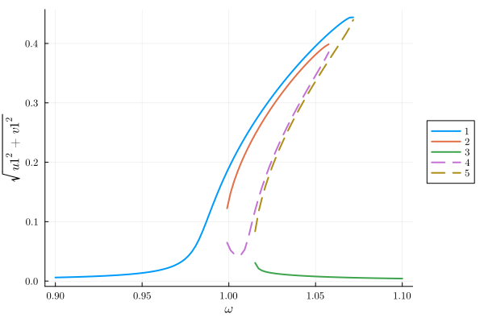

# Parametrically driven resonator {#parametron}

One of the most famous effects displaced by nonlinear oscillators is parametric resonance, where the frequency of the linear resonator is modulated in time [Phys. Rev. E 94, 022201 (2016)](https://doi.org/10.1103/PhysRevE.94.022201). In the following we analyse this system, governed by the equations

$$\ddot{x}(t)+\gamma\dot{x}(t)+\Omega^2(1-\lambda\cos(2\omega t + \psi))x + \alpha x^3 +\eta x^2 \dot{x}+F_\text{d}(t)=0$$

where for completeness we also considered an external drive term $F_\text{d}(t)=F\cos(\omega t + \theta)$ and a nonlinear damping term $\eta x^2 \dot{x}$

To implement this system in Harmonic Balance, we first import the library

```julia
using HarmonicBalance, Plots
```


Subsequently, we type define parameters in the problem and the oscillating amplitude function $x(t)$ using the `variables` macro from `Symbolics.jl`

```julia
@variables ω₀ γ λ F η α ω t x(t)

natural_equation =
    d(d(x, t), t) +
    γ * d(x, t) +
    (ω₀^2 - λ * cos(2 * ω * t)) * x +
    α * x^3 +
    η * d(x, t) * x^2
forces = F * cos(ω * t)
diff_eq = DifferentialEquation(natural_equation + forces, x)
```


```ansi
System of 1 differential equations
Variables:       x(t)
Harmonic ansatz: x(t) => ;   

Differential(t)(Differential(t)(x(t))) + F*cos(t*ω) + Differential(t)(x(t))*γ + x(t)*(-cos(2t*ω)*λ + ω₀^2) + (x(t)^3)*α + (x(t)^2)*Differential(t)(x(t))*η ~ 0

```


Note that an equation of the form

$$m \ddot{x}+m \omega_{0}^{2}\left(1-\lambda \cos (2\omega t+\psi)\right) x+\gamma \dot{x}+\alpha x^{3}+\eta x^{2} \dot{x}=F \cos \omega t$$

can be brought to dimensionless form by rescaling the units as described in [Phys. Rev. E 94, 022201 (2016)](https://doi.org/10.1103/PhysRevE.94.022201).

We are interested in studying the response of the oscillator to parametric driving and forcing. In particular, we focus on the first parametric resonance of the system, i.e. operating around twice the bare frequency of the undriven oscillator $\omega$ while the frequency of the external drive is also $\omega$. For this purpose, we consider a harmonic ansatz which contains a single frequency: $x(t)\approx u\cos(\omega t)+v\sin(\omega t)$. In HarmonicBalance, we can do this via `add_harmonic` command:

```julia
add_harmonic!(diff_eq, x, ω);
```


and replacing this by the time independent (averaged) equations of motion. This can be simply done by writing

```julia
harmonic_eq = get_harmonic_equations(diff_eq)
```


```ansi
A set of 2 harmonic equations
Variables: u1(T), v1(T)
Parameters: ω, α, γ, ω₀, λ, η, F

Harmonic ansatz: 
x(t) = u1(T)*cos(ωt) + v1(T)*sin(ωt)

Harmonic equations:

F - (1//2)*u1(T)*λ + (2//1)*Differential(T)(v1(T))*ω + Differential(T)(u1(T))*γ - u1(T)*(ω^2) + u1(T)*(ω₀^2) + v1(T)*γ*ω + (3//4)*(u1(T)^3)*α + (3//4)*(u1(T)^2)*Differential(T)(u1(T))*η + (1//2)*u1(T)*Differential(T)(v1(T))*v1(T)*η + (3//4)*u1(T)*(v1(T)^2)*α + (1//4)*(v1(T)^2)*Differential(T)(u1(T))*η + (1//4)*(u1(T)^2)*v1(T)*η*ω + (1//4)*(v1(T)^3)*η*ω ~ 0

Differential(T)(v1(T))*γ + (1//2)*v1(T)*λ - (2//1)*Differential(T)(u1(T))*ω - u1(T)*γ*ω - v1(T)*(ω^2) + v1(T)*(ω₀^2) + (1//4)*(u1(T)^2)*Differential(T)(v1(T))*η + (3//4)*(u1(T)^2)*v1(T)*α + (1//2)*u1(T)*v1(T)*Differential(T)(u1(T))*η + (3//4)*Differential(T)(v1(T))*(v1(T)^2)*η + (3//4)*(v1(T)^3)*α - (1//4)*(u1(T)^3)*η*ω - (1//4)*u1(T)*(v1(T)^2)*η*ω ~ 0

```


The output of these equations are consistent with the result found in the literature. Now we are interested in the linear response spectrum, which we can obtain from the solutions to the averaged equations (rotating frame) as a function of the external drive, after fixing all other parameters in the system. A call to `get_steady_states` then retrieves all steadystates found along the sweep employing the homotopy continuation method, which occurs in a complex space (see the nice [HomotopyContinuation.jl docs](https://www.juliahomotopycontinuation.org))

## 1D parameters {#1D-parameters}

We start with a `varied` set containing one parameter, $\omega$,

```julia
fixed = (ω₀ => 1.0, γ => 1e-2, λ => 5e-2, F => 1e-3, α => 1.0, η => 0.3)
varied = ω => range(0.9, 1.1, 100)

result = get_steady_states(harmonic_eq, varied, fixed)
```


```ansi
A steady state result for 100 parameter points

Solution branches:   5
   of which real:    5
   of which stable:  3

Classes: stable, physical, Hopf

```


In `get_steady_states`, the default method `WarmUp()` initiates the homotopy in a generalised version of the harmonic equations, where parameters become random complex numbers. A parameter homotopy then follows to each of the frequency values $\omega$ in sweep. This offers speed-up, but requires to be tested in each scenario against the method `TotalDegree`, which initializes the homotopy in a total degree system (maximum number of roots), but needs to track significantly more homotopy paths and there is slower.

After solving the system, we can save the full output of the simulation and the model (e.g. symbolic expressions for the harmonic equations) into a file

```julia
HarmonicBalance.save("parametron_result.jld2", result);
```


During the execution of `get_steady_states`, different solution branches are classified by their proximity in complex space, with subsequent filtering of real (physically acceptable solutions). In addition, the stability properties of each steady state is assessed from the eigenvalues of the Jacobian matrix. All this information can be succinctly represented in a 1D plot via

```julia
plot(result; x="ω", y="sqrt(u1^2 + v1^2)")
```

{width=600px height=400px}

The user can also introduce custom classes based on parameter conditions via `classify_solutions!`. Plots can be overlaid and use keywords from `Plots`,
MarkdownAST.LineBreak()


```julia
classify_solutions!(result, "sqrt(u1^2 + v1^2) > 0.1", "large")
plot(result, "sqrt(u1^2 + v1^2)"; class=["physical", "large"], style=:dash)
plot!(result, "sqrt(u1^2 + v1^2)"; not_class="large")
```

{width=600px height=400px}

Alternatively, we may visualise all underlying solutions, including complex ones,

```julia
plot(result, "sqrt(u1^2 + v1^2)"; class="all")
```

{width=600px height=400px}

## 2D parameters {#2D-parameters}

The parametrically driven oscillator boasts a stability diagram called &quot;Arnold&#39;s tongues&quot; delineating zones where the oscillator is stable from those where it is exponentially unstable (if the nonlinearity was absence).  We can retrieve this diagram by calculating the steady states as a function of external detuning $\delta=\omega_L-\omega_0$ and the parametric drive strength $\lambda$.

To perform a 2D sweep over driving frequency $\omega$ and parametric drive strength $\lambda$, we keep `fixed` from before but include 2 variables in `varied`

```julia
fixed = (ω₀ => 1.0, γ => 1e-2, F => 1e-3, α => 1.0, η => 0.3)
varied = (ω => range(0.8, 1.2, 50), λ => range(0.001, 0.6, 50))
result_2D = get_steady_states(harmonic_eq, varied, fixed);
```


```ansi


Solving for 2500 parameters...   2%|▍                   |  ETA: 0:00:32
   # parameters solved: 48
       # paths tracked: 240











Solving for 2500 parameters...   3%|▋                   |  ETA: 0:00:31
   # parameters solved: 72
       # paths tracked: 360











Solving for 2500 parameters...   4%|▊                   |  ETA: 0:00:31
   # parameters solved: 97
       # paths tracked: 485











Solving for 2500 parameters...   5%|█                   |  ETA: 0:00:31
   # parameters solved: 120
       # paths tracked: 600











Solving for 2500 parameters...   6%|█▏                  |  ETA: 0:00:31
   # parameters solved: 143
       # paths tracked: 715











Solving for 2500 parameters...   7%|█▍                  |  ETA: 0:00:30
   # parameters solved: 168
       # paths tracked: 840











Solving for 2500 parameters...   8%|█▌                  |  ETA: 0:00:30
   # parameters solved: 188
       # paths tracked: 940











Solving for 2500 parameters...   8%|█▋                  |  ETA: 0:00:30
   # parameters solved: 210
       # paths tracked: 1050











Solving for 2500 parameters...   9%|█▉                  |  ETA: 0:00:30
   # parameters solved: 230
       # paths tracked: 1150











Solving for 2500 parameters...  10%|██                  |  ETA: 0:00:30
   # parameters solved: 256
       # paths tracked: 1280











Solving for 2500 parameters...  11%|██▎                 |  ETA: 0:00:30
   # parameters solved: 274
       # paths tracked: 1370











Solving for 2500 parameters...  12%|██▍                 |  ETA: 0:00:30
   # parameters solved: 298
       # paths tracked: 1490











Solving for 2500 parameters...  13%|██▌                 |  ETA: 0:00:30
   # parameters solved: 319
       # paths tracked: 1595











Solving for 2500 parameters...  14%|██▊                 |  ETA: 0:00:29
   # parameters solved: 340
       # paths tracked: 1700











Solving for 2500 parameters...  15%|██▉                 |  ETA: 0:00:29
   # parameters solved: 363
       # paths tracked: 1815











Solving for 2500 parameters...  15%|███▏                |  ETA: 0:00:29
   # parameters solved: 385
       # paths tracked: 1925











Solving for 2500 parameters...  16%|███▎                |  ETA: 0:00:28
   # parameters solved: 411
       # paths tracked: 2055











Solving for 2500 parameters...  17%|███▌                |  ETA: 0:00:28
   # parameters solved: 433
       # paths tracked: 2165











Solving for 2500 parameters...  18%|███▋                |  ETA: 0:00:28
   # parameters solved: 454
       # paths tracked: 2270











Solving for 2500 parameters...  19%|███▉                |  ETA: 0:00:27
   # parameters solved: 478
       # paths tracked: 2390











Solving for 2500 parameters...  20%|████                |  ETA: 0:00:27
   # parameters solved: 506
       # paths tracked: 2530











Solving for 2500 parameters...  21%|████▎               |  ETA: 0:00:27
   # parameters solved: 527
       # paths tracked: 2635











Solving for 2500 parameters...  22%|████▍               |  ETA: 0:00:26
   # parameters solved: 549
       # paths tracked: 2745











Solving for 2500 parameters...  23%|████▋               |  ETA: 0:00:26
   # parameters solved: 572
       # paths tracked: 2860











Solving for 2500 parameters...  24%|████▊               |  ETA: 0:00:26
   # parameters solved: 595
       # paths tracked: 2975











Solving for 2500 parameters...  25%|█████               |  ETA: 0:00:25
   # parameters solved: 618
       # paths tracked: 3090











Solving for 2500 parameters...  26%|█████▏              |  ETA: 0:00:25
   # parameters solved: 645
       # paths tracked: 3225











Solving for 2500 parameters...  27%|█████▍              |  ETA: 0:00:25
   # parameters solved: 665
       # paths tracked: 3325











Solving for 2500 parameters...  27%|█████▌              |  ETA: 0:00:25
   # parameters solved: 684
       # paths tracked: 3420











Solving for 2500 parameters...  28%|█████▋              |  ETA: 0:00:24
   # parameters solved: 710
       # paths tracked: 3550











Solving for 2500 parameters...  29%|█████▉              |  ETA: 0:00:24
   # parameters solved: 734
       # paths tracked: 3670











Solving for 2500 parameters...  30%|██████              |  ETA: 0:00:23
   # parameters solved: 757
       # paths tracked: 3785











Solving for 2500 parameters...  31%|██████▎             |  ETA: 0:00:23
   # parameters solved: 781
       # paths tracked: 3905











Solving for 2500 parameters...  32%|██████▌             |  ETA: 0:00:23
   # parameters solved: 805
       # paths tracked: 4025











Solving for 2500 parameters...  33%|██████▋             |  ETA: 0:00:23
   # parameters solved: 824
       # paths tracked: 4120











Solving for 2500 parameters...  34%|██████▊             |  ETA: 0:00:22
   # parameters solved: 845
       # paths tracked: 4225











Solving for 2500 parameters...  35%|███████             |  ETA: 0:00:22
   # parameters solved: 869
       # paths tracked: 4345











Solving for 2500 parameters...  36%|███████▏            |  ETA: 0:00:22
   # parameters solved: 894
       # paths tracked: 4470











Solving for 2500 parameters...  37%|███████▎            |  ETA: 0:00:21
   # parameters solved: 913
       # paths tracked: 4565











Solving for 2500 parameters...  38%|███████▌            |  ETA: 0:00:21
   # parameters solved: 941
       # paths tracked: 4705











Solving for 2500 parameters...  39%|███████▊            |  ETA: 0:00:21
   # parameters solved: 968
       # paths tracked: 4840











Solving for 2500 parameters...  40%|███████▉            |  ETA: 0:00:20
   # parameters solved: 989
       # paths tracked: 4945











Solving for 2500 parameters...  41%|████████▏           |  ETA: 0:00:20
   # parameters solved: 1013
       # paths tracked: 5065











Solving for 2500 parameters...  42%|████████▎           |  ETA: 0:00:20
   # parameters solved: 1038
       # paths tracked: 5190











Solving for 2500 parameters...  42%|████████▌           |  ETA: 0:00:19
   # parameters solved: 1062
       # paths tracked: 5310











Solving for 2500 parameters...  43%|████████▋           |  ETA: 0:00:19
   # parameters solved: 1080
       # paths tracked: 5400











Solving for 2500 parameters...  44%|████████▊           |  ETA: 0:00:19
   # parameters solved: 1101
       # paths tracked: 5505











Solving for 2500 parameters...  45%|█████████           |  ETA: 0:00:18
   # parameters solved: 1126
       # paths tracked: 5630











Solving for 2500 parameters...  46%|█████████▎          |  ETA: 0:00:18
   # parameters solved: 1153
       # paths tracked: 5765











Solving for 2500 parameters...  47%|█████████▌          |  ETA: 0:00:18
   # parameters solved: 1182
       # paths tracked: 5910











Solving for 2500 parameters...  48%|█████████▋          |  ETA: 0:00:17
   # parameters solved: 1208
       # paths tracked: 6040











Solving for 2500 parameters...  49%|█████████▉          |  ETA: 0:00:17
   # parameters solved: 1236
       # paths tracked: 6180











Solving for 2500 parameters...  50%|██████████          |  ETA: 0:00:17
   # parameters solved: 1256
       # paths tracked: 6280











Solving for 2500 parameters...  51%|██████████▎         |  ETA: 0:00:16
   # parameters solved: 1283
       # paths tracked: 6415











Solving for 2500 parameters...  52%|██████████▌         |  ETA: 0:00:16
   # parameters solved: 1306
       # paths tracked: 6530











Solving for 2500 parameters...  53%|██████████▋         |  ETA: 0:00:16
   # parameters solved: 1325
       # paths tracked: 6625











Solving for 2500 parameters...  54%|██████████▊         |  ETA: 0:00:15
   # parameters solved: 1350
       # paths tracked: 6750











Solving for 2500 parameters...  55%|███████████         |  ETA: 0:00:15
   # parameters solved: 1372
       # paths tracked: 6860











Solving for 2500 parameters...  56%|███████████▎        |  ETA: 0:00:15
   # parameters solved: 1402
       # paths tracked: 7010











Solving for 2500 parameters...  57%|███████████▍        |  ETA: 0:00:14
   # parameters solved: 1426
       # paths tracked: 7130











Solving for 2500 parameters...  58%|███████████▋        |  ETA: 0:00:14
   # parameters solved: 1451
       # paths tracked: 7255











Solving for 2500 parameters...  59%|███████████▊        |  ETA: 0:00:14
   # parameters solved: 1473
       # paths tracked: 7365











Solving for 2500 parameters...  60%|████████████        |  ETA: 0:00:13
   # parameters solved: 1496
       # paths tracked: 7480











Solving for 2500 parameters...  61%|████████████▏       |  ETA: 0:00:13
   # parameters solved: 1518
       # paths tracked: 7590











Solving for 2500 parameters...  62%|████████████▍       |  ETA: 0:00:13
   # parameters solved: 1543
       # paths tracked: 7715











Solving for 2500 parameters...  63%|████████████▌       |  ETA: 0:00:12
   # parameters solved: 1569
       # paths tracked: 7845











Solving for 2500 parameters...  64%|████████████▊       |  ETA: 0:00:12
   # parameters solved: 1593
       # paths tracked: 7965











Solving for 2500 parameters...  65%|████████████▉       |  ETA: 0:00:12
   # parameters solved: 1613
       # paths tracked: 8065











Solving for 2500 parameters...  65%|█████████████▏      |  ETA: 0:00:11
   # parameters solved: 1637
       # paths tracked: 8185











Solving for 2500 parameters...  66%|█████████████▎      |  ETA: 0:00:11
   # parameters solved: 1660
       # paths tracked: 8300











Solving for 2500 parameters...  67%|█████████████▌      |  ETA: 0:00:11
   # parameters solved: 1680
       # paths tracked: 8400











Solving for 2500 parameters...  68%|█████████████▋      |  ETA: 0:00:11
   # parameters solved: 1700
       # paths tracked: 8500











Solving for 2500 parameters...  69%|█████████████▊      |  ETA: 0:00:10
   # parameters solved: 1719
       # paths tracked: 8595











Solving for 2500 parameters...  70%|█████████████▉      |  ETA: 0:00:10
   # parameters solved: 1739
       # paths tracked: 8695











Solving for 2500 parameters...  70%|██████████████▏     |  ETA: 0:00:10
   # parameters solved: 1760
       # paths tracked: 8800











Solving for 2500 parameters...  71%|██████████████▎     |  ETA: 0:00:10
   # parameters solved: 1783
       # paths tracked: 8915











Solving for 2500 parameters...  72%|██████████████▌     |  ETA: 0:00:09
   # parameters solved: 1808
       # paths tracked: 9040











Solving for 2500 parameters...  73%|██████████████▋     |  ETA: 0:00:09
   # parameters solved: 1833
       # paths tracked: 9165











Solving for 2500 parameters...  74%|██████████████▉     |  ETA: 0:00:09
   # parameters solved: 1857
       # paths tracked: 9285











Solving for 2500 parameters...  75%|███████████████     |  ETA: 0:00:08
   # parameters solved: 1877
       # paths tracked: 9385











Solving for 2500 parameters...  76%|███████████████▎    |  ETA: 0:00:08
   # parameters solved: 1899
       # paths tracked: 9495











Solving for 2500 parameters...  77%|███████████████▍    |  ETA: 0:00:08
   # parameters solved: 1921
       # paths tracked: 9605











Solving for 2500 parameters...  78%|███████████████▋    |  ETA: 0:00:07
   # parameters solved: 1948
       # paths tracked: 9740











Solving for 2500 parameters...  79%|███████████████▊    |  ETA: 0:00:07
   # parameters solved: 1969
       # paths tracked: 9845











Solving for 2500 parameters...  80%|███████████████▉    |  ETA: 0:00:07
   # parameters solved: 1991
       # paths tracked: 9955











Solving for 2500 parameters...  80%|████████████████▏   |  ETA: 0:00:07
   # parameters solved: 2009
       # paths tracked: 10045











Solving for 2500 parameters...  81%|████████████████▎   |  ETA: 0:00:06
   # parameters solved: 2033
       # paths tracked: 10165











Solving for 2500 parameters...  82%|████████████████▌   |  ETA: 0:00:06
   # parameters solved: 2055
       # paths tracked: 10275











Solving for 2500 parameters...  83%|████████████████▋   |  ETA: 0:00:06
   # parameters solved: 2078
       # paths tracked: 10390











Solving for 2500 parameters...  84%|████████████████▊   |  ETA: 0:00:05
   # parameters solved: 2100
       # paths tracked: 10500











Solving for 2500 parameters...  85%|█████████████████   |  ETA: 0:00:05
   # parameters solved: 2120
       # paths tracked: 10600











Solving for 2500 parameters...  86%|█████████████████▏  |  ETA: 0:00:05
   # parameters solved: 2144
       # paths tracked: 10720











Solving for 2500 parameters...  87%|█████████████████▍  |  ETA: 0:00:04
   # parameters solved: 2168
       # paths tracked: 10840











Solving for 2500 parameters...  88%|█████████████████▋  |  ETA: 0:00:04
   # parameters solved: 2197
       # paths tracked: 10985











Solving for 2500 parameters...  89%|█████████████████▊  |  ETA: 0:00:04
   # parameters solved: 2219
       # paths tracked: 11095











Solving for 2500 parameters...  90%|█████████████████▉  |  ETA: 0:00:03
   # parameters solved: 2242
       # paths tracked: 11210











Solving for 2500 parameters...  91%|██████████████████▏ |  ETA: 0:00:03
   # parameters solved: 2263
       # paths tracked: 11315











Solving for 2500 parameters...  91%|██████████████████▎ |  ETA: 0:00:03
   # parameters solved: 2285
       # paths tracked: 11425











Solving for 2500 parameters...  93%|██████████████████▌ |  ETA: 0:00:02
   # parameters solved: 2314
       # paths tracked: 11570











Solving for 2500 parameters...  93%|██████████████████▊ |  ETA: 0:00:02
   # parameters solved: 2337
       # paths tracked: 11685











Solving for 2500 parameters...  95%|██████████████████▉ |  ETA: 0:00:02
   # parameters solved: 2363
       # paths tracked: 11815











Solving for 2500 parameters...  95%|███████████████████▏|  ETA: 0:00:02
   # parameters solved: 2385
       # paths tracked: 11925











Solving for 2500 parameters...  96%|███████████████████▎|  ETA: 0:00:01
   # parameters solved: 2405
       # paths tracked: 12025











Solving for 2500 parameters...  97%|███████████████████▌|  ETA: 0:00:01
   # parameters solved: 2431
       # paths tracked: 12155











Solving for 2500 parameters...  98%|███████████████████▋|  ETA: 0:00:01
   # parameters solved: 2456
       # paths tracked: 12280











Solving for 2500 parameters...  99%|███████████████████▊|  ETA: 0:00:00
   # parameters solved: 2476
       # paths tracked: 12380











Solving for 2500 parameters... 100%|████████████████████| Time: 0:00:33
   # parameters solved: 2500
       # paths tracked: 12500
```


Now, we count the number of solutions for each point and represent the corresponding phase diagram in parameter space. This is done using `plot_phase_diagram`. Only counting stable solutions,

```julia
plot_phase_diagram(result_2D; class="stable")
```

{width=600px height=400px}

In addition to phase diagrams, we can plot functions of the solution. The syntax is identical to 1D plotting. Let us overlay 2 branches into a single plot,

```julia
# overlay branches with different colors
plot(result_2D, "sqrt(u1^2 + v1^2)"; branch=1, class="stable", camera=(60, -40))
plot!(result_2D, "sqrt(u1^2 + v1^2)"; branch=2, class="stable", color=:red)
```

{width=600px height=400px}

Note that solutions are ordered in parameter space according to their closest neighbors. Plots can again be limited to a given class (e.g stable solutions only) through the keyword argument `class`.


---


_This page was generated using [Literate.jl](https://github.com/fredrikekre/Literate.jl)._
