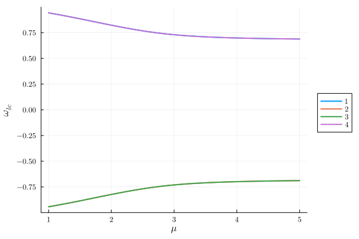
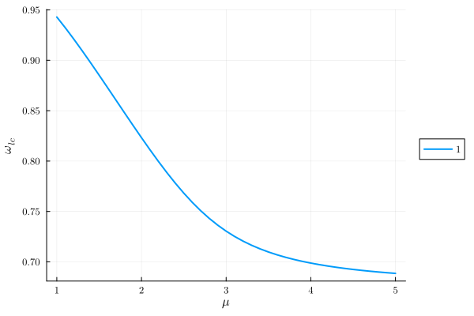
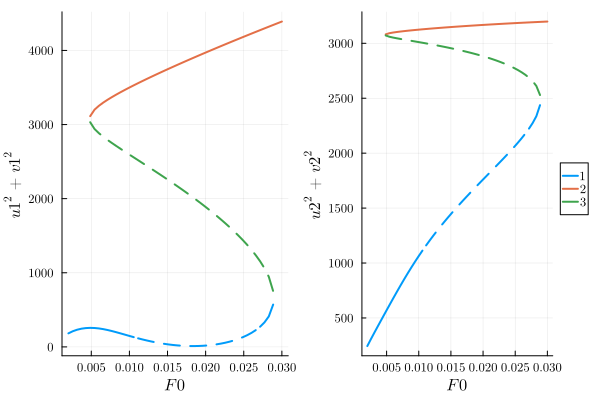
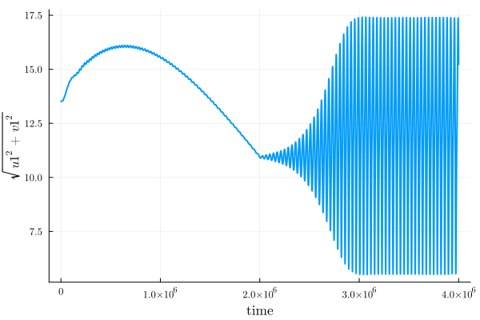

# Limit cycles {#limit_cycles}

In contrast to the previous tutorials, limit cycle problems feature harmonic(s) whose numerical value is not imposed externally. We shall construct our `HarmonicEquation` as usual, but identify this harmonic as an extra variable, rather than a fixed parameter.

## Non-driven system - the van der Pol oscillator {#Non-driven-system-the-van-der-Pol-oscillator}

Here we solve the equation of motion of the [van der Pol oscillator](https://en.wikipedia.org/wiki/Van_der_Pol_oscillator). This is a single-variable second-order ODE with continuous time-translation symmetry (i.e., no &#39;clock&#39; imposing a frequency and/or phase), which displays periodic solutions known as _relaxation oscillations_. For more detail, refer also to [arXiv:2308.06092](https://arxiv.org/abs/2308.06092).

```julia
using HarmonicBalance, Plots
@variables ω_lc, t, ω0, x(t), μ
diff_eq = DifferentialEquation(d(d(x,t),t) - μ*(1-x^2) * d(x,t) + x, x)
```


```ansi
System of 1 differential equations
Variables:       x(t)
Harmonic ansatz: x(t) => ;   

x(t) + Differential(t)(Differential(t)(x(t))) - (1 - (x(t)^2))*Differential(t)(x(t))*μ ~ 0

```


Choosing to expand the motion of $x(t)$ using $ω_{lc}$, $3ω_{lc}$ and $5ω_{lc}$, we define

```julia
foreach(1:2:5) do i
  add_harmonic!(diff_eq, x, i*ω_lc)
end;
```


and obtain 6 harmonic equations,

```julia
harmonic_eq = get_harmonic_equations(diff_eq)
```


```ansi
A set of 6 harmonic equations
Variables: u1(T), v1(T), u2(T), v2(T), u3(T), v3(T)
Parameters: ω_lc, μ

Harmonic ansatz: 
x(t) = u1(T)*cos(ω_lct) + v1(T)*sin(ω_lct) + u2(T)*cos(3ω_lct) + v2(T)*sin(3ω_lct) + u3(T)*cos(5ω_lct) + v3(T)*sin(5ω_lct)

Harmonic equations:

u1(T) + (2//1)*Differential(T)(v1(T))*ω_lc - Differential(T)(u1(T))*μ - u1(T)*(ω_lc^2) - v1(T)*μ*ω_lc + (1//4)*(u1(T)^2)*Differential(T)(u2(T))*μ + (3//4)*(u1(T)^2)*Differential(T)(u1(T))*μ + u1(T)*Differential(T)(u3(T))*u3(T)*μ + (1//2)*u1(T)*Differential(T)(u3(T))*u2(T)*μ + u1(T)*Differential(T)(v3(T))*v3(T)*μ + (1//2)*u1(T)*Differential(T)(v3(T))*v2(T)*μ + (1//2)*u1(T)*v3(T)*Differential(T)(v2(T))*μ + (1//2)*u1(T)*Differential(T)(v1(T))*v2(T)*μ + (1//2)*u1(T)*Differential(T)(v1(T))*v1(T)*μ + u1(T)*v2(T)*Differential(T)(v2(T))*μ + (1//2)*u1(T)*v1(T)*Differential(T)(v2(T))*μ + (1//2)*u1(T)*Differential(T)(u2(T))*u3(T)*μ + u1(T)*Differential(T)(u2(T))*u2(T)*μ + (1//2)*u1(T)*Differential(T)(u1(T))*u2(T)*μ - (1//4)*Differential(T)(u3(T))*(v2(T)^2)*μ - (1//2)*Differential(T)(u3(T))*v2(T)*v1(T)*μ + (1//4)*Differential(T)(u3(T))*(u2(T)^2)*μ + (1//2)*Differential(T)(v3(T))*v2(T)*u2(T)*μ + (1//2)*Differential(T)(v3(T))*v1(T)*u2(T)*μ + (1//2)*(v3(T)^2)*Differential(T)(u1(T))*μ + (1//2)*v3(T)*Differential(T)(v1(T))*u2(T)*μ + (1//2)*v3(T)*v2(T)*Differential(T)(u2(T))*μ + (1//2)*v3(T)*v2(T)*Differential(T)(u1(T))*μ + (1//2)*v3(T)*v1(T)*Differential(T)(u2(T))*μ + (1//2)*v3(T)*u2(T)*Differential(T)(v2(T))*μ - (1//2)*Differential(T)(v1(T))*v2(T)*u3(T)*μ - (1//2)*Differential(T)(v1(T))*v1(T)*u2(T)*μ + (1//2)*(v2(T)^2)*Differential(T)(u1(T))*μ + (1//2)*v2(T)*v1(T)*Differential(T)(u1(T))*μ - (1//2)*v2(T)*u3(T)*Differential(T)(v2(T))*μ - (1//4)*(v1(T)^2)*Differential(T)(u2(T))*μ + (1//4)*(v1(T)^2)*Differential(T)(u1(T))*μ - (1//2)*v1(T)*u3(T)*Differential(T)(v2(T))*μ + (1//2)*Differential(T)(u2(T))*u3(T)*u2(T)*μ + (1//2)*(u3(T)^2)*Differential(T)(u1(T))*μ + (1//2)*u3(T)*Differential(T)(u1(T))*u2(T)*μ + (1//2)*Differential(T)(u1(T))*(u2(T)^2)*μ + (1//4)*(u1(T)^2)*v2(T)*μ*ω_lc + (1//4)*(u1(T)^2)*v1(T)*μ*ω_lc + (1//2)*u1(T)*v3(T)*u2(T)*μ*ω_lc - (1//2)*u1(T)*v2(T)*u3(T)*μ*ω_lc - (1//2)*u1(T)*v1(T)*u2(T)*μ*ω_lc + (1//2)*(v3(T)^2)*v1(T)*μ*ω_lc + (1//4)*v3(T)*(v2(T)^2)*μ*ω_lc - (1//2)*v3(T)*v2(T)*v1(T)*μ*ω_lc - (1//4)*v3(T)*(u2(T)^2)*μ*ω_lc + (1//2)*(v2(T)^2)*v1(T)*μ*ω_lc - (1//4)*v2(T)*(v1(T)^2)*μ*ω_lc + (1//2)*v2(T)*u3(T)*u2(T)*μ*ω_lc + (1//4)*(v1(T)^3)*μ*ω_lc + (1//2)*v1(T)*(u3(T)^2)*μ*ω_lc - (1//2)*v1(T)*u3(T)*u2(T)*μ*ω_lc + (1//2)*v1(T)*(u2(T)^2)*μ*ω_lc ~ 0

v1(T) - Differential(T)(v1(T))*μ - (2//1)*Differential(T)(u1(T))*ω_lc + u1(T)*μ*ω_lc - v1(T)*(ω_lc^2) + (1//4)*(u1(T)^2)*Differential(T)(v1(T))*μ + (1//4)*(u1(T)^2)*Differential(T)(v2(T))*μ - (1//2)*u1(T)*Differential(T)(u3(T))*v2(T)*μ + (1//2)*u1(T)*Differential(T)(v3(T))*u2(T)*μ + (1//2)*u1(T)*v3(T)*Differential(T)(u2(T))*μ - (1//2)*u1(T)*Differential(T)(v1(T))*u2(T)*μ + (1//2)*u1(T)*v2(T)*Differential(T)(u1(T))*μ - (1//2)*u1(T)*v1(T)*Differential(T)(u2(T))*μ + (1//2)*u1(T)*v1(T)*Differential(T)(u1(T))*μ - (1//2)*u1(T)*u3(T)*Differential(T)(v2(T))*μ + (1//2)*Differential(T)(u3(T))*v2(T)*u2(T)*μ + Differential(T)(u3(T))*v1(T)*u3(T)*μ - (1//2)*Differential(T)(u3(T))*v1(T)*u2(T)*μ + Differential(T)(v3(T))*v3(T)*v1(T)*μ + (1//4)*Differential(T)(v3(T))*(v2(T)^2)*μ - (1//2)*Differential(T)(v3(T))*v2(T)*v1(T)*μ - (1//4)*Differential(T)(v3(T))*(u2(T)^2)*μ + (1//2)*(v3(T)^2)*Differential(T)(v1(T))*μ - (1//2)*v3(T)*Differential(T)(v1(T))*v2(T)*μ + (1//2)*v3(T)*v2(T)*Differential(T)(v2(T))*μ - (1//2)*v3(T)*v1(T)*Differential(T)(v2(T))*μ - (1//2)*v3(T)*Differential(T)(u2(T))*u2(T)*μ + (1//2)*v3(T)*Differential(T)(u1(T))*u2(T)*μ + (1//2)*Differential(T)(v1(T))*(v2(T)^2)*μ - (1//2)*Differential(T)(v1(T))*v2(T)*v1(T)*μ + (3//4)*Differential(T)(v1(T))*(v1(T)^2)*μ + (1//2)*Differential(T)(v1(T))*(u3(T)^2)*μ - (1//2)*Differential(T)(v1(T))*u3(T)*u2(T)*μ + (1//2)*Differential(T)(v1(T))*(u2(T)^2)*μ + v2(T)*v1(T)*Differential(T)(v2(T))*μ + (1//2)*v2(T)*Differential(T)(u2(T))*u3(T)*μ - (1//2)*v2(T)*u3(T)*Differential(T)(u1(T))*μ - (1//4)*(v1(T)^2)*Differential(T)(v2(T))*μ - (1//2)*v1(T)*Differential(T)(u2(T))*u3(T)*μ + v1(T)*Differential(T)(u2(T))*u2(T)*μ - (1//2)*v1(T)*Differential(T)(u1(T))*u2(T)*μ + (1//2)*u3(T)*u2(T)*Differential(T)(v2(T))*μ - (1//4)*(u1(T)^3)*μ*ω_lc - (1//4)*(u1(T)^2)*u2(T)*μ*ω_lc - (1//2)*u1(T)*(v3(T)^2)*μ*ω_lc - (1//2)*u1(T)*v3(T)*v2(T)*μ*ω_lc - (1//2)*u1(T)*(v2(T)^2)*μ*ω_lc - (1//2)*u1(T)*v2(T)*v1(T)*μ*ω_lc - (1//4)*u1(T)*(v1(T)^2)*μ*ω_lc - (1//2)*u1(T)*(u3(T)^2)*μ*ω_lc - (1//2)*u1(T)*u3(T)*u2(T)*μ*ω_lc - (1//2)*u1(T)*(u2(T)^2)*μ*ω_lc - (1//2)*v3(T)*v2(T)*u2(T)*μ*ω_lc - (1//2)*v3(T)*v1(T)*u2(T)*μ*ω_lc + (1//4)*(v2(T)^2)*u3(T)*μ*ω_lc + (1//2)*v2(T)*v1(T)*u3(T)*μ*ω_lc + (1//4)*(v1(T)^2)*u2(T)*μ*ω_lc - (1//4)*u3(T)*(u2(T)^2)*μ*ω_lc ~ 0

u2(T) - Differential(T)(u2(T))*μ + (6//1)*Differential(T)(v2(T))*ω_lc - (3//1)*v2(T)*μ*ω_lc - (9//1)*u2(T)*(ω_lc^2) + (1//4)*(u1(T)^2)*Differential(T)(u3(T))*μ + (1//2)*(u1(T)^2)*Differential(T)(u2(T))*μ + (1//4)*(u1(T)^2)*Differential(T)(u1(T))*μ + (1//2)*u1(T)*Differential(T)(u3(T))*u2(T)*μ + (1//2)*u1(T)*Differential(T)(v3(T))*v2(T)*μ + (1//2)*u1(T)*Differential(T)(v3(T))*v1(T)*μ + (1//2)*u1(T)*v3(T)*Differential(T)(v1(T))*μ + (1//2)*u1(T)*v3(T)*Differential(T)(v2(T))*μ - (1//2)*u1(T)*Differential(T)(v1(T))*v1(T)*μ + (1//2)*u1(T)*Differential(T)(u2(T))*u3(T)*μ + (1//2)*u1(T)*u3(T)*Differential(T)(u1(T))*μ + u1(T)*Differential(T)(u1(T))*u2(T)*μ + (1//2)*Differential(T)(u3(T))*v2(T)*v1(T)*μ - (1//4)*Differential(T)(u3(T))*(v1(T)^2)*μ + Differential(T)(u3(T))*u3(T)*u2(T)*μ + Differential(T)(v3(T))*v3(T)*u2(T)*μ - (1//2)*Differential(T)(v3(T))*v1(T)*u2(T)*μ + (1//2)*(v3(T)^2)*Differential(T)(u2(T))*μ - (1//2)*v3(T)*Differential(T)(v1(T))*u2(T)*μ + (1//2)*v3(T)*v2(T)*Differential(T)(u1(T))*μ - (1//2)*v3(T)*v1(T)*Differential(T)(u2(T))*μ + (1//2)*v3(T)*v1(T)*Differential(T)(u1(T))*μ + (1//2)*Differential(T)(v1(T))*v2(T)*u3(T)*μ - (1//2)*Differential(T)(v1(T))*v1(T)*u3(T)*μ + Differential(T)(v1(T))*v1(T)*u2(T)*μ + (1//4)*(v2(T)^2)*Differential(T)(u2(T))*μ + (1//2)*v2(T)*u2(T)*Differential(T)(v2(T))*μ + (1//2)*(v1(T)^2)*Differential(T)(u2(T))*μ - (1//4)*(v1(T)^2)*Differential(T)(u1(T))*μ + (1//2)*v1(T)*u3(T)*Differential(T)(v2(T))*μ + (1//2)*Differential(T)(u2(T))*(u3(T)^2)*μ + (3//4)*Differential(T)(u2(T))*(u2(T)^2)*μ + (1//2)*u3(T)*Differential(T)(u1(T))*u2(T)*μ + (3//4)*(u1(T)^2)*v3(T)*μ*ω_lc + (3//2)*(u1(T)^2)*v2(T)*μ*ω_lc + (3//4)*(u1(T)^2)*v1(T)*μ*ω_lc + (3//2)*u1(T)*v3(T)*u2(T)*μ*ω_lc - (3//2)*u1(T)*v2(T)*u3(T)*μ*ω_lc - (3//2)*u1(T)*v1(T)*u3(T)*μ*ω_lc + (3//2)*(v3(T)^2)*v2(T)*μ*ω_lc + (3//2)*v3(T)*v2(T)*v1(T)*μ*ω_lc - (3//4)*v3(T)*(v1(T)^2)*μ*ω_lc + (3//4)*(v2(T)^3)*μ*ω_lc + (3//2)*v2(T)*(v1(T)^2)*μ*ω_lc + (3//2)*v2(T)*(u3(T)^2)*μ*ω_lc + (3//4)*v2(T)*(u2(T)^2)*μ*ω_lc - (1//4)*(v1(T)^3)*μ*ω_lc + (3//2)*v1(T)*u3(T)*u2(T)*μ*ω_lc ~ 0

v2(T) - (6//1)*Differential(T)(u2(T))*ω_lc - Differential(T)(v2(T))*μ - (9//1)*v2(T)*(ω_lc^2) + (3//1)*u2(T)*μ*ω_lc + (1//4)*(u1(T)^2)*Differential(T)(v3(T))*μ + (1//4)*(u1(T)^2)*Differential(T)(v1(T))*μ + (1//2)*(u1(T)^2)*Differential(T)(v2(T))*μ - (1//2)*u1(T)*Differential(T)(u3(T))*v2(T)*μ - (1//2)*u1(T)*Differential(T)(u3(T))*v1(T)*μ + (1//2)*u1(T)*Differential(T)(v3(T))*u2(T)*μ + (1//2)*u1(T)*v3(T)*Differential(T)(u2(T))*μ + (1//2)*u1(T)*v3(T)*Differential(T)(u1(T))*μ - (1//2)*u1(T)*Differential(T)(v1(T))*u3(T)*μ + u1(T)*v2(T)*Differential(T)(u1(T))*μ + (1//2)*u1(T)*v1(T)*Differential(T)(u1(T))*μ - (1//2)*u1(T)*u3(T)*Differential(T)(v2(T))*μ + Differential(T)(u3(T))*v2(T)*u3(T)*μ + (1//2)*Differential(T)(u3(T))*v1(T)*u2(T)*μ + Differential(T)(v3(T))*v3(T)*v2(T)*μ + (1//2)*Differential(T)(v3(T))*v2(T)*v1(T)*μ - (1//4)*Differential(T)(v3(T))*(v1(T)^2)*μ + (1//2)*(v3(T)^2)*Differential(T)(v2(T))*μ + (1//2)*v3(T)*Differential(T)(v1(T))*v2(T)*μ - (1//2)*v3(T)*Differential(T)(v1(T))*v1(T)*μ + (1//2)*v3(T)*v1(T)*Differential(T)(v2(T))*μ + (1//2)*v3(T)*Differential(T)(u1(T))*u2(T)*μ + Differential(T)(v1(T))*v2(T)*v1(T)*μ - (1//4)*Differential(T)(v1(T))*(v1(T)^2)*μ + (1//2)*Differential(T)(v1(T))*u3(T)*u2(T)*μ + (3//4)*(v2(T)^2)*Differential(T)(v2(T))*μ + (1//2)*v2(T)*Differential(T)(u2(T))*u2(T)*μ - (1//2)*v2(T)*u3(T)*Differential(T)(u1(T))*μ + (1//2)*(v1(T)^2)*Differential(T)(v2(T))*μ + (1//2)*v1(T)*Differential(T)(u2(T))*u3(T)*μ - (1//2)*v1(T)*u3(T)*Differential(T)(u1(T))*μ + (1//2)*(u3(T)^2)*Differential(T)(v2(T))*μ + (1//4)*(u2(T)^2)*Differential(T)(v2(T))*μ - (1//4)*(u1(T)^3)*μ*ω_lc - (3//4)*(u1(T)^2)*u3(T)*μ*ω_lc - (3//2)*(u1(T)^2)*u2(T)*μ*ω_lc - (3//2)*u1(T)*v3(T)*v2(T)*μ*ω_lc - (3//2)*u1(T)*v3(T)*v1(T)*μ*ω_lc + (3//4)*u1(T)*(v1(T)^2)*μ*ω_lc - (3//2)*u1(T)*u3(T)*u2(T)*μ*ω_lc - (3//2)*(v3(T)^2)*u2(T)*μ*ω_lc + (3//2)*v3(T)*v1(T)*u2(T)*μ*ω_lc - (3//4)*(v2(T)^2)*u2(T)*μ*ω_lc - (3//2)*v2(T)*v1(T)*u3(T)*μ*ω_lc + (3//4)*(v1(T)^2)*u3(T)*μ*ω_lc - (3//2)*(v1(T)^2)*u2(T)*μ*ω_lc - (3//2)*(u3(T)^2)*u2(T)*μ*ω_lc - (3//4)*(u2(T)^3)*μ*ω_lc ~ 0

u3(T) - Differential(T)(u3(T))*μ + (10//1)*Differential(T)(v3(T))*ω_lc - (5//1)*v3(T)*μ*ω_lc - (25//1)*u3(T)*(ω_lc^2) + (1//2)*(u1(T)^2)*Differential(T)(u3(T))*μ + (1//4)*(u1(T)^2)*Differential(T)(u2(T))*μ - (1//2)*u1(T)*Differential(T)(v1(T))*v2(T)*μ - (1//2)*u1(T)*v2(T)*Differential(T)(v2(T))*μ - (1//2)*u1(T)*v1(T)*Differential(T)(v2(T))*μ + (1//2)*u1(T)*Differential(T)(u2(T))*u2(T)*μ + u1(T)*u3(T)*Differential(T)(u1(T))*μ + (1//2)*u1(T)*Differential(T)(u1(T))*u2(T)*μ + (1//4)*Differential(T)(u3(T))*(v3(T)^2)*μ + (1//2)*Differential(T)(u3(T))*(v2(T)^2)*μ + (1//2)*Differential(T)(u3(T))*(v1(T)^2)*μ + (3//4)*Differential(T)(u3(T))*(u3(T)^2)*μ + (1//2)*Differential(T)(u3(T))*(u2(T)^2)*μ + (1//2)*Differential(T)(v3(T))*v3(T)*u3(T)*μ + (1//2)*Differential(T)(v1(T))*v2(T)*u2(T)*μ + Differential(T)(v1(T))*v1(T)*u3(T)*μ - (1//2)*Differential(T)(v1(T))*v1(T)*u2(T)*μ - (1//4)*(v2(T)^2)*Differential(T)(u1(T))*μ + (1//2)*v2(T)*v1(T)*Differential(T)(u2(T))*μ - (1//2)*v2(T)*v1(T)*Differential(T)(u1(T))*μ + v2(T)*u3(T)*Differential(T)(v2(T))*μ - (1//4)*(v1(T)^2)*Differential(T)(u2(T))*μ + (1//2)*v1(T)*u2(T)*Differential(T)(v2(T))*μ + Differential(T)(u2(T))*u3(T)*u2(T)*μ + (1//4)*Differential(T)(u1(T))*(u2(T)^2)*μ + (5//2)*(u1(T)^2)*v3(T)*μ*ω_lc + (5//4)*(u1(T)^2)*v2(T)*μ*ω_lc + (5//2)*u1(T)*v2(T)*u2(T)*μ*ω_lc + (5//2)*u1(T)*v1(T)*u2(T)*μ*ω_lc + (5//4)*(v3(T)^3)*μ*ω_lc + (5//2)*v3(T)*(v2(T)^2)*μ*ω_lc + (5//2)*v3(T)*(v1(T)^2)*μ*ω_lc + (5//4)*v3(T)*(u3(T)^2)*μ*ω_lc + (5//2)*v3(T)*(u2(T)^2)*μ*ω_lc + (5//4)*(v2(T)^2)*v1(T)*μ*ω_lc - (5//4)*v2(T)*(v1(T)^2)*μ*ω_lc - (5//4)*v1(T)*(u2(T)^2)*μ*ω_lc ~ 0

v3(T) - (10//1)*Differential(T)(u3(T))*ω_lc - Differential(T)(v3(T))*μ - (25//1)*v3(T)*(ω_lc^2) + (5//1)*u3(T)*μ*ω_lc + (1//2)*(u1(T)^2)*Differential(T)(v3(T))*μ + (1//4)*(u1(T)^2)*Differential(T)(v2(T))*μ + u1(T)*v3(T)*Differential(T)(u1(T))*μ + (1//2)*u1(T)*Differential(T)(v1(T))*u2(T)*μ + (1//2)*u1(T)*v2(T)*Differential(T)(u2(T))*μ + (1//2)*u1(T)*v2(T)*Differential(T)(u1(T))*μ + (1//2)*u1(T)*v1(T)*Differential(T)(u2(T))*μ + (1//2)*u1(T)*u2(T)*Differential(T)(v2(T))*μ + (1//2)*Differential(T)(u3(T))*v3(T)*u3(T)*μ + (3//4)*Differential(T)(v3(T))*(v3(T)^2)*μ + (1//2)*Differential(T)(v3(T))*(v2(T)^2)*μ + (1//2)*Differential(T)(v3(T))*(v1(T)^2)*μ + (1//4)*Differential(T)(v3(T))*(u3(T)^2)*μ + (1//2)*Differential(T)(v3(T))*(u2(T)^2)*μ + v3(T)*Differential(T)(v1(T))*v1(T)*μ + v3(T)*v2(T)*Differential(T)(v2(T))*μ + v3(T)*Differential(T)(u2(T))*u2(T)*μ + (1//4)*Differential(T)(v1(T))*(v2(T)^2)*μ - (1//2)*Differential(T)(v1(T))*v2(T)*v1(T)*μ - (1//4)*Differential(T)(v1(T))*(u2(T)^2)*μ + (1//2)*v2(T)*v1(T)*Differential(T)(v2(T))*μ + (1//2)*v2(T)*Differential(T)(u1(T))*u2(T)*μ - (1//4)*(v1(T)^2)*Differential(T)(v2(T))*μ - (1//2)*v1(T)*Differential(T)(u2(T))*u2(T)*μ + (1//2)*v1(T)*Differential(T)(u1(T))*u2(T)*μ - (5//2)*(u1(T)^2)*u3(T)*μ*ω_lc - (5//4)*(u1(T)^2)*u2(T)*μ*ω_lc + (5//4)*u1(T)*(v2(T)^2)*μ*ω_lc + (5//2)*u1(T)*v2(T)*v1(T)*μ*ω_lc - (5//4)*u1(T)*(u2(T)^2)*μ*ω_lc - (5//4)*(v3(T)^2)*u3(T)*μ*ω_lc - (5//2)*(v2(T)^2)*u3(T)*μ*ω_lc - (5//2)*v2(T)*v1(T)*u2(T)*μ*ω_lc - (5//2)*(v1(T)^2)*u3(T)*μ*ω_lc + (5//4)*(v1(T)^2)*u2(T)*μ*ω_lc - (5//4)*(u3(T)^3)*μ*ω_lc - (5//2)*u3(T)*(u2(T)^2)*μ*ω_lc ~ 0

```


So far, $ω_{lc}$ appears as any other harmonic. However, it is not fixed by any external drive or &#39;clock&#39;, instead, it emerges out of a Hopf instability in the system. We can verify that fixing `ω_lc` and calling `get_steady_states`.

```julia
get_steady_states(harmonic_eq, μ => 1:0.1:5, ω_lc => 1.2)
```


gives a single solution with zero amplitude.

Taking instead $ω_{lc}$ as a variable to be solved for [results in a phase freedom](/background/limit_cycles#limit_cycles_bg), implying an infinite number of solutions. To perform the [gauge-fixing procedure](/background/limit_cycles#gauge_fixing), we call `get_limit_cycles`, marking the limit cycle harmonic as a keyword argument,

```julia
result = get_limit_cycles(harmonic_eq, μ => 1:0.1:5, (), ω_lc)
```


```ansi
A steady state result for 41 parameter points

Solution branches:   92
   of which real:    4
   of which stable:  4

Classes: unique_cycle, stable, physical, Hopf

```


The results show a fourfold [degeneracy of solutions](/background/limit_cycles#limit_cycles_bg):

```julia
plot(result, y="ω_lc")
```

{width=600px height=400px}

The automatically created solution class `unique_cycle` filters the degeneracy out:

```julia
plot(result, y="ω_lc", class="unique_cycle")
```

{width=600px height=400px}

## Driven system - coupled Duffings {#Driven-system-coupled-Duffings}

So far, we have largely focused on finding and analysing steady states, i.e., fixed points of the harmonic equations, which satisfy

$$\begin{equation}
\frac{d\mathbf{u}(T)}{dT}  = \bar{\mathbf{F}} (\mathbf{u}) = 0\,.
\end{equation}$$

Fixed points are however merely a subset of possible solutions of the slow-flow equations – strictly speaking, solutions where $\mathbf{u}(T)$ remains time-dependent are allowed. These are quite unusual, since $\bar{\mathbf{F}} (\mathbf{u})$ [is by construction time-independent](/background/harmonic_balance#intro_hb) and the effective equations thus possesses _continuous time-translation symmetry_. The appearance of explicitly time-dependent solutions then constitutes spontaneous time-translation symmetry breaking.

Such solutions, known as _limit cycles_, typically appear as closed periodic trajectories of the harmonic variables $\mathbf{u}(T)$. The simplest way to numerically characterise them is a time-dependent simulation, using a steady-state diagram as a guide.

Here we reconstruct the results of [Zambon et al., Phys Rev. A 102, 023526 (2020)](https://journals.aps.org/pra/abstract/10.1103/PhysRevA.102.023526), where limit cycles are shown to appear in a system of two coupled nonlinear oscillators. In this problem, two oscillators $x_1$ and $x_2$, have (the same) damping and Kerr nonlinearity and are linearly coupled,

$$\begin{align}
\ddot{x}_1+ \gamma \dot{x}_1 + \omega_0^2 x_1 + \alpha x_1^3 + 2J(x_1-x_2) &= F_0 \cos(\omega t) \\
\ddot{x}_2+ \gamma \dot{x}_2 + \omega_0^2 x_2 + \alpha x_2^3 + 2J(x_2-x_1) &= \eta F_0 \cos(\omega t)
\end{align}$$

```julia
using HarmonicBalance
@variables γ F α ω0 F0 η ω J t x(t) y(t);
eqs = [d(x,t,2) + γ*d(x,t) + ω0^2*x + α*x^3 + 2*J*ω0*(x-y) - F0*cos(ω*t),
       d(y,t,2) + γ*d(y,t) + ω0^2*y + α*y^3 + 2*J*ω0*(y-x) - η*F0*cos(ω*t)]
diff_eq = DifferentialEquation(eqs, [x,y])
```


```ansi
System of 2 differential equations
Variables:       x(t), y(t)
Harmonic ansatz: x(t) => ;   y(t) => ;   

Differential(t)(Differential(t)(x(t))) - F0*cos(t*ω) + Differential(t)(x(t))*γ + 2J*(x(t) - y(t))*ω0 + x(t)*(ω0^2) + (x(t)^3)*α ~ 0
Differential(t)(Differential(t)(y(t))) + Differential(t)(y(t))*γ - F0*cos(t*ω)*η + 2J*(-x(t) + y(t))*ω0 + y(t)*(ω0^2) + (y(t)^3)*α ~ 0

```


The analysis of Zambon et al. uses a frame rotating at the pump frequency $\omega$ to describe both oscillators. For us, this means we expand both modes using $\omega$ to obtain the harmonic equations.

```julia
add_harmonic!(diff_eq, x, ω)
add_harmonic!(diff_eq, y, ω)

harmonic_eq = get_harmonic_equations(diff_eq)
```


```ansi
A set of 4 harmonic equations
Variables: u1(T), v1(T), u2(T), v2(T)
Parameters: ω, ω0, J, α, γ, F0, η

Harmonic ansatz: 
x(t) = u1(T)*cos(ωt) + v1(T)*sin(ωt)
y(t) = u2(T)*cos(ωt) + v2(T)*sin(ωt)

Harmonic equations:

-F0 + (2//1)*Differential(T)(v1(T))*ω + Differential(T)(u1(T))*γ + (2//1)*J*u1(T)*ω0 - (2//1)*J*u2(T)*ω0 - u1(T)*(ω^2) + u1(T)*(ω0^2) + v1(T)*γ*ω + (3//4)*(u1(T)^3)*α + (3//4)*u1(T)*(v1(T)^2)*α ~ 0

Differential(T)(v1(T))*γ - (2//1)*Differential(T)(u1(T))*ω - (2//1)*J*v2(T)*ω0 + (2//1)*J*v1(T)*ω0 - u1(T)*γ*ω - v1(T)*(ω^2) + v1(T)*(ω0^2) + (3//4)*(u1(T)^2)*v1(T)*α + (3//4)*(v1(T)^3)*α ~ 0

-F0*η + Differential(T)(u2(T))*γ + (2//1)*Differential(T)(v2(T))*ω - (2//1)*J*u1(T)*ω0 + (2//1)*J*u2(T)*ω0 + v2(T)*γ*ω - u2(T)*(ω^2) + u2(T)*(ω0^2) + (3//4)*(v2(T)^2)*u2(T)*α + (3//4)*(u2(T)^3)*α ~ 0

-(2//1)*Differential(T)(u2(T))*ω + Differential(T)(v2(T))*γ + (2//1)*J*v2(T)*ω0 - (2//1)*J*v1(T)*ω0 - v2(T)*(ω^2) + v2(T)*(ω0^2) - u2(T)*γ*ω + (3//4)*(v2(T)^3)*α + (3//4)*v2(T)*(u2(T)^2)*α ~ 0

```


Solving for a range of drive amplitudes $F_0$,

```julia
fixed = (
    ω0 => 1.4504859, # natural frequency of separate modes (in paper's notation, ħω0 - J)
    γ => 27.4e-6,    # damping
    J => 154.1e-6,   # coupling term
    α => 3.867e-7,   # Kerr nonlinearity
    ω => 1.4507941,  # pump frequency, resonant with antisymmetric mode (in paper, ħω0 + J)
    η => -0.08     # pumping leaking to site 2  (F2 = ηF1)
)
varied = F0 => range(0.002, 0.03, 50)

result = get_steady_states(harmonic_eq, varied, fixed)
```


```ansi
A steady state result for 50 parameter points

Solution branches:   11
   of which real:    3
   of which stable:  2

Classes: stable, physical, Hopf

```


Let us first see the steady states.

```julia
p1 = plot(result, "u1^2 + v1^2", legend=false)
p2 = plot(result, "u2^2 + v2^2")
plot(p1, p2)
```

{width=600px height=400px}

According to Zambon et al., a limit cycle solution exists around $F_0 \cong 0.011$, which can be accessed by a jump from branch 1 in an upwards sweep of $F_0$. Since a limit cycle is not a steady state of our harmonic equations, it does not appear in the diagram. We do however see that branch 1 ceases to be stable around $F_0 \cong 0.010$, meaning a jump should occur.

Let us try and simulate the limit cycle. We could in principle run a time-dependent simulation with a fixed value of $F_0$, but this would require a suitable initial condition. Instead, we will sweep $F_0$ upwards from a low starting value. To observe the dynamics just after the jump has occurred, we follow the sweep by a time interval where the system evolves under fixed parameters.

```julia
using OrdinaryDiffEqTsit5
initial_state = result[1][1]

T = 2e6
sweep = AdiabaticSweep(F0 => (0.002, 0.011), (0,T))

# start from initial_state, use sweep, total time is 2*T
time_problem = ODEProblem(harmonic_eq, initial_state, sweep=sweep, timespan=(0,2*T))
time_evo = solve(time_problem, Tsit5(), saveat=100);
```


Inspecting the amplitude as a function of time,

```julia
plot(time_evo, "sqrt(u1^2 + v1^2)", harmonic_eq)
```

{width=600px height=400px}

we see that initially the sweep is adiabatic as it proceeds along the steady-state branch 1. At around $T = 2e6$, an instability occurs and $u_1(T)$ starts to rapidly oscillate. At that point, the sweep is stopped. Under free time evolution, the system then settles into a limit-cycle solution where the coordinates move along closed trajectories.

By plotting the $u$ and $v$ variables against each other, we observe the limit cycle shapes in phase space,

```julia
p1 = plot(time_evo, ["u1", "v1"], harmonic_eq)
p2 = plot(time_evo, ["u2", "v2"], harmonic_eq)
plot(p1, p2)
```

{width=600px height=400px}
