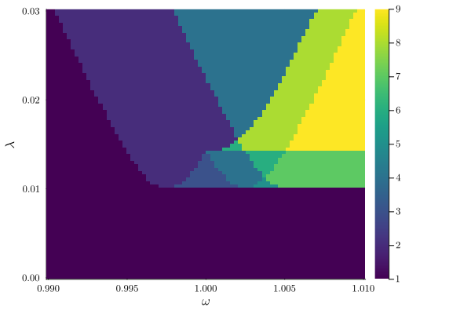
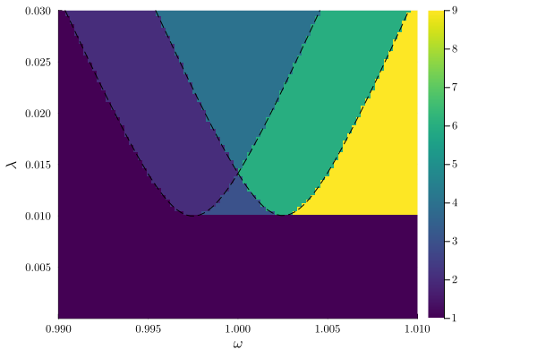
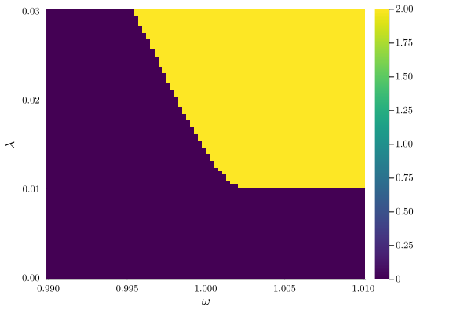
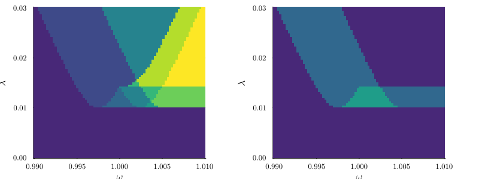

# State dependent perturbation of the parametron {#State-dependent-perturbation-of-the-parametron}

In this example, we will show how we can understand the bifurcation lines of two coupled duffing resonotors with a global parametric drive. This example is part of the paper [Ameye et al. (arXiv:2501.08793)](https://www.arxiv.org/abs/2501.08793).

Let us load the following packages into our environment:

```julia
using HarmonicBalance, Plots;
HB = HarmonicBalance;
HSS = HarmonicSteadyState;
crange = (0, 9);
```


Later, we will need to classify the solutions of our perturbation. To make this work, we define our own classification functions:

```julia
function my_classify_default!(result)
    my_classify_solutions!(result, HSS.is_physical, "physical")
    my_classify_solutions!(result, HSS.is_stable, "stable")
    return HSS.order_branches!(result, ["physical", "stable"]) # shuffle the branches to have relevant
end
function my_classify_solutions!(res::HSS.Result, f::Function, name::String)
    values = my_classify_solutions(res, f)
    return res.classes[name] = values
end
function my_classify_solutions(res::HSS.Result, f::Function)
    values = similar(res.solutions, BitVector)
    for (idx, soln) in enumerate(res.solutions)
        values[idx] = [
            f(my_get_single_solution(res; index=idx, branch=b), res) for b in 1:length(soln)
        ]
    end
    return values
end
function my_get_single_solution(res; index, branch)
    sol = get_single_solution(res; index=index, branch=branch)
    return merge(
        sol, Dict(ua => A[CartesianIndex(index)][1], va => A[CartesianIndex(index)][2])
    )
end
```


```ansi
my_get_single_solution (generic function with 1 method)
```


We will consider two coupled linearly coupled parametrons, i.e., Duffing resonators with a global parametric drive. The equations of motion are given by:

$$\begin{aligned}
& \ddot{x}_1 + (\omega_0^2 - \lambda \cos(2\omega t)) x_1 + \gamma \dot{x}_1 + \alpha x_1^3 -J x_2 = 0\\
& \ddot{x}_2 + (\omega_0^2 - \lambda \cos(2\omega t)) x_2 + \gamma \dot{x}_2 + \alpha x_2^3 -J x_1 = 0
\end{aligned}$$

where $x_1$ and $x_2$ are the two individual modes. The system is characterized by several parameters. The parameter `ω₀` represents the bare frequency of the system, which is the natural frequency at which the system oscillates in the absence of any external driving force. The parameter `ω` denotes the drive frequency, which is the frequency of an external driving force applied to the system. The parameter `λ` stands for the amplitude of the parametric drive, which modulates the natural frequency  periodically. The parameter `α` represents the nonlinearity of the system, indicating how the system&#39;s response deviates from a linear behavior. The parameter `J` signifies the coupling strength, which measures the interaction strength between different parts or modes of the system. Finally, the parameter `γ` denotes the damping, which quantifies the rate at which the system loses energy to its surroundings.

With HarmonicBalance.jl, we can easily solve the phase diagram of the system in the limit where the modes oscillate at the frequency $\omega$:

```julia
@variables t x1(t) x2(t);
@variables ω0 ω λ α J γ;
equations = [
    d(d(x1, t), t) + (ω0^2 - λ * cos(2 * ω * t)) * x1 + γ * d(x1, t) + α * x1^3 - J * x2,
    d(d(x2, t), t) + (ω0^2 - λ * cos(2 * ω * t)) * x2 + γ * d(x2, t) + α * x2^3 - J * x1,
]
system = DifferentialEquation(equations, [x1, x2])
add_harmonic!(system, x1, ω)
add_harmonic!(system, x2, ω)
harmonic_normal = get_harmonic_equations(system)
```


```ansi
A set of 4 harmonic equations
Variables: u1(T), v1(T), u2(T), v2(T)
Parameters: ω, α, γ, ω0, λ, J

Harmonic ansatz: 
x1(t) = u1(T)*cos(ωt) + v1(T)*sin(ωt)
x2(t) = u2(T)*cos(ωt) + v2(T)*sin(ωt)

Harmonic equations:

-J*u2(T) - (1//2)*u1(T)*λ + (2//1)*Differential(T)(v1(T))*ω + Differential(T)(u1(T))*γ - u1(T)*(ω^2) + u1(T)*(ω0^2) + v1(T)*γ*ω + (3//4)*(u1(T)^3)*α + (3//4)*u1(T)*(v1(T)^2)*α ~ 0

-J*v2(T) + Differential(T)(v1(T))*γ + (1//2)*v1(T)*λ - (2//1)*Differential(T)(u1(T))*ω - u1(T)*γ*ω - v1(T)*(ω^2) + v1(T)*(ω0^2) + (3//4)*(u1(T)^2)*v1(T)*α + (3//4)*(v1(T)^3)*α ~ 0

-J*u1(T) + Differential(T)(u2(T))*γ - (1//2)*u2(T)*λ + (2//1)*Differential(T)(v2(T))*ω + v2(T)*γ*ω - u2(T)*(ω^2) + u2(T)*(ω0^2) + (3//4)*(v2(T)^2)*u2(T)*α + (3//4)*(u2(T)^3)*α ~ 0

-J*v1(T) + (1//2)*v2(T)*λ - (2//1)*Differential(T)(u2(T))*ω + Differential(T)(v2(T))*γ - v2(T)*(ω^2) + v2(T)*(ω0^2) - u2(T)*γ*ω + (3//4)*(v2(T)^3)*α + (3//4)*v2(T)*(u2(T)^2)*α ~ 0

```


We sweep over the system where we both increase the drive frequency $\omega$ and the parametric drive amplitude $\lambda$:

```julia
res = 80
fixed = HSS.OrderedDict(ω0 => 1.0, α => 1.0, J => 0.005, γ => 0.005)
varied = HSS.OrderedDict((ω => range(0.99, 1.01, res), λ => range(1e-6, 0.03, res)))
method = TotalDegree()
result_ωλ = get_steady_states(harmonic_normal, method, varied, fixed; show_progress=false);
plot_phase_diagram(result_ωλ; class="stable")
```

{width=600px height=400px}

The phase diagram shows the number of stable steady states in the $\omega-\lambda$ plane. We find a familiar structure with two Arnold tongues (also known as Mathieu stability zones) around the drive frequency $\omega_s=\sqrt{\omega_0^2-J}$ and $\omega_s=\sqrt{\omega_0^2+J}$.

```julia
λ_bif(ω, ω0, γ) = 2 * sqrt((ω^2 - ω0^2)^2 + γ^2 * ω^2)
plot_phase_diagram(result_ωλ; class="stable", xlims=(0.99, 1.01), ylims=(1e-6, 0.03))
plot!(
    ω -> λ_bif(ω, √(fixed[ω0]^2 + fixed[J]), fixed[γ]),
    range(0.99, 1.01, res);
    label="",
    c=:black,
    ls=:dash,
)
plot!(
    ω -> λ_bif(ω, √(fixed[ω0]^2 - fixed[J]), fixed[γ]),
    range(0.99, 1.01, res);
    label="",
    c=:black,
    ls=:dash,
)
```

{width=600px height=400px}

These frequencies where the lobes are centered around corresponds to the normal mode frequency of the coupled system. Indeed, when resonators are strongly coupled, the system is better described in the normal mode basis. However, in addition, we also find additional bifurcation lines in the phase diagram. These bifurcation lines we would like to understand with a state-dependent perturbation.

As the system, in the strongly coupled limit, is better described in the normal mode basis, let&#39;s us consider the symmetric and antisymmetric modes $x_s = (x_1 + x_2)/2$ and $x_a = (x_1 - x_2)/2$, respectively. The equations of motion in this basis are given by:

$$\begin{aligned}
& \ddot{x}_s + (\omega_0^2 - J - \lambda \cos(2\omega t)) x_s + \gamma \dot{x}_s + \alpha (x_s^3 + 3 * x_a^2 * x_s) = 0\\
& \ddot{x}_a + (\omega_0^2 + J - \lambda \cos(2\omega t)) x_a + \gamma \dot{x}_a + \alpha (x_a^3 + 3 * x_s^2 * x_a)= 0
\end{aligned}$$

Note that the system couples nonlinearly through the Kerr medium. However, solving the full system with HarmonicBalance.jl, expanding the normal modes in the the frequency $\omega$ yields the same phase diagram:

```julia
@variables t xs(t) xa(t);
@variables ω0 ω λ α J γ;
equations = [
    d(d(xs, t), t) +
    (ω0^2 - J - λ * cos(2 * ω * t)) * xs +
    γ * d(xs, t) +
    α * (xs^3 + 3 * xa^2 * xs),
    d(d(xa, t), t) +
    (ω0^2 + J - λ * cos(2 * ω * t)) * xa +
    γ * d(xa, t) +
    α * (xa^3 + 3 * xs^2 * xa),
]
system = DifferentialEquation(equations, [xs, xa])

add_harmonic!(system, xs, ω)
add_harmonic!(system, xa, ω)
harmonic_normal = get_harmonic_equations(system);

method = TotalDegree()
result_ωλ_normal = get_steady_states(
    harmonic_normal, method, varied, fixed; show_progress=false
);

plot_phase_diagram(result_ωλ_normal; class="stable")
```

{width=600px height=400px}

We would like to predict the additional bifurcation lines above by doing a proper perturbation of the nonlinear coupling. Hence, we consider the uncoupled system by removing the coupled terms in the equations of motion.

```julia
@variables t xa(t) xs(t);
@variables ω0 ω λ α J;
equations_xa = [
    d(d(xa, t), t) + (ω0^2 + J - λ * cos(2 * ω * t)) * xa + γ * d(xa, t) + α * xa^3
]
equations_xs = [
    d(d(xs, t), t) + (ω0^2 - J - λ * cos(2 * ω * t)) * xs + γ * d(xs, t) + α * xs^3
]
system_uncoupled = DifferentialEquation(append!(equations_xs, equations_xa), [xs, xa])
add_harmonic!(system_uncoupled, xa, ω)
add_harmonic!(system_uncoupled, xs, ω)
harmonic_uncoupled = get_harmonic_equations(system_uncoupled);

plot_phase_diagram(
    get_steady_states(harmonic_uncoupled, method, varied, fixed; show_progress=false);
    class="stable",
    xlims=(0.99, 1.01),
    ylims=(1e-6, 0.03),
)
plot!(
    ω -> λ_bif(ω, √(fixed[ω0]^2 + fixed[J]), fixed[γ]),
    range(0.99, 1.01, res);
    label="",
    c=:black,
    ls=:dash,
)
plot!(
    ω -> λ_bif(ω, √(fixed[ω0]^2 - fixed[J]), fixed[γ]),
    range(0.99, 1.01, res);
    label="",
    c=:black,
    ls=:dash,
)
```

{width=600px height=400px}

Let us assume that the antisymmetrcic mode is in the parametric non-zero amplitude state. We will dress the symmetric mode with the non-zero amplitude solution of the antisymmetric mode.

```julia
equations_xa = [
    d(d(xa, t), t) + (ω0^2 + J - λ * cos(2 * ω * t)) * xa + γ * d(xa, t) + α * xa^3
]
equations_xs = [
    d(d(xs, t), t) + (ω0^2 - J - λ * cos(2 * ω * t)) * xs + γ * d(xs, t) + α * xs^3
]
system_xa = DifferentialEquation(equations_xa, [xa])
system_xs = DifferentialEquation(equations_xs, [xs])
add_harmonic!(system_xa, xa, ω)
add_harmonic!(system_xs, xs, ω)
harmonic_antisym = get_harmonic_equations(system_xa);
harmonic_sym = get_harmonic_equations(system_xs);
```


The uncoupled antisysmmetic mode will have a typical parametron phase diagram around the frequency $\omega_a$. We are interested in the non-zero amplitude solution which we will consider as the zeroth order in the perturbation.

```julia
result_ωλ_antisym = get_steady_states(harmonic_antisym, varied, fixed);

classify_solutions!(result_ωλ_antisym, "sqrt(u1^2 + v1^2) > 1e-3", "not_zero")
plot_phase_diagram(result_ωλ_antisym; class=["stable", "not_zero"])
```

{width=600px height=400px}

We filter the non-zero amplitude solution and store it in a matrix $A$:

```julia
branch_mat = findfirst.(HSS._get_mask(result_ωλ_antisym, ["stable", "not_zero"], []))
A = map(CartesianIndices(result_ωλ_antisym.solutions)) do idx
    branch = branch_mat[idx]
    if isnothing(branch)
        sol = zeros(2)
    else
        sol = real(result_ωλ_antisym.solutions[idx][branch])
    end
    sol
end;
heatmap(map(v -> v[1]^2 + v[2]^2, A)')
```

{width=600px height=400px}

The next step is to dress the symmetric mode with the non-zero amplitude solution of the antisymmetric mode. For this we set up a perturbed problem for the symmetric mode:

```julia
@variables T u2(T) v2(T) ua va
harmonic_tmp = deepcopy(harmonic_sym)
harmonic_tmp.equations = HB.Symbolics.substitute(
    HB.rearrange_standard(harmonic_normal).equations[1:2], Dict(u2 => ua, v2 => va)
)
harmonic_tmp.parameters = push!(harmonic_tmp.parameters, ua, va)
prob = HarmonicSteadyState.HomotopyContinuationProblem(harmonic_tmp, varied, fixed)
```


```ansi
2 algebraic equations for steady states
Variables: u1, v1
Parameters: ω, ω0, J, λ, α, γ, ua, va

```


We will sweep over the $\omega-\lambda$ plane and substitute the non-zero amplitude solution of the antisymmetric mode into the coupled equations of thesymmetric mode.

```julia
all_keys = cat(collect(keys(varied)), collect(keys(fixed)); dims=1)
permutation = first.(
    filter(!isempty, [findall(x -> isequal(x, par), all_keys) for par in prob.parameters])
)

param_ranges = collect(values(varied))
input_array = collect(Iterators.product(param_ranges..., values(fixed)...))
input_array = getindex.(input_array, [permutation])
input_array = HSS.tuple_to_vector.(input_array)
input_array = map(idx -> push!(input_array[idx], A[idx]...), CartesianIndices(input_array));
```


Solving for the steady states of the dressed symmetric mode:

```julia
function solve_perturbed_system(prob, input)
    result_full = HSS.ProgressMeter.@showprogress map(input_array) do input
        HSS.HomotopyContinuation.solve(
            prob.system;
            start_system=:total_degree,
            target_parameters=input,
            threading=false,
            show_progress=false,
        )
    end

    rounded_solutions = HSS.HomotopyContinuation.solutions.(result_full)
    solutions = HSS.pad_solutions(rounded_solutions)

    jacobian = HarmonicBalance.get_Jacobian(harmonic_tmp)
    J_variables = cat(prob.variables, collect(keys(varied)), [ua, va]; dims=1)
    compiled_J = HSS.compile_matrix(jacobian, J_variables; rules=fixed)
    compiled_J = HSS.JacobianFunction(HSS.solution_type(solutions))(compiled_J)
    result = HSS.Result(
        solutions,
        varied,
        fixed,
        prob,
        Dict(),
        zeros(Int64, size(solutions)...),
        compiled_J,
        HSS.seed(method),
    )

    my_classify_default!(result)
    return result
end
result = solve_perturbed_system(prob, input_array)

plot(
    plot_phase_diagram(result_ωλ_normal; class=["stable"], colorbar=false),
    plot_phase_diagram(result; class=["stable"], colorbar=false);
    clim=crange,
    size=(800, 300),
)
```

{width=800px height=300px}

We see that the perturbed symmetirc mode gives the same bifurcation lines as the full system. Hence, the nonlinear normal mode coupling instantiates a new bifurcation in the system. For more detail consider reading the paper [Ameye et al. (arXiv:2501.08793)](https://www.arxiv.org/abs/2501.08793) where we explore and explain the bifurcation line of the coupled Kerr/Duffing parametric oscillators.


---


_This page was generated using [Literate.jl](https://github.com/fredrikekre/Literate.jl)._
