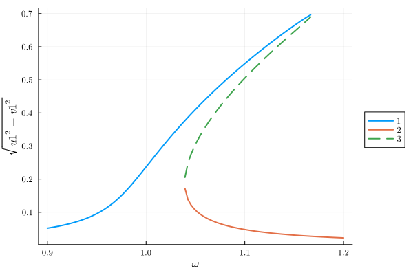

# Installation {#Installation}

Assuming that you are all [set up with a Julia and Jupyter](/introduction/index#setting-up-julia-and-jupyter-notebooks), it is easy to install HarmonicBalance.jl, as we are registered in the Julia General registry. You can simply run the following command in the Julia REPL:

```julia
julia> using Pkg
julia> Pkg.add("HarmonicBalance")
```


or

```julia
julia> ] # `]` should be pressed
julia> Pkg.add("HarmonicBalance")
```


You can check which version you have installled with the command

```julia
julia> ]
julia> status HarmonicBalance
```


# Getting Started {#getting_started}

Let us find the steady states of an external driven Duffing oscillator with nonlinear damping. Its equation of motion is:

$$\begin{equation}
\underbrace{\ddot{x}(t) + \gamma \dot{x}(t) + \omega_0^2 x(t)}_{\text{damped harmonic oscillator}} + \underbrace{\alpha x(t)^3}_{\text{Duffing coefficient}} = \underbrace{F \cos(\omega t)}_{\text{periodic drive}}
\end{equation}$$

```julia
using HarmonicBalance, Plots
@variables α ω ω0 F t η x(t) # declare constant variables and a function x(t)
eom = d(x,t,2) + ω0^2*x + α*x^3 + η*d(x,t)*x^2 ~ F*cos(ω*t)
diff_eq = DifferentialEquation(eom, x)
add_harmonic!(diff_eq, x, ω) # specify the ansatz x = u(T) cos(ωt) + v(T) sin(ωt)

# implement ansatz to get harmonic equations
harmonic_eq = get_harmonic_equations(diff_eq)

fixed = (α => 1.0, ω0 => 1.0, F => 0.01, η => 0.1)   # fixed parameters
varied = ω => range(0.9, 1.2, 100)           # range of parameter values
result = get_steady_states(harmonic_eq, varied, fixed)
```


```ansi
A steady state result for 100 parameter points

Solution branches:   3
   of which real:    3
   of which stable:  2

Classes: stable, physical, Hopf

```


The obtained steady states can be plotted as a function of the driving frequency:

```julia
plot(result, "sqrt(u1^2 + v1^2)")
```

{width=600px height=400px}

If you want learn more on what you can do with HarmonicBalance.jl, check out the [tutorials](/tutorials/index#tutorials). We also have collected some [examples](/examples/index#examples) of different physical systems.


---


# Setting Up Julia and Jupyter Notebooks {#Setting-Up-Julia-and-Jupyter-Notebooks}

To ensure a smooth experience with our package, please follow these steps to set up Julia and Jupyter notebooks. Once these steps are completed, you can proceed to install and use our package seamlessly.
1. **Download Julia**: Visit the [Julia Downloads page](https://julialang.org) and download the latest stable release for your operating system.
  
2. **Install Julia**: Follow the installation instructions for your platform:
  
3. Open Julia and enter the package manager by typing `]` in the Julia REPL.
  
4. Add the `IJulia` package, which integrates Julia with Jupyter:
  
  ```julia
  add IJulia
  ```
  
  
5. Once installed, we need to install a Julia Jupyter kernel:
  

```julia
using IJulia
installkernel("4 threads", env=Dict("JULIA_NUM_THREADS"=>"4"))
```

