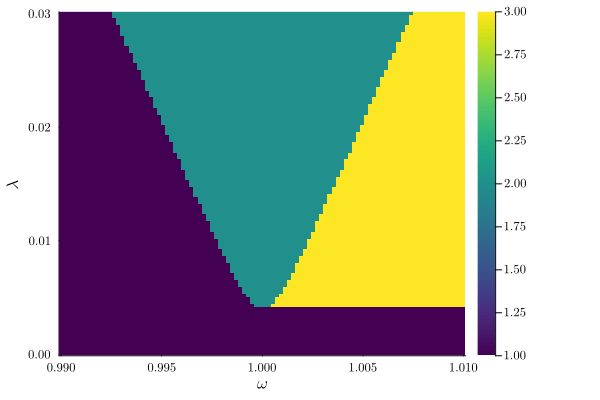
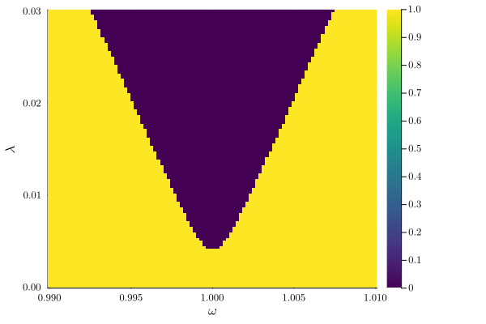
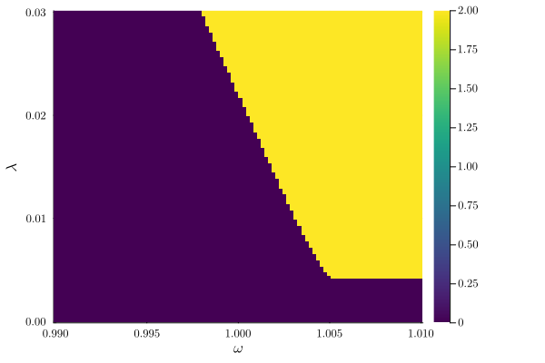

# Classifying solutions {#classifying}

Given that you obtained some steady states for a parameter sweep of a specific model it can be useful to classify these solution. Let us consider a simple parametric oscillator.

```julia
using HarmonicBalance

@variables ω₀ γ λ α ω t x(t)

natural_equation = d(d(x, t), t) + γ * d(x, t) + (ω₀^2 - λ * cos(2 * ω * t)) * x + α * x^3
diff_eq = DifferentialEquation(natural_equation, x)

add_harmonic!(diff_eq, x, ω);

harmonic_eq = get_harmonic_equations(diff_eq)
```


```ansi
A set of 2 harmonic equations
Variables: u1(T), v1(T)
Parameters: ω, α, γ, ω₀, λ

Harmonic ansatz: 
x(t) = u1(T)*cos(ωt) + v1(T)*sin(ωt)

Harmonic equations:

-(1//2)*u1(T)*λ + (2//1)*Differential(T)(v1(T))*ω + Differential(T)(u1(T))*γ - u1(T)*(ω^2) + u1(T)*(ω₀^2) + v1(T)*γ*ω + (3//4)*(u1(T)^3)*α + (3//4)*u1(T)*(v1(T)^2)*α ~ 0

Differential(T)(v1(T))*γ + (1//2)*v1(T)*λ - (2//1)*Differential(T)(u1(T))*ω - u1(T)*γ*ω - v1(T)*(ω^2) + v1(T)*(ω₀^2) + (3//4)*(u1(T)^2)*v1(T)*α + (3//4)*(v1(T)^3)*α ~ 0

```


We perform a 2d sweep in the driving frequency $\omega$ and driving strength $\lambda$:

```julia
fixed = (ω₀ => 1.0, γ => 0.002, α => 1.0)
varied = (ω => range(0.99, 1.01, 100), λ => range(1e-6, 0.03, 100))

result_2D = get_steady_states(harmonic_eq, varied, fixed)
```


```ansi
A steady state result for 10000 parameter points

Solution branches:   5
   of which real:    5
   of which stable:  3

Classes: stable, physical, Hopf

```


By default the steady states of the system are classified by four different catogaries:
- `physical`: Solutions that are physical, i.e., all variables are purely real.
  
- `stable`: Solutions that are stable, i.e., all eigenvalues of the Jacobian have negative real parts.
  
- `Hopf`: Solutions that are physical and have exactly two Jacobian eigenvalues with positive real parts, which are complex conjugates of each other. The class can help to identify regions where a limit cycle is present due to a [Hopf bifurcation](https://en.wikipedia.org/wiki/Hopf_bifurcation). See also the tutorial on [limit cycles](/tutorials/limit_cycles#limit_cycles).
  
- `binary_labels`: each region in the parameter sweep receives an identifier based on its permutation of stable branches. This allows to distinguish between different phases, which may have the same number of stable solutions.
  

We can plot the number of stable solutions in the sweep using the `phase_diagram` function

```julia
M = phase_diagram(result_2D, class="stable")
```


```ansi
100×100 Matrix{Int64}:
 1  1  1  1  1  1  1  1  1  1  1  1  1  …  1  1  1  1  1  1  1  1  1  1  1  1
 1  1  1  1  1  1  1  1  1  1  1  1  1     1  1  1  1  1  1  1  1  1  1  1  1
 1  1  1  1  1  1  1  1  1  1  1  1  1     1  1  1  1  1  1  1  1  1  1  1  1
 1  1  1  1  1  1  1  1  1  1  1  1  1     1  1  1  1  1  1  1  1  1  1  1  1
 1  1  1  1  1  1  1  1  1  1  1  1  1     1  1  1  1  1  1  1  1  1  1  1  1
 1  1  1  1  1  1  1  1  1  1  1  1  1  …  1  1  1  1  1  1  1  1  1  1  1  1
 1  1  1  1  1  1  1  1  1  1  1  1  1     1  1  1  1  1  1  1  1  1  1  1  1
 1  1  1  1  1  1  1  1  1  1  1  1  1     1  1  1  1  1  1  1  1  1  1  1  1
 1  1  1  1  1  1  1  1  1  1  1  1  1     1  1  1  1  1  1  1  1  1  1  1  1
 1  1  1  1  1  1  1  1  1  1  1  1  1     1  1  1  1  1  1  1  1  1  1  1  1
 ⋮              ⋮              ⋮        ⋱        ⋮              ⋮           
 1  1  1  1  1  1  1  1  1  1  1  1  1     3  3  3  3  3  3  3  3  3  3  3  3
 1  1  1  1  1  1  1  1  1  1  1  1  1     3  3  3  3  3  3  3  3  3  3  3  3
 1  1  1  1  1  1  1  1  1  1  1  1  1     3  3  3  3  3  3  3  3  3  3  3  3
 1  1  1  1  1  1  1  1  1  1  1  1  1     3  3  3  3  3  3  3  3  3  3  3  3
 1  1  1  1  1  1  1  1  1  1  1  1  1  …  3  3  3  3  3  3  3  3  3  3  3  3
 1  1  1  1  1  1  1  1  1  1  1  1  1     3  3  3  3  3  3  3  3  3  3  3  3
 1  1  1  1  1  1  1  1  1  1  1  1  1     3  3  3  3  3  3  3  3  3  3  3  3
 1  1  1  1  1  1  1  1  1  1  1  1  1     3  3  3  3  3  3  3  3  3  3  3  3
 1  1  1  1  1  1  1  1  1  1  1  1  1     3  3  3  3  3  3  3  3  3  3  3  3
```


The Matrix `M` contains the number of stable steady states for each parameter pair. You could visualize the matrix using your fovourite plotting library. Here we use `Plots.jl`, making use of the [PlotsExt.jl](/manual/plotting#plotting) extension of HarmonicBalance.jl.

```julia
using Plots
plot_phase_diagram(result_2D, class="stable")
```

{width=600px height=400px}

If we plot the a cut at $\lambda=0.01$, we see that in the blue region only one stable solution exists with zero amplitude:

```julia
plot(result_2D, y="√(u1^2+v1^2)", cut=λ => 0.01, class="stable") |> display
```


Indeed, extracting a single steady states gives an attractor with at zero:

```julia
get_single_solution(result_2D; branch=1, index=(1, 1))
```


```ansi
OrderedCollections.OrderedDict{Num, ComplexF64} with 7 entries:
  u1 => 1.39541e-203-2.74098e-205im
  v1 => 2.34229e-204+5.98032e-205im
  ω  => 0.99+0.0im
  λ  => 1.0e-6+0.0im
  ω₀ => 1.0+0.0im
  γ  => 0.002+0.0im
  α  => 1.0+0.0im
```


This solution becomes stable again outside the green lobe. Also called Mathieu lobe. Indeed, we can classify the zero amplitude solution by adding an extra category as a class:

```julia
classify_solutions!(result_2D, "sqrt(u1^2 + v1^2) < 0.001", "zero")
result_2D
```


```ansi
A steady state result for 10000 parameter points

Solution branches:   5
   of which real:    5
   of which stable:  3

Classes: zero, stable, physical, Hopf

```


We can visualize the zero amplitude solution:

```julia
plot_phase_diagram(result_2D, class=["zero", "stable"])
```

{width=600px height=400px}

This shows that inside the Mathieu lobe the zero amplitude solution becomes unstable due to the parametric drive being resonant with the oscillator.

We can also visualize the equi-amplitude curves of the solutions:

```julia
classify_solutions!(result_2D, "sqrt(u1^2 + v1^2) > 0.12", "large amplitude")
plot_phase_diagram(result_2D, class=["large amplitude", "stable"])
```

{width=600px height=400px}
