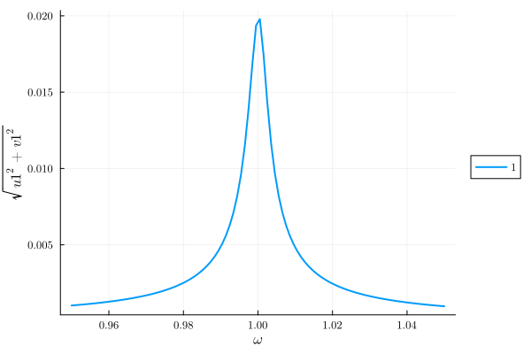
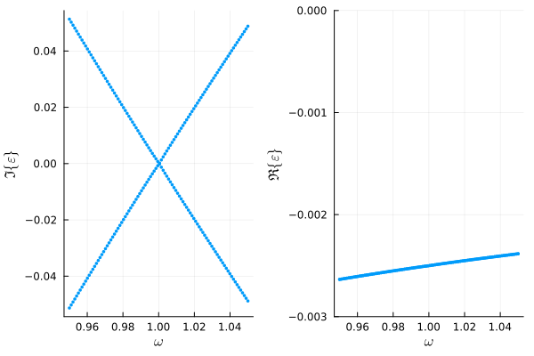
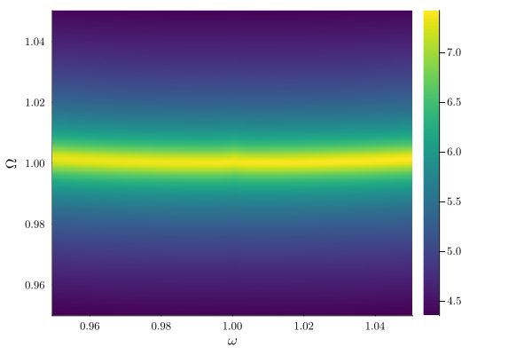
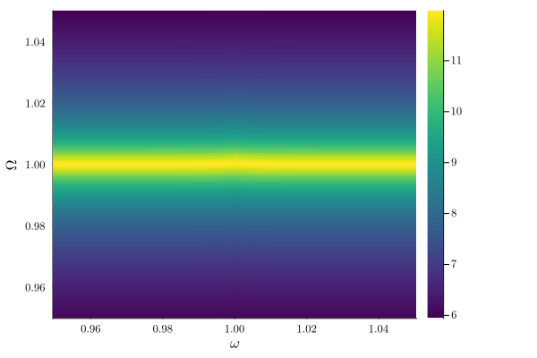
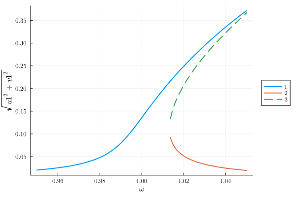
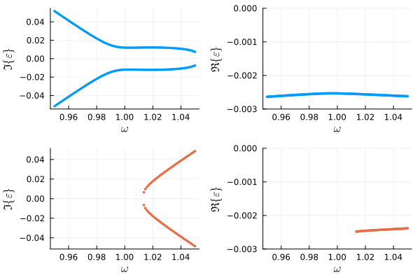
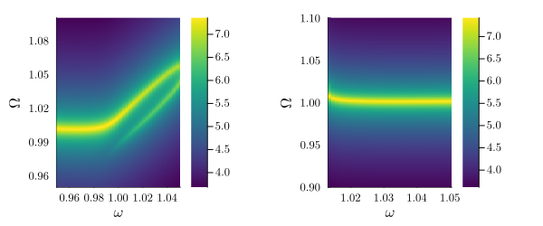
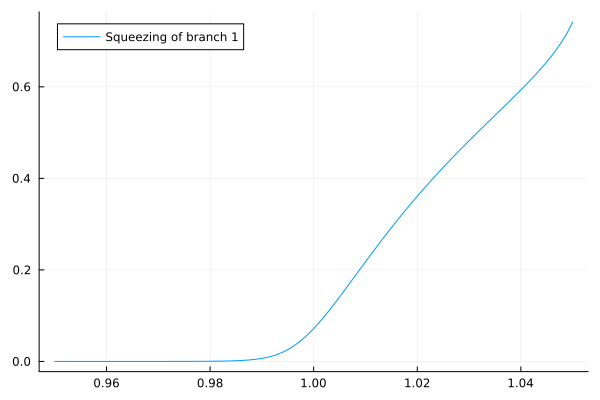
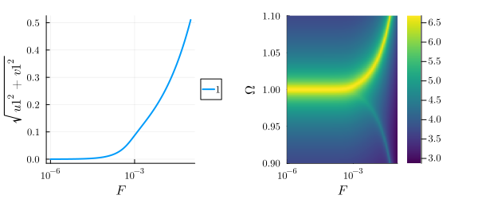

# Linear response {#linresp_ex}

In HarmonicBalance.jl, the [stability and linear response](/background/stability_response#linresp_background) are treated using the [`LinearResponse`](/manual/linear_response#linresp_man) module.

Here we calculate the white noise response of a simple nonlinear system. A set of reference results may be found in Huber et al. in [Phys. Rev. X 10, 021066 (2020)](https://doi.org/10.1103/PhysRevX.10.021066). We start by defining the [Duffing oscillator](/tutorials/steady_states#Duffing)

```julia
using HarmonicBalance
using Plots.Measures: mm
@variables α, ω, ω0, F, γ, t, x(t); # declare constant variables and a function x(t)

# define ODE
diff_eq = DifferentialEquation(d(x,t,2) + ω0*x + α*x^3 + γ*d(x,t) ~ F*cos(ω*t), x)

# specify the ansatz x = u(T) cos(ω*t) + v(T) sin(ω*t)
add_harmonic!(diff_eq, x, ω)

# implement ansatz to get harmonic equations
harmonic_eq = get_harmonic_equations(diff_eq)
```


```ansi
A set of 2 harmonic equations
Variables: u1(T), v1(T)
Parameters: ω, α, γ, ω0, F

Harmonic ansatz: 
x(t) = u1(T)*cos(ωt) + v1(T)*sin(ωt)

Harmonic equations:

u1(T)*ω0 + (2//1)*Differential(T)(v1(T))*ω + Differential(T)(u1(T))*γ - u1(T)*(ω^2) + v1(T)*γ*ω + (3//4)*(u1(T)^3)*α + (3//4)*u1(T)*(v1(T)^2)*α ~ F

Differential(T)(v1(T))*γ + v1(T)*ω0 - (2//1)*Differential(T)(u1(T))*ω - u1(T)*γ*ω - v1(T)*(ω^2) + (3//4)*(u1(T)^2)*v1(T)*α + (3//4)*(v1(T)^3)*α ~ 0

```


## Linear regime {#Linear-regime}

When driven weakly, the Duffing resonator behaves quasi-linearly, i.e, its response to noise is independent of the applied drive. We see that for weak driving, $F = 10^{-4}$, the amplitude is a Lorentzian.

```julia
fixed = (α => 1, ω0 => 1.0, γ => 0.005, F => 0.0001)   # fixed parameters
varied = ω => range(0.95, 1.05, 100)           # range of parameter values
result = get_steady_states(harmonic_eq, varied, fixed)

using Plots
plot(result, "sqrt(u1^2 + v1^2)")
```

{width=600px height=400px}

To find the fluctuation on the top of the steady state one often employs a [Bogoliubov-de Gennes analyses](https://en.wikipedia.org/wiki/Linear_dynamical_system). Here, we compute the eigenvalues $\lambda_k$ of the Jacobian matrix at the steady state. The imaginary part of the eigenvalues gives characteristic frequencies of the &quot;quasi-particle excitations&quot;. The real part gives the lifetime of these excitations.

The compute the eigenvalues of a specific branch, we can use the corresponding function:

```julia
eigvalues= eigenvalues(result, 1)
```


```ansi
100-element Vector{Vector{ComplexF64}}:
 [-0.002635025483416223 - 0.05130968369322024im, -0.002635025483416223 + 0.05130968369322024im]
 [-0.00263208498649721 + 0.0502456625392319im, -0.002632084986497203 - 0.05024566253923189im]
 [-0.0026291538496303474 - 0.049182829615858216im, -0.0026291538496303474 + 0.04918282961585821im]
 [-0.002626232033712053 + 0.048121181326731904im, -0.002626232033712041 - 0.048121181326731904im]
 [-0.002623319499673189 - 0.04706071411071011im, -0.002623319499673187 + 0.04706071411071011im]
 [-0.0026204162088748102 + 0.04600142444438698im, -0.0026204162088748085 - 0.04600142444438698im]
 [-0.0026175221229822465 + 0.044943308845025065im, -0.0026175221229822396 - 0.04494330884502506im]
 [-0.002614637203793596 + 0.04388636387398492im, -0.0026146372037935944 - 0.043886363873984924im]
 [-0.002611761413511878 - 0.04283058614074662im, -0.0026117614135118747 + 0.04283058614074661im]
 [-0.0026088947145430277 + 0.04177597230764105im, -0.002608894714543026 - 0.041775972307641046im]
 ⋮
 [-0.0024014301807852717 - 0.0410807145474565im, -0.00240143018078527 + 0.0410807145474565im]
 [-0.002399200789589509 - 0.04205057968925276im, -0.0023992007895895055 + 0.04205057968925276im]
 [-0.0023969778742868337 - 0.04301954219239343im, -0.002396977874286825 + 0.043019542192393435im]
 [-0.00239476140911226 - 0.043987604954327277im, -0.002394761409112253 + 0.04398760495432727im]
 [-0.002392551368596764 - 0.04495477083104321im, -0.002392551368596757 + 0.04495477083104321im]
 [-0.0023903477274196464 + 0.04592104264110824im, -0.0023903477274196394 - 0.045921042641108245im]
 [-0.002388150460397559 + 0.04688642316912874im, -0.002388150460397552 - 0.046886423169128756im]
 [-0.0023859595425549177 + 0.04785091516872298im, -0.002385959542554909 - 0.047850915168722974im]
 [-0.0023837749491295024 - 0.048814521365088855im, -0.0023837749491295024 + 0.04881452136508884im]
```


Using the [PlotsExt.jl](/manual/plotting#plotting) extension, one can quickly compute and plot the eigenvalues as follows

```julia
plot(
    plot_eigenvalues(result, 1),
    plot_eigenvalues(result, 1, type=:real, ylims=(-0.003, 0)),
)
```

{width=600px height=400px}

We find a single pair of complex conjugate eigenvalues linearly changing with the driving frequency. Both real parts are negative, indicating stability.

As discussed in [background section on linear response](/background/stability_response#linresp_background), the excitation manifest itself as a lorentenzian peak in a Power Spectral Density (PSD) measurement. The PSD can be plotted using [`plot_linear_response`](/manual/linear_response#linresp_man):

```julia
plot_linear_response(result, x, 1, Ω_range=range(0.95, 1.05, 300), logscale=true)
```

{width=600px height=400px}

The response has a peak at $\omega_0$, irrespective of the driving frequency $\omega$. Indeed, the eigenvalues shown before where plotted in the rotating frame at the frequency of the drive $\omega$. Hence, the imaginary part of eigenvalues shows the frequency (energy) needed to excite the system at it natural frequency (The frequency its want to be excited at.)

Note the slight &quot;bending&quot; of the noise peak with $\omega$ - this is given by the failure of the first-order calculation of the jacobian to capture response far-detuned from the drive frequency. One can correct this by using higher-order derivatives of the `Differentialequation` object in the jacobian calculation. For more details on this see the [thesis](https://www.doi.org/10.3929/ethz-b-000589190). We can use this corrections by setting the `order` argument in the `plot_linear_response` function:

```julia
plot_linear_response(result, x, 1, Ω_range=range(0.95, 1.05, 300), logscale=true, order=2)
```

{width=600px height=400px}

To compute the matrix without plotting you can use the functions specified at the [linear respinse manual](/manual/linear_response#linresp_man).

## Nonlinear regime {#Nonlinear-regime}

For strong driving, matters get more complicated. Let us now use a drive $F = 2*10^{-3}$ :

```julia
fixed = (α => 1, ω0 => 1.0, γ => 0.005, F => 0.002)   # fixed parameters
varied = ω => range(0.95, 1.05, 100)           # range of parameter values
result = get_steady_states(harmonic_eq, varied, fixed)

plot(result, x="ω", y="sqrt(u1^2 + v1^2)");
```

{width=600px height=400px}

The amplitude is the well-known Duffing curve. Let&#39;s look at the eigenvalues of the two stable branches, 1 and 2.

```julia
plot(
    plot_eigenvalues(result, 1),
    plot_eigenvalues(result, 1, type=:real, ylims=(-0.003, 0)),
    plot_eigenvalues(result, 2),
    plot_eigenvalues(result, 2, type=:real, ylims=(-0.003, 0)),
)
```

{width=600px height=400px}

Again every branch gives a single pair of complex conjugate eigenvalues. However, for branch 1, the characteristic frequencies due not change linearly with the driving frequency around $\omega=\omega_0$. This is a sign of steady state becoming nonlinear at large amplitudes.

The same can be seen in the PSD:

```julia
plot(
  plot_linear_response(result, x, 1, Ω_range=range(0.95,1.1,300), logscale=true),
  plot_linear_response(result, x, 2, Ω_range=range(0.9,1.1,300), logscale=true),
    size=(600, 250), margin=3mm
)
```

{width=600px height=250px}

In branch 1 the linear response to white noise shows _more than one peak_. This is a distinctly nonlinear phenomenon, indicative of the squeezing of the steady state. Branch 2 is again quasi-linear, which stems from its low amplitude.

We can compute the squeezing of the steady states by using the corresponding eigenvectors of the eigenvalus. Indeed, defining (TODO add reference)

```julia
function symplectic(v)
    2 * (real(v[1]) * imag(v[2]) - imag(v[1]) * real(v[2]))
end
function squeeze(v)
    symp = symplectic(v)
    ((1 - symp) / (1 + symp))^sign(symp)
end
```


```ansi
squeeze (generic function with 1 method)
```


We can compute the squeezing of the steady states as follows:

```julia
eigvecs = eigenvectors(result, 1)
squeezed = [squeeze.(eachcol(mat))[1] for mat in eigvecs]
plot(range(0.95, 1.05, 100), squeezed, label="Squeezing of branch 1")
```

{width=600px height=400px}

Following [Huber et al.](https://doi.org/10.1103/PhysRevX.10.021066), we may also fix $\omega = \omega_0$ and plot the linear response as a function of $F$. The response turns out to be single-valued over a large range of driving strengths. Using a log scale for the x-axis:

```julia
fixed = (α => 1., ω0 => 1.0, γ => 1e-2, ω => 1)   # fixed parameters
swept = F => 10 .^ range(-6, -1, 200)           # range of parameter values
result = get_steady_states(harmonic_eq, swept, fixed)

plot(
  plot(result, "sqrt(u1^2 + v1^2)", xscale=:log),
  plot_linear_response(result, x, 1, Ω_range=range(0.9,1.1,300), logscale=true, xscale=:log),
  size=(600, 250), margin=3mm
)
```

{width=600px height=250px}

We see that for low $F$, quasi-linear behaviour with a single Lorentzian response occurs, while for larger $F$, two peaks form in the noise response. The two peaks are strongly unequal in magnitude, which is an example of internal squeezing (See supplemental material of [Huber et al.](https://doi.org/10.1103/PhysRevX.10.021066)).
