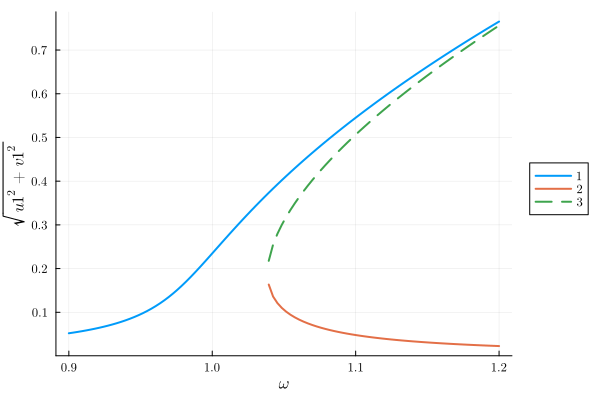
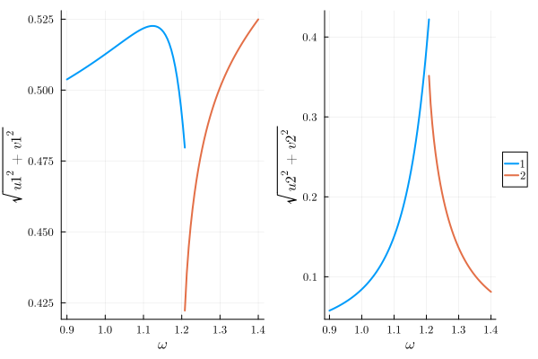

# Finding the steady states of a Duffing oscillator {#Duffing}

Here we show the workflow of HarmonicBalance.jl on a simple example - the driven Duffing oscillator. The equation of motion for the displacement $x(t)$ reads

$$\begin{equation}
\underbrace{\ddot{x}(t) + \gamma \dot{x}(t) + \omega_0^2 x(t)}_{\text{damped harmonic oscillator}} + \underbrace{\alpha x(t)^3}_{\text{Duffing coefficient}} = \underbrace{F \cos(\omega t)}_{\text{periodic drive}}
\end{equation}$$

In general, there is no analytical solution to the differential equation. Fortunately, some harmonics are more important than others. By truncating the infinite-dimensional Fourier space to a set of judiciously chosen harmonics, we may obtain a soluble system. For the Duffing resonator, we can well try to only consider the drive frequency $\omega$. To implement this, we use the _harmonic ansatz_

$$x(t) = U \cos(\omega t) + V \sin(\omega t) \,,$$

which constraints the spectrum of $x(t)$ to a single harmonic. Fixing the quadratures $U$ and $V$ to be constant then reduces the differential equation to two coupled cubic polynomial equations (for more details on this step, see the appendices in the [white paper](https://scipost.org/SciPostPhysCodeb.6)). Finding the roots of coupled polynomials is in general very hard. We here apply the method of homotopy continuation, as implemented in [HomotopyContinuation.jl](https://www.juliahomotopycontinuation.org/) which is guaranteed to find the complete set of roots.

First we need to declare the symbolic variables (the excellent [Symbolics.jl](https://github.com/JuliaSymbolics/Symbolics.jl) is used here).

```julia
using HarmonicBalance
@variables α ω ω0 F γ t x(t) # declare constant variables and a function x(t)
```

$$ \begin{equation}
\left[
\begin{array}{c}
\alpha \\
\omega \\
\mathtt{{\omega}0} \\
F \\
\gamma \\
t \\
x\left( t \right) \\
\end{array}
\right]
\end{equation}
 $$

Next, we have to input the equations of motion. This will be stored as a `DifferentialEquation`. The input needs to specify that only `x` is a mathematical variable, the other symbols are parameters:

```julia
diff_eq = DifferentialEquation(d(x,t,2) + ω0^2*x + α*x^3 + γ*d(x,t) ~ F*cos(ω*t), x)
```


```ansi
System of 1 differential equations
Variables:       x(t)
Harmonic ansatz: x(t) => ;   

Differential(t)(Differential(t)(x(t))) + Differential(t)(x(t))*γ + x(t)*(ω0^2) + (x(t)^3)*α ~ F*cos(t*ω)

```


## One harmonic {#One-harmonic}

The harmonic ansatz needs to be specified now – we expand `x` in a single frequency $\omega$.

```julia
add_harmonic!(diff_eq, x, ω) # specify the ansatz x = u(T) cos(ωt) + v(T) sin(ωt)
```


The object `diff_eq` now contains all the necessary information to convert the differential equation to the algebraic _harmonic equations_ (coupled polynomials in $U$ and $V$).

```julia
harmonic_eq = get_harmonic_equations(diff_eq)
```


```ansi
A set of 2 harmonic equations
Variables: u1(T), v1(T)
Parameters: ω, α, γ, ω0, F

Harmonic ansatz: 
x(t) = u1(T)*cos(ωt) + v1(T)*sin(ωt)

Harmonic equations:

(2//1)*Differential(T)(v1(T))*ω + Differential(T)(u1(T))*γ - u1(T)*(ω^2) + u1(T)*(ω0^2) + v1(T)*γ*ω + (3//4)*(u1(T)^3)*α + (3//4)*u1(T)*(v1(T)^2)*α ~ F

Differential(T)(v1(T))*γ - (2//1)*Differential(T)(u1(T))*ω - u1(T)*γ*ω - v1(T)*(ω^2) + v1(T)*(ω0^2) + (3//4)*(u1(T)^2)*v1(T)*α + (3//4)*(v1(T)^3)*α ~ 0

```


The variables `u1` and `v1` were declared automatically to construct the harmonic ansatz. The _slow time_ variable `T` describes variation of the quadratures on timescales much slower than `ω`. For a steady state, all derivatives w.r.t `T` vanish, leaving only algebraic equations to be solved.

We are ready to start plugging in numbers! Let us find steady states by solving `harmonic_eq` for numerical parameters. Homotopy continuation is especially suited to [solving over a range of parameter values](https://www.juliahomotopycontinuation.org/guides/parameter-homotopies/). Here we will solve over a range of driving frequencies `ω` – these are stored as `Pairs{Sym, Vector{Float}}`:

```julia
varied = ω => range(0.9, 1.2, 100); # range of parameter values
```


```ansi
ω => 0.9:0.0030303030303030303:1.2
```


The other parameters we be fixed – these are declared as `Pairs{Sym, Float}` pairs:

```julia
fixed = (α => 1., ω0 => 1.0, F => 0.01, γ => 0.01); # fixed parameters
```


```ansi
(α => 1.0, ω0 => 1.0, F => 0.01, γ => 0.01)
```


Now everything is ready to crank the handle. `get_steady_states` solves our `harmonic_eq` using the varied and fixed parameters:

```julia
result = get_steady_states(harmonic_eq, varied, fixed)
```


```ansi
A steady state result for 100 parameter points

Solution branches:   3
   of which real:    3
   of which stable:  2

Classes: stable, physical, Hopf

```


The algorithm has found 3 solution branches in total (out of the [hypothetically admissible](https://en.wikipedia.org/wiki/B%C3%A9zout%27s_theorem) $3^{2} = 9$). All of these are real – and therefore physically observable – for at least some values of $\omega$. Only 2 branches are stable under infinitesimal perturbations. The &quot;Classes&quot; are boolean labels classifying each solution point, which may be used to select results for plotting.

To visualize the results, we can use the `Plots.jl` extension of HarmonicBalance. In short, the [PlotsExt.jl](/manual/plotting#plotting) code module gets loaded up conditions that Plots.jl is loaded. To know more about package extensions, you can visit the [julia documentation](https://pkgdocs.julialang.org/v1/creating-packages/#Conditional-loading-of-code-in-packages-(Extensions)).

Here we plot the solution amplitude, $\sqrt{U^2 + V^2}$ against the drive frequency $\omega$:

```julia
using Plots
plot(result, "sqrt(u1^2 + v1^2)")
```

{width=600px height=400px}

This is the expected [response curve](https://en.wikipedia.org/wiki/Duffing_equation#Frequency_response) for the Duffing equation.

If you want to use another plotting package then `Plots.jl`, you can extract the desired the data from the `result` object and use it in your preferred plotting package.

```julia
Y = get_solutions(result, "sqrt(u1^2 + v1^2)")
```


```ansi
100-element Vector{Vector{ComplexF64}}:
 [0.052018252688548865 + 1.4763556108352277e-39im, NaN + NaN*im, NaN + NaN*im]
 [0.05350409873601037 + 1.7682816237800798e-38im, NaN + NaN*im, NaN + NaN*im]
 [0.05507950952558313 - 1.5042017114615136e-39im, NaN + NaN*im, NaN + NaN*im]
 [0.056752395754592934 + 1.7608932232281176e-38im, NaN + NaN*im, NaN + NaN*im]
 [0.058531557933164474 + 1.1895072065808566e-38im, NaN + NaN*im, NaN + NaN*im]
 [0.06042680006976532 + 1.4084347341650409e-37im, NaN + NaN*im, NaN + NaN*im]
 [0.062449057224280326 + 2.022070885121794e-39im, NaN + NaN*im, NaN + NaN*im]
 [0.06461053756748154 + 3.782899235883258e-37im, NaN + NaN*im, NaN + NaN*im]
 [0.06692487893821529 - 7.159750257578077e-37im, NaN + NaN*im, NaN + NaN*im]
 [0.06940731879175716 - 9.05749869876619e-36im, NaN + NaN*im, NaN + NaN*im]
 ⋮
 [0.7208945671058409 + 9.805071127351202e-71im, 0.02617300479879441 + 0.0im, NaN + NaN*im]
 [0.7272065484880825 + 6.455560019902363e-41im, 0.02569212388375472 - 1.4059605599584656e-45im, NaN + NaN*im]
 [0.7334774314184077 + 1.4513647193008286e-48im, 0.02522748187697229 + 1.9583778876510703e-48im, NaN + NaN*im]
 [0.7397074914670921 + 3.256748601526058e-44im, 0.024778270139119492 - 2.191065954103261e-47im, NaN + NaN*im]
 [0.7458968612891713 + 6.394090250338288e-47im, 0.02434373315416625 + 0.0im, NaN + NaN*im]
 [0.7520454974269711 + 2.0325083638737126e-34im, 0.02392316420636251 + 6.839513540641689e-49im, NaN + NaN*im]
 [0.7581531325641623 + 1.260507399367225e-34im, 0.023515901475943724 - 8.564483740088528e-50im, NaN + NaN*im]
 [0.7642192050744053 - 1.0553764276822929e-46im, 0.023121324506598654 - 1.7448925014840846e-46im, NaN + NaN*im]
 [0.770242751665831 - 1.5760481466634026e-45im, 0.02273885100371398 - 2.2441104597360666e-44im, NaN + NaN*im]
```


## Using multiple harmonics {#Using-multiple-harmonics}

In the above section, we truncated the Fourier space to a single harmonic $\omega$ – the oscillator was assumed to only oscillate at the drive frequency. However, the Duffing oscillator can exhibit a rich spectrum of harmonics. We can obtain some intuition by treating $\alpha$ perturbatively in the equation of motion, i.e., by solving

$$\ddot{x}(t) + \gamma \dot{x}(t) + \omega_0^2 x(t) + \epsilon \alpha x(t)^3 = F \cos(\omega t)$$

for small $\epsilon$. To zeroth order, the response of the system is $x_0(t) = X_0 \cos(\omega t + \phi_0)$. Expanding $x(t) = x_0(t) + \epsilon x_1(t)$, we find that the perturbation $x_1(t)$ satisfies to first order

$$\ddot{x}_1(t) + \gamma \dot{x}_1(t) \left[ \omega_0^2 + \frac{3 \alpha X_0^2}{4} \right] x_1(t) = - \frac{\alpha X_0^3}{4} \cos(3 \omega t + 3 \phi_0) \,,$$

which gives a response of the form $x_1(t) = X_1 \cos(3 \omega t + \phi_1)$. Clearly, the oscillator now responds not only at frequency $\omega$, but also at $3 \omega$! This effect is known as [_high harmonic generation_](https://en.wikipedia.org/wiki/High_harmonic_generation) or more generally _frequency conversion_. By continuing the procedure to higher orders, we eventually obtain an infinity of harmonics present in the response. In general, there is no analytical solution to such problems.

We argued that frequency conversion takes place, to first order from $\omega$ to $3 \omega$. We can reflect this process by using a extended harmonic ansatz:

$$\begin{equation}
x(t) = U_1 \cos(\omega t) + V_1 \sin(\omega t) + U_2 \cos(3\omega t) + V_2 \sin(3\omega t) \,.
\end{equation}$$

Note that this is not a perturbative treatment! The harmonics $\omega$ and $3 \omega$ are on the same footing here. This is implemented as

```julia
add_harmonic!(diff_eq, x, [ω, 3ω]) # specify the two-harmonics ansatz
harmonic_eq = get_harmonic_equations(diff_eq)
```


```ansi
A set of 4 harmonic equations
Variables: u1(T), v1(T), u2(T), v2(T)
Parameters: ω, ω0, γ, α, F

Harmonic ansatz: 
x(t) = u1(T)*cos(ωt) + v1(T)*sin(ωt) + u2(T)*cos(3ωt) + v2(T)*sin(3ωt)

Harmonic equations:

(2//1)*Differential(T)(v1(T))*ω + Differential(T)(u1(T))*γ - u1(T)*(ω^2) + u1(T)*(ω0^2) + v1(T)*γ*ω + (3//4)*(u1(T)^3)*α + (3//4)*(u1(T)^2)*u2(T)*α + (3//2)*u1(T)*(v2(T)^2)*α + (3//2)*u1(T)*v2(T)*v1(T)*α + (3//4)*u1(T)*(v1(T)^2)*α + (3//2)*u1(T)*(u2(T)^2)*α - (3//4)*(v1(T)^2)*u2(T)*α ~ F

Differential(T)(v1(T))*γ - (2//1)*Differential(T)(u1(T))*ω - u1(T)*γ*ω - v1(T)*(ω^2) + v1(T)*(ω0^2) + (3//4)*(u1(T)^2)*v2(T)*α + (3//4)*(u1(T)^2)*v1(T)*α - (3//2)*u1(T)*v1(T)*u2(T)*α + (3//2)*(v2(T)^2)*v1(T)*α - (3//4)*v2(T)*(v1(T)^2)*α + (3//4)*(v1(T)^3)*α + (3//2)*v1(T)*(u2(T)^2)*α ~ 0

Differential(T)(u2(T))*γ + (6//1)*Differential(T)(v2(T))*ω + (3//1)*v2(T)*γ*ω - (9//1)*u2(T)*(ω^2) + u2(T)*(ω0^2) + (1//4)*(u1(T)^3)*α + (3//2)*(u1(T)^2)*u2(T)*α - (3//4)*u1(T)*(v1(T)^2)*α + (3//4)*(v2(T)^2)*u2(T)*α + (3//2)*(v1(T)^2)*u2(T)*α + (3//4)*(u2(T)^3)*α ~ 0//1

-(6//1)*Differential(T)(u2(T))*ω + Differential(T)(v2(T))*γ - (9//1)*v2(T)*(ω^2) + v2(T)*(ω0^2) - (3//1)*u2(T)*γ*ω + (3//2)*(u1(T)^2)*v2(T)*α + (3//4)*(u1(T)^2)*v1(T)*α + (3//4)*(v2(T)^3)*α + (3//2)*v2(T)*(v1(T)^2)*α + (3//4)*v2(T)*(u2(T)^2)*α - (1//4)*(v1(T)^3)*α ~ 0//1

```


The variables `u1`, `v1` now encode `ω` and `u2`, `v2` encode `3ω`. We see this system is much harder to solve as we now have 4 harmonic variables, resulting in 4 coupled cubic equations. A maximum of $3^4 = 81$ solutions [may appear](https://en.wikipedia.org/wiki/B%C3%A9zout%27s_theorem)!

```julia
result = get_steady_states(harmonic_eq, varied, fixed)
plot(result, "sqrt(u1^2 + v1^2)")
```

{width=600px height=400px}

For the above parameters (where a perturbative treatment would have been reasonable), the principal response at $\omega$ looks rather similar, with a much smaller upconverted component appearing at $3 \omega$:

```julia
p1=plot(result, "sqrt(u1^2 + v1^2)", legend=false)
p2=plot(result, "sqrt(u2^2 + v2^2)")
plot(p1, p2)
```

{width=600px height=400px}

The non-perturbative nature of the ansatz allows us to capture some behaviour which is _not_ a mere extension of the usual single-harmonic Duffing response. Suppose we drive a strongly nonlinear resonator at frequency $\omega \cong \omega_0 / 3$. Such a drive is far out of resonance, however, the upconverted harmonic $3 \omega = \omega_0$ is not and may play an important role! Let us try this out:

```julia
fixed = (α => 10., ω0 => 3, F => 5, γ=>0.01)   # fixed parameters
varied = ω => range(0.9, 1.4, 100)           # range of parameter values
result = get_steady_states(harmonic_eq, varied, fixed)
```


```ansi
A steady state result for 100 parameter points

Solution branches:   7
   of which real:    2
   of which stable:  2

Classes: stable, physical, Hopf

```


Although 9 branches were found in total, only 3 remain physical (real-valued). Let us visualise the amplitudes corresponding to the two harmonics, $\sqrt{U_1^2 + V_1^2}$ and $\sqrt{U_2^2 + V_2^2}$ :

```julia
p1 = plot(result, "sqrt(u1^2 + v1^2)", legend=false)
p2 = plot(result, "sqrt(u2^2 + v2^2)")
plot(p1, p2)
```

{width=600px height=400px}

The contributions of $\omega$ and $3\omega$ are now comparable and the system shows some fairly complex behaviour! This demonstrates how an exact solution within an extended Fourier subspace goes beyond a perturbative treatment.
