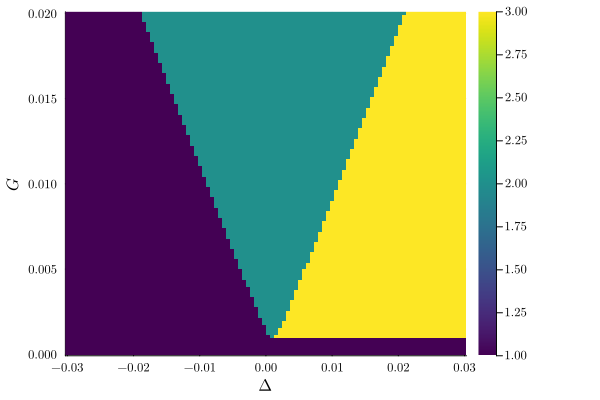
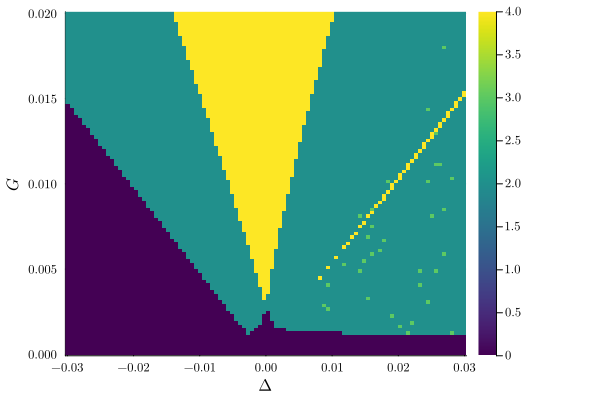
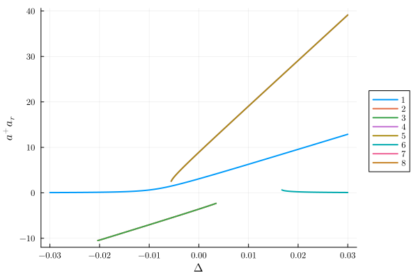
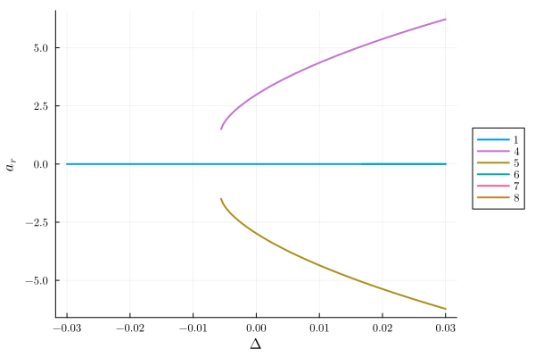
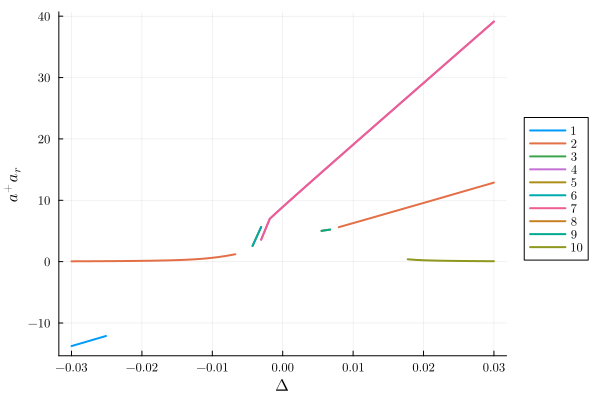

# Cumulant approximations for the Kerr parametric oscillator {#Cumulant-approximations-for-the-Kerr-parametric-oscillator}

Let us compare the higher cumulant approximations for the Kerr parametric oscillator (KPO). The KPO is a model for a cavity with a Kerr nonlinearity and a parametric drive after one applied the Rotating Wave approximation. For this we use the `QuantumCumulants` and the `QuantumCumulantsExt` module in `HarmonicBalance`.

```julia
using QuantumCumulants, HarmonicBalance, Plots
```


## first order cumulant {#first-order-cumulant}

Let us define the Hamiltonian of the KPO using QuantumCumulants.

```julia
h = FockSpace(:cavity)
@qnumbers a::Destroy(h)
@variables Δ::Real U::Real G::Real κ::Real
param = [Δ, U, G, κ]

H_RWA = (-Δ + U) * a' * a + U * (a'^2 * a^2) / 2 - G * (a' * a' + a * a) / 2
ops = [a, a']
```


```ansi
2-element Vector{QuantumCumulants.QSym}:
 a
 a′
```


We can now compute the mean-field equations for the KPO using the `meanfield` function from `QuantumCumulants`. We need the complete the system equations of moition using the `complete` function.

```julia
eqs_RWA = meanfield(ops, H_RWA, [a]; rates=[κ], order=1)
eqs_completed_RWA = complete(eqs_RWA)
```

\begin{align}
\frac{d}{dt} \langle a\rangle  &=  - U \mathit{i} \langle a\rangle ^{2} \langle a^\dagger\rangle  -0.5 \kappa \langle a\rangle  + \left(  - U + \Delta \right) \mathit{i} \langle a\rangle  + G \mathit{i} \langle a^\dagger\rangle  \\
\frac{d}{dt} \langle a^\dagger\rangle  &=  - G \mathit{i} \langle a\rangle  -0.5 \kappa \langle a^\dagger\rangle  + U \mathit{i} \langle a\rangle  \langle a^\dagger\rangle ^{2} + \left( U - \Delta \right) \mathit{i} \langle a^\dagger\rangle 
\end{align}


To compute the steady states of the KPO, we use `HarmonicBalance`. We define the HomotopyContinuation problem using the `Problem`.

```julia
fixed = (U => 0.001, κ => 0.002)
varied = (Δ => range(-0.03, 0.03, 100), G => range(1e-5, 0.02, 100))
problem_c1 = HarmonicSteadyState.HomotopyContinuationProblem(
    eqs_completed_RWA, param, varied, fixed
)
```


```ansi
2 algebraic equations for steady states
Variables: aᵣ, aᵢ
Parameters: Δ, U, G, κ

```


This gives us the phase

```julia
result = get_steady_states(problem_c1, WarmUp())
plot_phase_diagram(result; class="stable")
```

{width=600px height=400px}

## second order cumulant {#second-order-cumulant}

The next order cumulant can be computed by setting the `order` keyword.

```julia
ops = [a]
eqs_RWA = meanfield(ops, H_RWA, [a]; rates=[κ], order=2)
eqs_c2 = complete(eqs_RWA)
problem_c2 = HarmonicSteadyState.HomotopyContinuationProblem(eqs_c2, param, varied, fixed)
```


```ansi
5 algebraic equations for steady states
Variables: aᵣ, aᵢ, a⁺aᵣ, aaᵣ, aaᵢ
Parameters: Δ, U, G, κ

```


Which gives us the phase diagram

```julia
result = get_steady_states(problem_c2, WarmUp())
plot_phase_diagram(result; class="stable", clim=(0, 4))
```

{width=600px height=400px}

However, the phase diagram seems to wrong. Indeed, plotting, the photon number `a⁺aᵣ` shows that and additional state with  the negative photon number is stable. However, the this is unphysical.

```julia
fixed = (U => 0.001, κ => 0.002, G => 0.01)
varied = (Δ => range(-0.03, 0.03, 200))
problem_c2 = HarmonicSteadyState.HomotopyContinuationProblem(eqs_c2, param, varied, fixed)
result = get_steady_states(problem_c2, TotalDegree())
plot(result; y="a⁺aᵣ", class="stable")
```

{width=600px height=400px}

Let us classify the solutions having negative photon numbers. That way we can filter out these solutions.

```julia
classify_solutions!(result, "a⁺aᵣ < 0", "neg photon number");
plot(result; y="aᵣ", class="stable", not_class="neg photon number")
```

{width=600px height=400px}

## third order cumulant {#third-order-cumulant}

Similarly, for third order

```julia
ops = [a]
eqs_RWA = meanfield(ops, H_RWA, [a]; rates=[κ], order=3)
eqs_c3 = complete(eqs_RWA)

fixed = (U => 0.001, κ => 0.002, G => 0.01)
varied = (Δ => range(-0.03, 0.03, 50))
problem_c3 = HarmonicSteadyState.HomotopyContinuationProblem(eqs_c3, param, varied, fixed)
result = get_steady_states(problem_c3, TotalDegree())
classify_solutions!(result, "a⁺aᵣ < 0", "neg photon number");
plot(result; y="a⁺aᵣ", class="stable")
```

{width=600px height=400px}


---


_This page was generated using [Literate.jl](https://github.com/fredrikekre/Literate.jl)._
