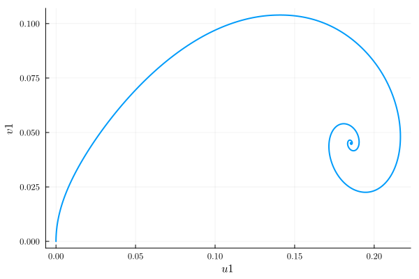
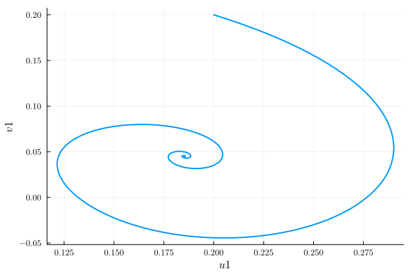
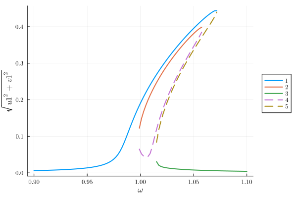
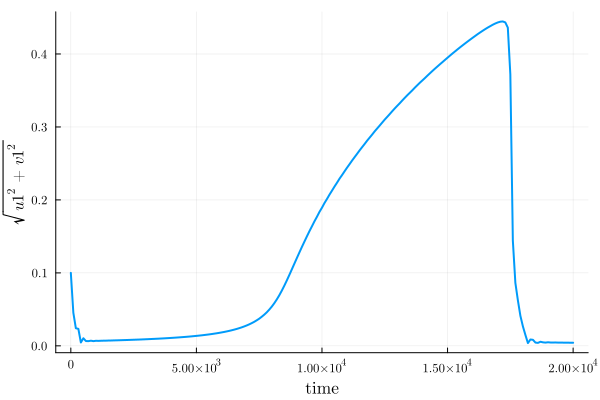

# Time-dependent simulations {#Time-dependent-simulations}

Most of HarmonicBalance.jl is focused on finding and analysing the steady states. Such states contain no information about transient behaviour, which is crucial to answer the following.
- Given an initial condition, which steady state does the system evolve into?
  
- How does the system behave if its parameters are varied in time?
  

It is straightforward to evolve the full equation of motion using an ODE solver. However, tracking oscillatory behaviour is computationally expensive.

In the [background](/background/harmonic_balance#intro_hb), we showed that nonlinear driven systems may be reduced to harmonic equations

$$\begin{equation}
\frac{d\mathbf{u}(T)}{dT}  = \bar{\mathbf{F}} (\mathbf{u})\,,
\end{equation}$$

As long as the chosen harmonics constituting $\mathbf{u}(T)$ capture the system&#39;s behaviour, we may numerically evolve the new effective differential equations instead of the full problem. Since the components of $\mathbf{u}(T)$ only vary very slowly (and are constant in a steady state), this is usually _vastly_ more efficient than evolving the full problem.

Here we primarily demonstrate on the parametrically driven oscillator.

We start by defining our system.

```julia
using HarmonicBalance, Plots
@variables ω0 γ λ F θ η α ω t x(t)

eq =  d(d(x,t),t) + γ*d(x,t) + ω0^2*(1 - λ*cos(2*ω*t))*x + α*x^3 + η*d(x,t)*x^2 ~ F*cos(ω*t + θ)

diff_eq = DifferentialEquation(eq, x)
add_harmonic!(diff_eq, x, ω); # single-frequency ansatz

harmonic_eq = get_harmonic_equations(diff_eq);
```


```ansi
A set of 2 harmonic equations
Variables: u1(T), v1(T)
Parameters: ω, α, γ, λ, ω0, η, θ, F

Harmonic ansatz: 
x(t) = u1(T)*cos(ωt) + v1(T)*sin(ωt)

Harmonic equations:

(2//1)*Differential(T)(v1(T))*ω + Differential(T)(u1(T))*γ - u1(T)*(ω^2) + u1(T)*(ω0^2) + v1(T)*γ*ω + (3//4)*(u1(T)^3)*α + (3//4)*(u1(T)^2)*Differential(T)(u1(T))*η + (1//2)*u1(T)*Differential(T)(v1(T))*v1(T)*η + (3//4)*u1(T)*(v1(T)^2)*α - (1//2)*u1(T)*λ*(ω0^2) + (1//4)*(v1(T)^2)*Differential(T)(u1(T))*η + (1//4)*(u1(T)^2)*v1(T)*η*ω + (1//4)*(v1(T)^3)*η*ω ~ F*cos(θ)

Differential(T)(v1(T))*γ - (2//1)*Differential(T)(u1(T))*ω - u1(T)*γ*ω - v1(T)*(ω^2) + v1(T)*(ω0^2) + (1//4)*(u1(T)^2)*Differential(T)(v1(T))*η + (3//4)*(u1(T)^2)*v1(T)*α + (1//2)*u1(T)*v1(T)*Differential(T)(u1(T))*η + (3//4)*Differential(T)(v1(T))*(v1(T)^2)*η + (3//4)*(v1(T)^3)*α + (1//2)*v1(T)*λ*(ω0^2) - (1//4)*(u1(T)^3)*η*ω - (1//4)*u1(T)*(v1(T)^2)*η*ω ~ -F*sin(θ)

```


The object `harmonic_eq` encodes the new effective differential equations.

We now wish to parse this input into [OrdinaryDiffEq.jl](https://diffeq.sciml.ai/stable/) and use its powerful ODE solvers. The desired object here is `OrdinaryDiffEq.ODEProblem`, which is then fed into `OrdinaryDiffEq.solve`.

## Evolving from an initial condition {#Evolving-from-an-initial-condition}

Given $\mathbf{u}(T_0)$, what is $\mathbf{u}(T)$ at future times?

For constant parameters, a [`HarmonicEquation`](/manual/API#QuestBase.HarmonicEquation) object can be fed into the constructor of [`ODEProblem`](/manual/API#SciMLBase.ODEProblem). The syntax is similar to DifferentialEquations.jl :

```julia
using OrdinaryDiffEqTsit5
u0 = [0.; 0.] # initial condition
fixed = (ω0 => 1.0, γ => 1e-2, λ => 5e-2, F => 1e-3,  α => 1.0, η => 0.3, θ => 0, ω => 1.0) # parameter values

ode_problem = ODEProblem(harmonic_eq, fixed, u0 = u0, timespan = (0,1000))
```


```ansi
ODEProblem with uType Vector{Float64} and tType Int64. In-place: true
Non-trivial mass matrix: false
timespan: (0, 1000)
u0: 2-element Vector{Float64}:
 0.0
 0.0
```


OrdinaryDiffEq.jl takes it from here - we only need to use `solve`.

```julia
time_evo = solve(ode_problem, Tsit5(), saveat=1.0);
plot(time_evo, ["u1", "v1"], harmonic_eq)
```

{width=600px height=400px}

Running the above code with `u0 = [0.2, 0.2]` gives the plots

```julia
u0 = [0.2; 0.2] # initial condition
ode_problem = remake(ode_problem, u0 = u0)
time_evo = solve(ode_problem, Tsit5(), saveat=1.0);
plot(time_evo, ["u1", "v1"], harmonic_eq)
```

{width=600px height=400px}

Let us compare this to the steady state diagram.

```julia
fixed = (ω0 => 1.0, γ => 1e-2, λ => 5e-2, F => 1e-3,  α => 1.0, η => 0.3, θ => 0)
varied = ω => range(0.9, 1.1, 100)
result = get_steady_states(harmonic_eq, varied, fixed)
plot(result, "sqrt(u1^2 + v1^2)")
```

{width=600px height=400px}

Clearly when evolving from `u0 = [0., 0.]`, the system ends up in the low-amplitude branch 2. With `u0 = [0.2, 0.2]`, the system ends up in branch 3.

## Adiabatic parameter sweeps {#Adiabatic-parameter-sweeps}

Experimentally, the primary means of exploring the steady state landscape is an adiabatic sweep one or more of the system parameters. This takes the system along a solution branch. If this branch disappears or becomes unstable, a jump occurs.

The object [`AdiabaticSweep`](/manual/API#HarmonicSteadyState.AdiabaticSweep) specifies a sweep, which is then used as an optional `sweep` keyword in the `ODEProblem` constructor.

```julia
sweep = AdiabaticSweep(ω => (0.9,1.1), (0, 2e4))
```


```ansi
AdiabaticSweep(Dict{Num, Function}(ω => TimeEvolution.var"#f#1"{Tuple{Float64, Float64}, Float64, Int64}((0.9, 1.1), 20000.0, 0)))
```


The sweep linearly interpolates between $\omega = 0.9$ at time 0 and $\omega  = 1.1$ at time 2e4. For earlier/later times, $\omega$ is constant.

Let us now define a new `ODEProblem` which incorporates `sweep` and again use `solve`:

```julia
ode_problem = ODEProblem(harmonic_eq, fixed, sweep=sweep, u0=[0.1;0.0], timespan=(0, 2e4))
time_evo = solve(ode_problem, Tsit5(), saveat=100)
plot(time_evo, "sqrt(u1^2 + v1^2)", harmonic_eq)
```

{width=600px height=400px}

We see the system first evolves from the initial condition towards the low-amplitude steady state. The amplitude increases as the sweep proceeds, with a jump occurring around $\omega = 1.08$ (i.e., time 18000).
