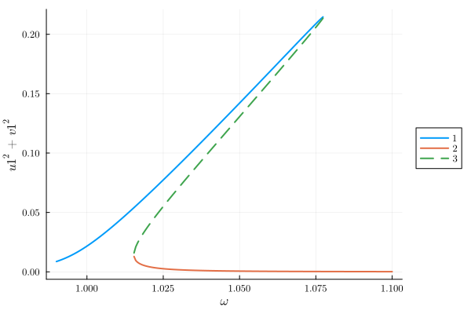
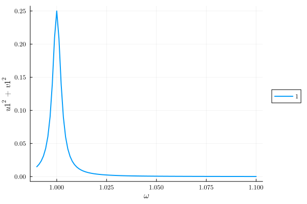
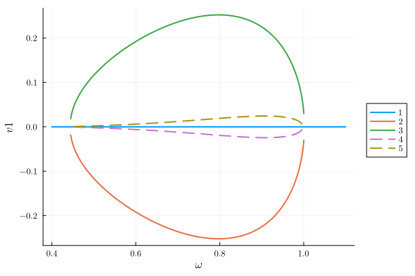
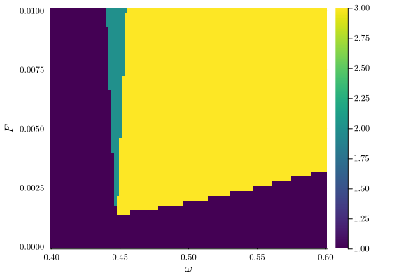

---
---


# Parametric Pumping via Three-Wave Mixing {#Parametric-Pumping-via-Three-Wave-Mixing}

```julia
using HarmonicBalance, Plots
using Plots.Measures
using Random
```


## System {#System}

```julia
@variables β α ω ω0 F γ t x(t) # declare constant variables and a function x(t)
diff_eq = DifferentialEquation(
    d(x, t, 2) + ω0^2 * x + β * x^2 + α * x^3 + γ * d(x, t) ~ F * cos(ω * t), x
)
add_harmonic!(diff_eq, x, ω) # specify the ansatz x = u(T) cos(ωt) + v(T) sin(ωt)
```


## 1st order Krylov expansion {#1st-order-Krylov-expansion}

```julia
harmonic_eq = get_krylov_equations(diff_eq; order=1)
harmonic_eq.equations
```

$$ \begin{align}
\frac{ - \frac{1}{2} ~ \mathtt{u1}\left( T \right) ~ \gamma ~ \omega + \frac{1}{2} ~ \omega^{2} ~ \mathtt{v1}\left( T \right) - \frac{1}{2} ~ \mathtt{{\omega}0}^{2} ~ \mathtt{v1}\left( T \right) - \frac{3}{8} ~ \left( \mathtt{u1}\left( T \right) \right)^{2} ~ \mathtt{v1}\left( T \right) ~ \alpha - \frac{3}{8} ~ \left( \mathtt{v1}\left( T \right) \right)^{3} ~ \alpha}{\omega} &= \frac{\mathrm{d} ~ \mathtt{u1}\left( T \right)}{\mathrm{d}T} \\
\frac{ - \frac{1}{2} ~ F - \frac{1}{2} ~ \omega^{2} ~ \mathtt{u1}\left( T \right) + \frac{1}{2} ~ \mathtt{{\omega}0}^{2} ~ \mathtt{u1}\left( T \right) - \frac{1}{2} ~ \mathtt{v1}\left( T \right) ~ \gamma ~ \omega + \frac{3}{8} ~ \left( \mathtt{u1}\left( T \right) \right)^{3} ~ \alpha + \frac{3}{8} ~ \left( \mathtt{v1}\left( T \right) \right)^{2} ~ \mathtt{u1}\left( T \right) ~ \alpha}{\omega} &= \frac{\mathrm{d} ~ \mathtt{v1}\left( T \right)}{\mathrm{d}T}
\end{align}
 $$

If we both have quadratic and cubic nonlineariy, we observe the normal duffing oscillator response.

```julia
varied = (ω => range(0.99, 1.1, 200)) # range of parameter values
fixed = (α => 1.0, β => 1.0, ω0 => 1.0, γ => 0.005, F => 0.0025) # fixed parameters

result = get_steady_states(harmonic_eq, varied, fixed)
plot(result; y="u1^2+v1^2")
```

{width=600px height=400px}

If we set the cubic nonlinearity to zero, we recover the driven damped harmonic oscillator. Indeed, thefirst order the quadratic nonlinearity has no affect on the system.

```julia
varied = (ω => range(0.99, 1.1, 100))
fixed = (α => 0.0, β => 1.0, ω0 => 1.0, γ => 0.005, F => 0.0025)

result = get_steady_states(harmonic_eq, varied, fixed)
plot(result; y="u1^2+v1^2")
```

{width=600px height=400px}

## 2nd order Krylov expansion {#2nd-order-Krylov-expansion}

The quadratic nonlinearity $\beta$ together with the drive at 2ω gives the effective parametric drive $\lambda_\mathrm{eff}=\frac{2F_1\beta}{3m\omega^2}$. But the cubic nonlinearity $\alpha$ is still needed to get the period doubling bifurcation through $\lambda_\mathrm{eff}$.

```julia
@variables β α ω ω0 F γ t x(t)
diff_eq = DifferentialEquation(
    d(x, t, 2) + ω0^2 * x + β * x^2 + α * x^3 + γ * d(x, t) ~ F * cos(2ω * t), x
)

add_harmonic!(diff_eq, x, ω)
harmonic_eq2 = get_krylov_equations(diff_eq; order=2)
```


```ansi
A set of 2 harmonic equations
Variables: u1(T), v1(T)
Parameters: ω, γ, ω0, F, α, β

Harmonic ansatz: 
x(t) = u1(T)*cos(ωt) + v1(T)*sin(ωt)

Harmonic equations:

(-(1//2)*u1(T)*γ*ω + (1//2)*v1(T)*(ω^2) - (1//2)*v1(T)*(ω0^2) - (3//8)*(u1(T)^2)*v1(T)*α - (3//8)*(v1(T)^3)*α) / ω + (-(1//6)*F*v1(T)*β*(ω^5) + (5//12)*(u1(T)^2)*v1(T)*(β^2)*(ω^5) + (5//12)*(v1(T)^3)*(β^2)*(ω^5) + (1//8)*v1(T)*(γ^2)*(ω^7) + (1//8)*v1(T)*(ω^9) - (1//4)*v1(T)*(ω^7)*(ω0^2) + (1//8)*v1(T)*(ω^5)*(ω0^4) - (3//8)*(u1(T)^2)*v1(T)*α*(ω^7) + (3//8)*(u1(T)^2)*v1(T)*α*(ω^5)*(ω0^2) - (3//8)*(v1(T)^3)*α*(ω^7) + (3//8)*(v1(T)^3)*α*(ω^5)*(ω0^2) + (51//256)*(u1(T)^4)*v1(T)*(α^2)*(ω^5) + (51//128)*(u1(T)^2)*(v1(T)^3)*(α^2)*(ω^5) + (51//256)*(v1(T)^5)*(α^2)*(ω^5)) / (ω^8) ~ Differential(T, 1)(u1(T))

(-(1//2)*u1(T)*(ω^2) + (1//2)*u1(T)*(ω0^2) - (1//2)*v1(T)*γ*ω + (3//8)*(u1(T)^3)*α + (3//8)*u1(T)*(v1(T)^2)*α) / ω + (-(1//6)*F*u1(T)*β*(ω^5) - (5//12)*(u1(T)^3)*(β^2)*(ω^5) - (5//12)*u1(T)*(v1(T)^2)*(β^2)*(ω^5) - (1//8)*u1(T)*(γ^2)*(ω^7) - (1//8)*u1(T)*(ω^9) + (1//4)*u1(T)*(ω^7)*(ω0^2) - (1//8)*u1(T)*(ω^5)*(ω0^4) + (3//8)*(u1(T)^3)*α*(ω^7) - (3//8)*(u1(T)^3)*α*(ω^5)*(ω0^2) + (3//8)*u1(T)*(v1(T)^2)*α*(ω^7) - (3//8)*u1(T)*(v1(T)^2)*α*(ω^5)*(ω0^2) - (51//256)*(u1(T)^5)*(α^2)*(ω^5) - (51//128)*(u1(T)^3)*(v1(T)^2)*(α^2)*(ω^5) - (51//256)*u1(T)*(v1(T)^4)*(α^2)*(ω^5)) / (ω^8) ~ Differential(T, 1)(v1(T))

```


```julia
varied = (ω => range(0.4, 1.1, 500))
fixed = (α => 1.0, β => 2.0, ω0 => 1.0, γ => 0.001, F => 0.005)

result = get_steady_states(harmonic_eq2, varied, fixed)
plot(result; y="v1")
```

{width=600px height=400px}

```julia
varied = (ω => range(0.4, 0.6, 100), F => range(1e-6, 0.01, 50))
fixed = (α => 1.0, β => 2.0, ω0 => 1.0, γ => 0.01)

method = TotalDegree()
result = get_steady_states(harmonic_eq2, method, varied, fixed)
plot_phase_diagram(result; class="stable")
```

{width=600px height=400px}


---


_This page was generated using [Literate.jl](https://github.com/fredrikekre/Literate.jl)._
