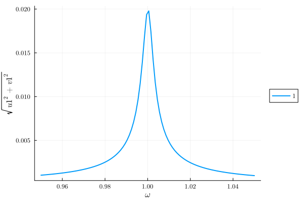
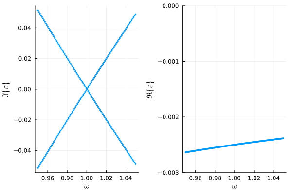
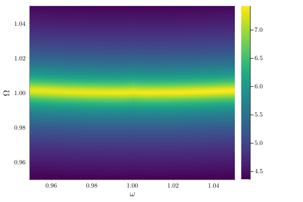
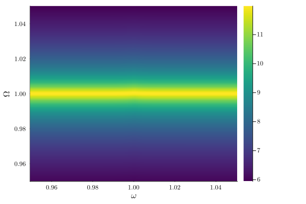
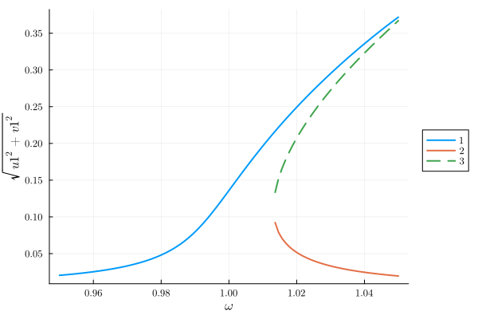
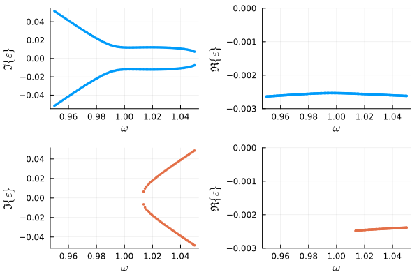
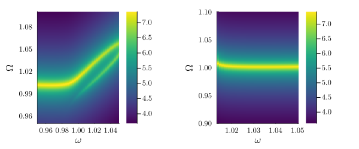
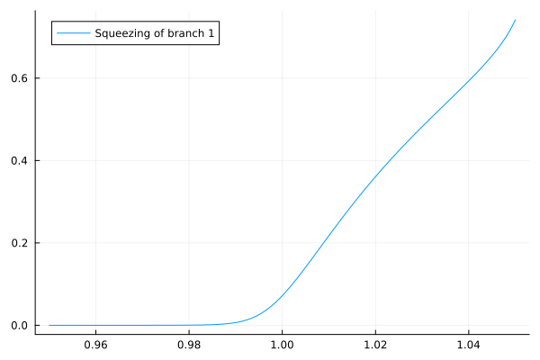
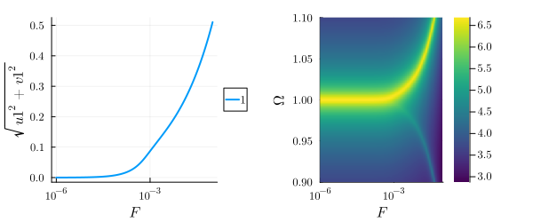

---
---

# Linear response {#linresp_ex}

In HarmonicBalance.jl, the [stability and linear response](/background/stability_response#linresp_background) are treated using the [`LinearResponse`](/manual/linear_response#linresp_man) module.

Here we calculate the white noise response of a simple nonlinear system. A set of reference results may be found in Huber et al. in [Phys. Rev. X 10, 021066 (2020)](https://doi.org/10.1103/PhysRevX.10.021066). We start by defining the [Duffing oscillator](/tutorials/steady_states#Duffing)

```julia
using HarmonicBalance
using Plots.Measures: mm
@variables α, ω, ω0, F, γ, t, x(t); # declare constant variables and a function x(t)

# define ODE
diff_eq = DifferentialEquation(d(x,t,2) + ω0*x + α*x^3 + γ*d(x,t) ~ F*cos(ω*t), x)

# specify the ansatz x = u(T) cos(ω*t) + v(T) sin(ω*t)
add_harmonic!(diff_eq, x, ω)

# implement ansatz to get harmonic equations
harmonic_eq = get_harmonic_equations(diff_eq)
```


```ansi
A set of 2 harmonic equations
Variables: u1(T), v1(T)
Parameters: ω, α, γ, ω0, F

Harmonic ansatz: 
x(t) = u1(T)*cos(ωt) + v1(T)*sin(ωt)

Harmonic equations:

Differential(T, 1)(u1(T))*γ + 2Differential(T, 1)(v1(T))*ω + u1(T)*ω0 - u1(T)*(ω^2) + v1(T)*γ*ω + (3//4)*(u1(T)^3)*α + (3//4)*u1(T)*(v1(T)^2)*α ~ F

Differential(T, 1)(v1(T))*γ - (2//1)*Differential(T, 1)(u1(T))*ω + v1(T)*ω0 - u1(T)*γ*ω - v1(T)*(ω^2) + (3//4)*(u1(T)^2)*v1(T)*α + (3//4)*(v1(T)^3)*α ~ 0

```


## Linear regime {#Linear-regime}

When driven weakly, the Duffing resonator behaves quasi-linearly, i.e, its response to noise is independent of the applied drive. We see that for weak driving, $F = 10^{-4}$, the amplitude is a Lorentzian.

```julia
fixed = (α => 1, ω0 => 1.0, γ => 0.005, F => 0.0001)   # fixed parameters
varied = ω => range(0.95, 1.05, 100)           # range of parameter values
result = get_steady_states(harmonic_eq, varied, fixed)

using Plots
plot(result, "sqrt(u1^2 + v1^2)")
```

{width=600px height=400px}

To find the fluctuation on the top of the steady state one often employs a [Bogoliubov-de Gennes analyses](https://en.wikipedia.org/wiki/Linear_dynamical_system). Here, we compute the eigenvalues $\lambda_k$ of the Jacobian matrix at the steady state. The imaginary part of the eigenvalues gives characteristic frequencies of the "quasi-particle excitations". The real part gives the lifetime of these excitations.

The compute the eigenvalues of a specific branch, we can use the corresponding function:

```julia
eigvalues= eigenvalues(result, 1)
```


```ansi
100-element Vector{Vector{ComplexF64}}:
 [-0.0026350254834076117 + 0.051309683693220184im, -0.0026350254834076065 - 0.051309683693220184im]
 [-0.002632084986499382 - 0.05024566253923191im, -0.0026320849864993785 + 0.05024566253923189im]
 [-0.0026291538496597336 + 0.0491828296158582im, -0.00262915384965973 - 0.049182829615858195im]
 [-0.0026262320336929088 + 0.04812118132673193im, -0.0026262320336929053 - 0.04812118132673193im]
 [-0.0026233194996614292 + 0.047060714110710146im, -0.0026233194996614275 - 0.047060714110710146im]
 [-0.0026204162088913525 - 0.04600142444438691im, -0.0026204162088913473 + 0.0460014244443869im]
 [-0.002617522122978503 - 0.044943308845025114im, -0.002617522122978503 + 0.04494330884502511im]
 [-0.0026146372037960386 + 0.04388636387398512im, -0.002614637203796035 - 0.043886363873985104im]
 [-0.0026117614135034647 + 0.0428305861407467im, -0.0026117614135034595 - 0.0428305861407467im]
 [-0.002608894714557459 - 0.041775972307641004im, -0.002608894714557457 + 0.041775972307641004im]
 ⋮
 [-0.002401430180792856 - 0.04108071454745638im, -0.002401430180792849 + 0.04108071454745638im]
 [-0.0023992007896006928 - 0.042050579689252576im, -0.0023992007896006876 + 0.04205057968925258im]
 [-0.0023969778742797872 - 0.0430195421923934im, -0.0023969778742797855 + 0.043019542192393394im]
 [-0.0023947614091184115 - 0.04398760495432726im, -0.0023947614091184115 + 0.043987604954327256im]
 [-0.002392551368603252 - 0.0449547708310431im, -0.002392551368603252 + 0.044954770831043114im]
 [-0.0023903477274088095 - 0.04592104264110834im, -0.002390347727408808 + 0.04592104264110834im]
 [-0.002388150460388247 - 0.04688642316912885im, -0.0023881504603882435 + 0.046886423169128846im]
 [-0.0023859595425654093 + 0.04785091516872288im, -0.0023859595425654006 - 0.04785091516872288im]
 [-0.002383774949127943 + 0.04881452136508878im, -0.002383774949127934 - 0.04881452136508878im]
```


Using the [PlotsExt.jl](/manual/plotting#plotting) extension, one can quickly compute and plot the eigenvalues as follows

```julia
plot(
    plot_eigenvalues(result, 1),
    plot_eigenvalues(result, 1, type=:real, ylims=(-0.003, 0)),
)
```

{width=600px height=400px}

We find a single pair of complex conjugate eigenvalues linearly changing with the driving frequency. Both real parts are negative, indicating stability.

As discussed in [background section on linear response](/background/stability_response#linresp_background), the excitation manifest itself as a lorentenzian peak in a Power Spectral Density (PSD) measurement. The PSD can be plotted using [`plot_linear_response`](/manual/linear_response#linresp_man):

```julia
plot_linear_response(result, x, 1, Ω_range=range(0.95, 1.05, 300), logscale=true)
```

{width=600px height=400px}

The response has a peak at $\omega_0$, irrespective of the driving frequency $\omega$. Indeed, the eigenvalues shown before where plotted in the rotating frame at the frequency of the drive $\omega$. Hence, the imaginary part of eigenvalues shows the frequency (energy) needed to excite the system at it natural frequency (The frequency its want to be excited at.)

Note the slight "bending" of the noise peak with $\omega$ - this is given by the failure of the first-order calculation of the jacobian to capture response far-detuned from the drive frequency. One can correct this by using higher-order derivatives of the `Differentialequation` object in the jacobian calculation. For more details on this see the [thesis](https://www.doi.org/10.3929/ethz-b-000589190). We can use this corrections by setting the `order` argument in the `plot_linear_response` function:

```julia
plot_linear_response(result, x, 1, Ω_range=range(0.95, 1.05, 300), logscale=true, order=2)
```

{width=600px height=400px}

To compute the matrix without plotting you can use the functions specified at the [linear respinse manual](/manual/linear_response#linresp_man).

## Nonlinear regime {#Nonlinear-regime}

For strong driving, matters get more complicated. Let us now use a drive $F = 2*10^{-3}$ :

```julia
fixed = (α => 1, ω0 => 1.0, γ => 0.005, F => 0.002)   # fixed parameters
varied = ω => range(0.95, 1.05, 100)           # range of parameter values
result = get_steady_states(harmonic_eq, varied, fixed)

plot(result, x="ω", y="sqrt(u1^2 + v1^2)");
```

{width=600px height=400px}

The amplitude is the well-known Duffing curve. Let's look at the eigenvalues of the two stable branches, 1 and 2.

```julia
plot(
    plot_eigenvalues(result, 1),
    plot_eigenvalues(result, 1, type=:real, ylims=(-0.003, 0)),
    plot_eigenvalues(result, 2),
    plot_eigenvalues(result, 2, type=:real, ylims=(-0.003, 0)),
)
```

{width=600px height=400px}

Again every branch gives a single pair of complex conjugate eigenvalues. However, for branch 1, the characteristic frequencies due not change linearly with the driving frequency around $\omega=\omega_0$. This is a sign of steady state becoming nonlinear at large amplitudes.

The same can be seen in the PSD:

```julia
plot(
  plot_linear_response(result, x, 1, Ω_range=range(0.95,1.1,300), logscale=true),
  plot_linear_response(result, x, 2, Ω_range=range(0.9,1.1,300), logscale=true),
    size=(600, 250), margin=3mm
)
```

{width=600px height=250px}

In branch 1 the linear response to white noise shows _more than one peak_. This is a distinctly nonlinear phenomenon, indicative of the squeezing of the steady state. Branch 2 is again quasi-linear, which stems from its low amplitude.

We can compute the squeezing of the steady states by using the corresponding eigenvectors of the eigenvalus. Indeed, defining (TODO add reference)

```julia
function symplectic(v)
    2 * (real(v[1]) * imag(v[2]) - imag(v[1]) * real(v[2]))
end
function squeeze(v)
    symp = symplectic(v)
    ((1 - symp) / (1 + symp))^sign(symp)
end
```


```ansi
squeeze (generic function with 1 method)
```


We can compute the squeezing of the steady states as follows:

```julia
eigvecs = eigenvectors(result, 1)
squeezed = [squeeze.(eachcol(mat))[1] for mat in eigvecs]
plot(range(0.95, 1.05, 100), squeezed, label="Squeezing of branch 1")
```

{width=600px height=400px}

Following [Huber et al.](https://doi.org/10.1103/PhysRevX.10.021066), we may also fix $\omega = \omega_0$ and plot the linear response as a function of $F$. The response turns out to be single-valued over a large range of driving strengths. Using a log scale for the x-axis:

```julia
fixed = (α => 1., ω0 => 1.0, γ => 1e-2, ω => 1)   # fixed parameters
swept = F => 10 .^ range(-6, -1, 200)           # range of parameter values
result = get_steady_states(harmonic_eq, swept, fixed)

plot(
  plot(result, "sqrt(u1^2 + v1^2)", xscale=:log),
  plot_linear_response(result, x, 1, Ω_range=range(0.9,1.1,300), logscale=true, xscale=:log),
  size=(600, 250), margin=3mm
)
```

{width=600px height=250px}

We see that for low $F$, quasi-linear behaviour with a single Lorentzian response occurs, while for larger $F$, two peaks form in the noise response. The two peaks are strongly unequal in magnitude, which is an example of internal squeezing (See supplemental material of [Huber et al.](https://doi.org/10.1103/PhysRevX.10.021066)).
