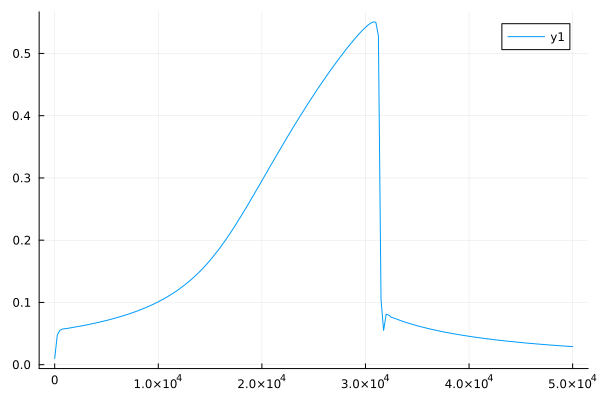

# Steady state sweeps {#Steady-state-sweeps}

```julia
using HarmonicBalance, SteadyStateDiffEq, ModelingToolkit
using BenchmarkTools, Plots, StaticArrays, LinearAlgebra
using OrdinaryDiffEqRosenbrock, OrdinaryDiffEqTsit5
using HarmonicBalance: OrderedDict

@variables α ω ω0 F γ η t x(t);

diff_eq = DifferentialEquation(
    d(x, t, 2) + ω0^2 * x + α * x^3 + γ * d(x, t) + η * d(x, t) * x^2 ~ F * cos(ω * t), x
)
add_harmonic!(diff_eq, x, ω)
harmonic_eq = get_harmonic_equations(diff_eq)

fixed = (ω0 => 1.0, γ => 1e-2, F => 0.02, α => 1.0, η => 0.3)
ω_span = (0.8, 1.3);
ω_range = range(ω_span..., 201);
varied = ω => ω_range

result_HB = get_steady_states(harmonic_eq, varied, fixed)
plot(result_HB, "sqrt(u1^2+v1^2)")
```

{width=600px height=400px}

## Steady state sweep using `SteadyStateDiffEq.jl` {#Steady-state-sweep-using-SteadyStateDiffEq.jl}

```julia
param = OrderedDict(merge(Dict(fixed), Dict(ω => 1.1)))
x0 = [0, 0.0];
prob_ss = SteadyStateProblem(
    harmonic_eq, x0, param; in_place=false, u0_constructor=x -> SVector(x...)
)

varied = 6 => ω_range
result_ss = steady_state_sweep(
    prob_ss, DynamicSS(Rodas5()); varied, abstol=1e-5, reltol=1e-5
)

plot(result_HB, "sqrt(u1^2+v1^2)")
plot!(ω_range, norm.(result_ss); c=:gray, ls=:dash)
```

{width=600px height=400px}

## Adiabatic evolution {#Adiabatic-evolution}

```julia
timespan = (0.0, 50_000)
sweep = AdiabaticSweep(ω => (0.8, 1.3), timespan) # linearly interpolate between two values at two times
ode_problem = ODEProblem(harmonic_eq, fixed; u0=[0.01; 0.0], timespan, sweep)
time_soln = solve(ode_problem, Tsit5(); saveat=250)

plot(result_HB, "sqrt(u1^2+v1^2)")
plot(time_soln.t, norm.(time_soln.u))
```

{width=600px height=400px}

## using follow_branch {#using-follow_branch}

```julia
followed_branch, Ys = follow_branch(1, result_HB; y="√(u1^2+v1^2)")
Y_followed_gr = real.([
    Ys[param_idx][branch] for (param_idx, branch) in enumerate(followed_branch)
]);

plot(result_HB, "sqrt(u1^2+v1^2)")
plot!(ω_range, Y_followed_gr; c=:gray, ls=:dash)
```

{width=600px height=400px}

## comparison {#comparison}

```julia
@btime result_ss = steady_state_sweep(
    prob_ss, DynamicSS(Rodas5()); varied, abstol=1e-5, reltol=1e-5
)

@btime time_soln = solve(ode_problem, Tsit5(); saveat=250)

@btime begin
    followed_branch, Ys = follow_branch(1, result_HB; y="√(u1^2+v1^2)")
    Y_followed_gr = real.([
        Ys[param_idx][branch] for (param_idx, branch) in enumerate(followed_branch)
    ])
end
```


```ansi
201-element Vector{Float64}:
 0.05519114899138601
 0.055799978946403664
 0.05642407910800839
 0.057064009203500576
 0.05772035586647759
 0.05839373420669391
 0.05908478948483703
 0.059794198899778044
 0.0605226734963945
 0.06127096020262132
 ⋮
 0.0313581435596104
 0.03104563715568653
 0.030738725800911366
 0.03043726150835462
 0.030141101491373817
 0.029850107935451137
 0.029564147782042915
 0.02928309252370293
 0.02900681800979332
```


Plotting them together gives:

```julia
plot(ω_range, norm.(result_ss))
plot!(ω_range, norm.(time_soln.u))
plot!(ω_range, Y_followed_gr)
```

{width=600px height=400px}


---


_This page was generated using [Literate.jl](https://github.com/fredrikekre/Literate.jl)._
